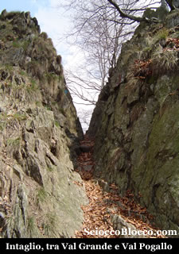
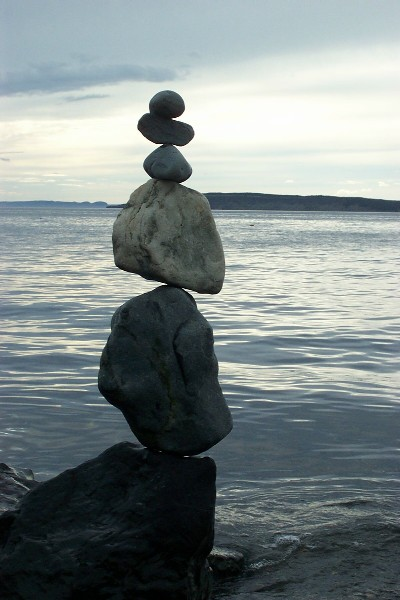

Il sentiero parte subito con buona pendenza snodandosi all'interno
di un bosco di latifoglie, tutto il percorso è punteggiato
da ben 20 cippi che indicano la strada e da otto bacheche
e quattro leggii che con immagini e brevi testi descrivono
alcune caratteristiche del luogo.

Affrontando con ritmo regolare la impegnativa salita, circa
a metà del percorso per
l'Alpe Prà ( Alpino ) si esce
dal bosco, si impone una sosta per riprendere fiato e per
ammirare la vista che si apre sotto di noi sulla valle sul
fiume e sui due laghi
Maggiore e Orta.

Il sentiero continua in salita ma allo scoperto e in giornate
di sole estivo il caldo accentuerà non poco le difficoltà
dell'ascesa.

Arrivati in un tratto dove al nostro fianco vedremo fare
la loro comparsa le felci, alzando gli occhi vedremo sopra
di noi l'Alpe Prà
e il rifugio dell'Alpino,
quì sulla sinistra del sentiero nei pressi di un
ciliegio vi è una famosa roccia
coppellata, una roccia piatta con la
punta rivolta alla valle e al lago.

Le coppelle sono cavità di varie dimensioni,
eseguite su una roccia in quantità e con disposizioni
variabili.

Presenti in tutto il mondo, per alcuni studiosi potrebbero
essere collegate a luoghi di culto e di tradizione preistorica.

La stessa chiesa sin dai primi secoli dell'era cristiana
condannò coloro che veneravano certe rocce in luoghi
selvaggi e nascosti in fondo ai boschi, pietre oggetto di
falsità diaboliche e sulle quali si depositavano
ex-voto, candele accese e altre offerte.

Molte le ipotesi sul significato dei massi coppellati, tra
le quali che fossero rappresentazione di costellazioni,
mappe del territorio o massi altare per sacrifici.

Riprendiamo
il sentiero e con un ultimo sforzo eccoci all'Alpe
Prà ( 1223 m ) conosciuta soprattutto
per la "Casa dell'Alpino",
rifugio aperto solo saltuariamente e di proprietà
dell'Associazione Nazionale Alpini.

Ci troviamo ad uno degli accessi più suggestivi ai
monti ed agli alpeggi della Val
Grande e della Val
Pogallo, con itinerari di vario impegno
e grande fascino.

Una sosta sulla balconata naturale del rifugio per ammirare
di nuovo sotto di noi la valle di Cicogna
e i laghi Maggiore
e Orta
è d'obbligo, ruotando lo sguardo di 90° verso
destra potremo vedere i bellissimi Corni
di Nibbio e dietro sullo sfondo il
Monte Rosa.

Riposati
e dissetati possiamo ripartire per la seconda nostra meta
che è Pogallo,
il sentiero parte proprio dietro il rifugio ricominciamo
a salire ma con molta meno pendenza inoltrandoci in un bosco
in poco tempo ci troveremo ad affrontare il passaggio da
un versante all'atro per entrare nella Val
Pogallo.

Un caratteristico passaggio scavato nella roccia permette
il passaggio di versante, questa bocchetta serviva all'Alpe
Prà sprovvista di sorgenti di raggiungere la vicina
Alpe Leciuri
dove l'acqua non mancava, tanto che fornisce ancora oggi
l'acquedotto di Cicogna.

Inziamo a camminare in costa sul nuovo versante e in men
che non si dica giungiamo all'Ape
Leciuri ( 1311 m ) punto massimo della
nostra ascesa, questo alpeggio è formato da resti
di vecchie casere e sotto di noi verso sinistra vediamo
Pogallo,
di fronte a noi vediamo il Pian
Cavallone e spostandoci sempre un po'
a sinistra la Marona
e la Zeda.

Se sarete fortunati potrete vedere qualche rapace che si
lascia trasportare dai venti della Val Pogallo che si apre
sotto di noi.

Iniziamo una discesa lunga e di media difficoltà,
dapprima allo scoperto poi all'interno di un denso bosco,
dove incontreremo la Cappella
di Cima Selva che doveva essere a protezione
del sentiero.

Infatti fino al 1904 data di ultimazione del sentiero di
fondovalle che percorreremo al ritorno questa era l'unica
via di accesso all'alta Val Pogallo

Proseguiamo la discesa per giungere all'Ape
Caslù ( 904 m ), anche lei caratterizzata
da alcune diroccate casere, continuiamo a scendere quando
all'improvviso finirà il bosco ci troveremo di fronte
al borgo di Pogallo
( 777 m ).

Pogallo
nei primi del novecento sotto la spinta di Carlo
Sutermeister divenne in breve tempo
un centro vitale e conobbe una metamorfosi che oggi forse
indignerebbe i verdi ma che allora inorgogliva chi vi lavorava.

Una popolazione che arrivò a contare centinaia di
lavoratori, sovente con famiglie al seguito, al servizio
di un inpreditore attento alle esigenze della comunità
e non solo a quelle della ditta.

Vennero rifatte le baite per gli operai più un fabbricato
in muratura per la sede della ditta, che ancora oggi resiste
all'ingresso dell'alpeggio,

Pogallo
era allora un vero e proprio villaggio, con illuminazione
elettrica, scuole elementari, asilo, spaccio,osteria, officina
di fabbro-maniscalco,stalla-latteria, forno, lavatoio, infermeria,
con canali e tubazioni vennero allestiti punti acqua.

Carlo Sutermeister
anticipo forme assicurative contro gli infortuni che erano
all'ordine del giorno.

Ci fu lavoro per muratori, boscaioli, meccanici, operai
delle teleferiche, c'erano galline, pecore, vacche, muli,
si faceva il pane, la grappa, burro, formaggio, si istallarono
anche due carabinieri, tutto ciò dove prima non c'era
che un alpeggio.

Nel 1952 la ditta IBAI asseriva che nel periodo 1946-1952
furono esboscati ben 745.500 quintali di materiale legnoso.

Per chi ne volesse sapere di più consiglio "Carlo
Sutermeister fra Intra e Val Grande"
di Sutermeister Cassano Alberti editore 1992.

Rifocilliamoci e beviamo un po' della fresca acqua delle
fontane e facciamo un giro per questo storico borgo, se
guardiamo verso nord direzione
ossola possiamo vedere la cima del
Laurasca
con la sua croce e poco più a destra il Cimone
di Corte Chiuso.

Se vogliamo possiamo scendere al fiume "Rio
Pogallo" per un sentiero che è
alla destra dell'ingresso dell'alpeggio, passando per un
suggestivo ponte su una tetra gola, giunti sulle cristalline
acque del rio gustiamoci il silenzio e il fruscio dell'acqua.

Se vogliamo possiamo fare un po' di Balancing o Inbilic
forma di Zen che sta prendendo piede sulle fresche rive
dei torrenti.

Da
Pogallo prendiamo il sentiero
che esce in piano dalla radura di fronte all'alpeggio, con
un po' di fortuna che è capitata a noi potrete incontrare
un giovane capriolo, con una marcia di facile difficoltà
ci avviamo a Cicogna.

Circa a metà cammino quasi tutto all'interno di boschi,
giungiamo ad un ponte che sovrasta una pozza d'acqua di
trasparenza straordinaria e una stretta gola dalla bellezza
mozzafiato, continuando tra su e giù giungiamo finalmente
a Cicogna
partenza e arrivo della nostra escursione.

