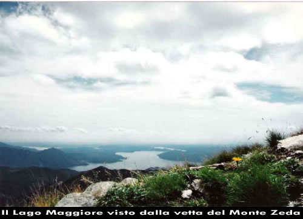
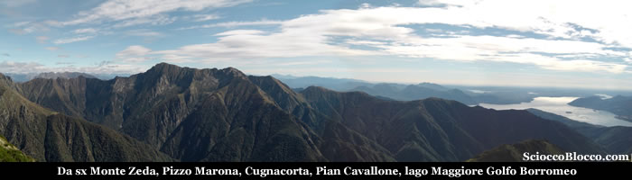

Partenza da **Archia** ( circa 1290 m), ci sono dei cartelli molto chiari che indicano la direzione, comunque prendiamo la strada sterrata tenendo sulla sinistra l’agriturismo. Camminiamo in piano per alcune centinaia di metri sino a giungere alla fine della strada carrabile, dove si trova una grossa fontana, facciamo rifornimento se non lo abbiamo ancora fatto. Proseguendo su una largo sentiero per larghi tratti gippabile iniziamo la nostra salita che è costante e di media difficoltà, ci accorgeremo ben presto che questo sentiero è una vera e propria strada rifinita egregiamente nonostante che da molti anni sembra che nessuno si occupi della manutenzione. Questo sentiero è in realtà molto di più e ha una antica e importante storia, il suo nome è “Sentiero Cadorna”. Con il nome di "Linea Cadorna" si intende il sistema di fortificazioni militari costruito durante la Prima Guerra Mondiale tra il Lago Maggiore e il Monte Massone.

Le fortificazioni comprendono un fìtto reticolo di mulattiere militari, trincee, postazioni d'artiglieria, luoghi di avvistamento, ospedaletti e strutture logistiche, centri di comando. Furono volute dal generale Luigi Cadorna di **Pallanza**, capo di stato maggiore dell'esercito italiano, per difendere il confine da un ipotizzato attacco austro-tedesco attraverso la Svizzera mai avvenuto. Esse coprono, nella logica della "guerra di posizione", un dislivello di 2.000 m tra la piana del Toce e il Monte Massone e fra il Lago Maggiore (Carmine inferiore) e il Monte Zeda e proseguono nelle Alpi centrali fino alle Orobie. Tra l'Ossola e la Valtellina furono costruiti 72 km di trincee, 88 postazioni di artiglierie di cui 11 in caverna, 296 km di strade carrozzabili, 398 km di mulattiere. I lavori costarono più di 100 milioni di lire del tempo e impiegarono oltre 15.000 operai. In un'economia di guerra, i lavori ebbero un impatto positivo per le popolazioni locali in quanto offrirono lavoro retribuito a muratori e scalpellini e costituirono una prima occasione di lavoro salariato per la manodopera femminile impegnata nel trasporto dei viveri alle squadre in montagna. Un "sentiero storico", attrezzato con pannelli esplicativi per visite didattiche, è stato allestito tra la Punta di Migiandone e il Forte di Bara.

Altri tratti visitabili sono la mulattiera nord del Montorfano e le alture del Verbano (Passo Folungo,  *Morissolo,  *Monte Carza. Camminando sopra questo pezzo di storia raggiungiamo in breve Passo Folungo (1369 m), continuando la marcia su di una salita regolare giungiamo dopo circa 1 ora dalla partenza Pian Vadà ( 1711 m ) dove ci sono pochi resti di un ex rifugio del C.A.I.. Nella valle che si apre davanti a noi possiamo vedere in basso a sinistra il Lago Maggiore con **Pallanza** e il campanile di S.Leonardo non che l’isolotto S.Giovanni . Proprio di fronte è ben visibile l’alpeggio “I Belmi” dietro il quale non visibile sul versante opposto si trova  *Onunchio con i sentieri che scendono ad Aurano e **Intra**gna. Proseguiamo sempre sul Sentiero Cadorna in lieve ascesa addentrandoci verso la Val Grande e la nostra meta, dopo circa 2 ore dalla partenza arriviamo alla bocchetta che si apre sulla **Val Cannobbina** ( circa 1950 m). Buttiamo uno sguardo in alto a sinistra, la croce che sta circa 200m sopra noi è la vetta del Monte Zeda, proprio sotto di noi a 1750 m c’è un bivacco riattato di recente di nome “La Forna”, se ci giriamo a sinistra verso sud possiamo vedere sotto il sentiero i resti di un postazione militare, e sul versante di fronte la postazione gemella. Un sentiero prosegue sulla costa sinistra della Zeda è quello che porta alla **Marona**, qualche centinaio di metri più avanti interseca un sentiero che sale zizzagando alla vetta. Noi scegliamo la via diretta e più faticosa seguiamo la cresta fatta di rocce e pietriccio facendo attenzione a dove mettiamo i piedi, il percorso è segnato dai colori bianco e rosso del C.A.I., ma scegliamo una nostra traiettoria e tenendo nel mirino la croce procediamo con prudenza. In circa 30’ di buon passo eccoci in vetta, abbiamo raggiunto la cima della montagna più famosa e alta del Verbano, Il Monte Zeda 2156 m.

Sotto la croce in ferro è posta una scatola metallica che contiene il registro di passaggio, lasciate la vostra firma e le vostre impressioni, scrivendo appoggiati all’altare di marmo di recente posa da parte di alcune associazioni volontarie della zona. Appena giunti in vetta, maestosa e selvaggia appare sotto il nostro sguardo la **Val Pogallo**. Con le spalle alla cresta da dove arriviamo ecco sotto a sinistra **Pogallo** e sopra l’**Alpe Leciuri** e proseguendo in una carrellata verso destra **Cima Tuss**,  **Cima Sasso** con sullo sfondo i **Corni di Nibbio** e ancora più dietro il **massiccio del** **Rosa**, quindi il **Pedum**,  **Bocchetta di Campo** e **Cima Campo**. Ruotando a destra di 90° riprendiamo dopo **Cima Campo**, il **Laurasca** in questa direzione in lontananza la **Valle Vigezzo** taglia per orizzontale l’orizzonte e a perpendicolo su **S.M.Maggiore** il profilo inconfondibile della **Scheggia**. Proseguiamo la nostra carrellata dopo il **Laurasca**, il **Cimone di Cortechiuso**,  **Cima Marsice** dove dietro si apre la **Val Loana**, **Monte Torrione**, **Cima Crocette** e la **Piota** proprio sotto di noi. Sulla destra della nostra cresta si apre la **Val Cannobbina** con **Falmenta** in basso a destra e **Gurro** un po’ più su e in fondo alla valle **Finero** e **Malesco**. Ruotando a destra di 90° ovvero nella direzione del nostro arrivo vediamo il **lago** e **Cannobio**. Concludiamo la nostra panoramica con l’ultima rotazione sempre verso destra di 90° e vedremo in fondo il **Pian Cavallone** e più vicino a noi la **Marona**, in basso a sinistra della cresta **Intra** mentre in basso a destra di nuovo **Pallanza** e sullo sfondo i **laghi Maggiore** e **Orta**.

Abbiamo appena spaziato con lo sguardo dal punto più privilegiato che si trova nel comprensorio **verbanese** che ci permette una vera e propria visione a 360° su tutto il territorio provinciale. Rifocilliamoci e affrontiamo il ritorno per lo stesso sentiero che abbiamo fatto all’andata badando a mettere molta attenzione nella discesa dalla vetta che può dimostrarsi insidiosa e raggiungiamo di nuovo **Archia** partenza e arrivo della nostra escursione.
