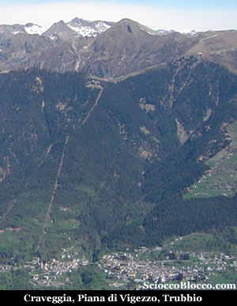

Giunti
a S.M. Maggiore
seguire le indicazioni per l’ovovia che si trova in
località Prestinone
e se non vogliamo salire a piedi prendiamo questo caratteristico
mezzo ormai tra i simboli della valle e in 15 minuti raggiungiamo
la Piana (1760
m).

Sotto
i pali degli impianti di risalita invernali parte il nostro
sentiero proprio dietro lo storico locale “Ratagin”.

Si percorre ora la bella mulattiera che in salita con direzione
Nord conduce ai piedi del Trubbio
in una visibile depressione.

Se volgiamo lo sguardo alla nostra sinistra potremo vedere
l’inconfondibile profilo della Scheggia
e poco più a destra la Pioda.

A questo punto si volge leggermente a sinistra e seguendo
sempre la mulattiera che più avanti diviene sentiero
si perviene alla bocchetta
di Moino a 1977 metri (circa un'ora
dalla Piana).

Superata la bocchetta, si lascia anche il bacino Vigezzino
e si entra in quello della Valle
Onsernone.

Da qui nella vallata che si apre in fondo verso nord sul
confine svizzero possiamo vedere i Bagni
di Craveggia.

Sulla destra del torrente Osernone,
in regione Fondo Manfracchio
(m 998), sgorga da un filone di pegmatite, una sorgente
di capacità di circa 12 litri al minuto.

L'acqua minerale ha una temperatura media di 30°, è
untuosa al tatto, emette odore di nafta ed ha gusto sgradevole.

Lasciata raffreddare all'aria libera diventa inodore limpida
e potabile.

Cura: bevanda e bagni.

Sulla destra del Rio della Vasca e a circa 150 metri dalla
rotabile, alla base di un macigno, sgorga una sorgente perenne
acidulo-ferruginosa della portata di poco più di
un litro al minuto.

L'acqua minerale è limpida, incolore, inodore.

Ha una temperatura di 12°; è ricca di carbonato
di ferro e di ossido carbonico e raccomandata quale ricostituente.

Esposta all'aria, si copre di un velo iridescente, dovuto
al biossido di manganese, di cui abbondano le soprastanti
rocce.

Non è ben certa la sua origine, dovuta, forse, all'azione
chimica dei vari ossidi di ferro che entrano nelle composizioni
di alcune rocce limitrofe.

Le "Aquae calidae
di Craveggia" sono già
ricordate in pergamena del 1352.

Sul luogo sorgeva uno Stabilimento di proprietà comunale,
ora distrutto; una rotabile lo collega all'attigua regione
svizzera.

Seguendo un bel sentierino che si mantiene sul pendio delle
Schegge di Moino
in breve ed in leggera discesa si raggiunge un primo laghetto
a m.1883.

Si risale poi senza sentiero il pendio a monte del laghetto,
seguendo il ruscello che fa da immissario al laghetto stesso
ed in pochi minuti si giunge ad un ripiano pietroso dove
è posto il secondo laghetto
a m.1940.

Proseguendo, dopo essere ridiscesi al primo laghetto, lungo
il sentiero che va in direzione Nord si arriva in pochi
minuti al terzo laghetto
presso le baite dell'alpe
Ruggia a m.1890,in parte invaso dalla
vegetazione e trasformato in palude e in torbiera.

Da tenere presente che fra il primo ed il terzo laghetto
è posto il piccolo e simpatico Rifugio
Greppi ( 1950m) del C.A.I.
Vigezzo (chiedere le chiavi a Santa
Maria Maggiore per potervi accedere).

Il rifugio di recente ristrutturazione e piccolo ma accogliente
può ospitare massimo 6 persone è dotato di
stufa a gas e nel sottotetto ci sono materassi e coperte
in abbondanza, ideale per un paio di notti in tranquillità
con pochi amici.

Da qui il ritorno alla Piana
partenza e arrivo della nostra escursione avviene in circa
1h .

