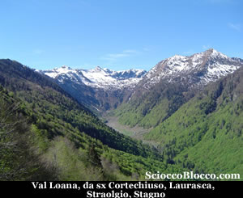
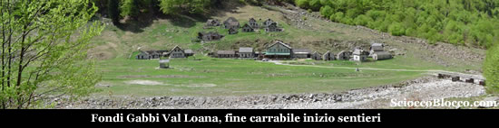
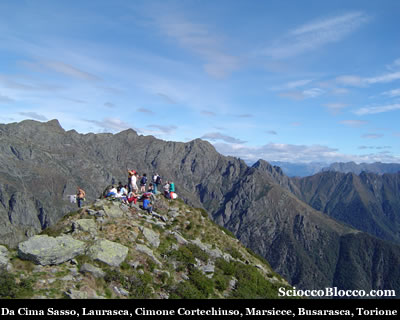
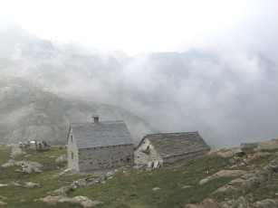
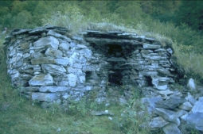

II **Parco Nazionale della Val Grande**, raggiungibile dalla **Valle Vigezzo** tramite il "Corridoio" della **Valle Loana**, è la più vasta e selvaggia area naturale d’ Italia. La **Valle Loana**, con il suo fiume che la divide a meta', costituisce una delle zone piu' belle della **Valle Vigezzo**, in particolar modo per la sua conformazione, e per la sua posizione, che si caratterizza per le sue cime. Una valle nella valle insomma! Cosi viene definita la **Valle Loana**, con le sue fornaci, ed i suoi boschi che hanno fornito di legname la **Valle Vigezzo**, e arredato la residenza borromea all’**isola Bella**, sul l**ago Maggiore**, una valle dove anche qui il tempo ha lasciato il segno di un passato ricco di eventi calamitosi devastanti, che ne hanno solcato il verde pascolo, ma che non sono comunque riusciti a cancellarne ed a nasconderne la bellezza unica ed esclusiva. Una valle, al centro dell’ interesse locale ove le amministrazioni pubbliche, hanno dedicato particolare riguardo all’ambiente: sarà prossimo l’ avvio di un lavoro finanziato dalla Comunità Europea, realizzato dalla **Comunità Montana Valle Vigezzo**, per recuperare il pascolo e l’ambiente, tramite lo spietramento, il ripristino della sentieristica, e la ricostruzione del ponticello pedonale sul fiume. Non e' un fatto strano, essere accolti all’ imbocco della valle dalle sue stupende bovine di razza "Bruna", che pascolano indisturbate sul meraviglioso tappeto verde.

L’agriturismo,aperto dal mese di giugno, al mese di settembre, ha una capacità ricettiva di 40 posti, e permette al turista di assaporare i piaceri della **cucina vigezzina**: il formaggio ossolano, il prosciutto tipico vigezzino, la polenta vigezzina, e specialità locali cucinate secondo una antica tradizione gastronomica.

Sorgeranno prossimamente una palestra di roccia ed un centro escursionistico per visite guidate nel **Parco Nazionale della Val Grande**. La **Valle Loana**, ha ora tutte le opportunità per favorire il turismo, e contribuire a valorizzare una importante area montana, sita a pochi chilometri dai più grandi centri urbani. Qual migliore occasione per visitar la **Valle Loana**.

Iniziamo il nostro cammino tenendoci sulla sinistra del fiume quando dopo alcune centinaia di metri la verde spianata andrà stringendosi vedremo che un sentiero si inoltra alla nostra sinistra sulla montagna tra basse felci e un bosco non particolarmente fitto. Circa 1h dopo la nostra partenza e una discreta salita arriveremo in cresta in località **La Forcola** (1800 m) sotto di noi vedremo il paese di **Finero** e la **Val Cannobina**.

Noi proseguiamo tenendoci in costa verso destra dalla direzione del nostro arrivo qui il dislivello sarà molto lieve ma il sentiero molto stretto e in alcuni punti il passaggio è aiutato da catene ancorate alla parete. Tra alcuni Sali scendi in circa 2h dalla partenza eccoci a **Corte Chiuso** che con i suoi 1883 metri è l'alpeggio più alto del comune ed è il più lontano dal paese di **Finero** a cui appartiene. L'alpeggio è costituito da un'ampia stalla e da una casera protette dalle valanghe da un dosso roccioso che le sovrasta. Intorno, i verdi praticelli, che un tempo alimentavano per circa un mese fino a 40 bovine, ora sono dimora di numerose marmotte. Gli edifici sono stati restaurati nel 1995 da un gruppo di giovani fineresi con il contributo del Comune di **Malesco**, proprietario degli immobili. Aggiriamo l’alpeggio e raggiungiamo il **Cimone di Cortechiuso** (2183 m) che sarà sulla sinistra del nostro sentiero, in 3h circa dalla nostra partenza saremo finalmente in vetta. Gli ultimi 300m di dislivello saranno assai impegnativi ma la vista dalla cima ripagherà di ogni sforzo.

Ecco alla destra a poca distanza il "**Laurasca**", ed il "**Cimone di Straolgio**" , che fanno da sentinella sul "**Passo di Scaredi**" e le sue baite, ultima tappa obbligatoria e porta d’ingresso nel Parco, dalla quale e' possibile ammirare, a partire da destra, le seguenti cime: II **Pizzo Ragno**, il **Pizzo Stagno**, il **Monte Togano**, il **Tignolino**, il **Menta**, il **Desen**, in primo piano, la **Colma di Premosello**, il **Proman**, i **Corni di Nibbio**, ed il **Pedum**, raggiungibile dalla **Bocchetta di Campo**. A far da sfondo a questo spettacolo naturale, la catena del **Monte Rosa**.

Di fronte a noi si apre la **Val Pogallo** e proprio la radura di **Pogallo** è ben visibile in fondo alla valle. Mentre partendo dalla nostra sinistra **cima Marsice**, la **Pioda**, la **Zeda**, La **Marona**, e diritto sullo sfondo il **Lago Maggiore** e poco a destra il **Lago d’Orta**. Riprendiamo il cammino, scendiamo dalla cima e prendiamo a sinistra sul sentiero passiamo al fianco del **Lago del Marmo** e scendiamo all’alpe  **Scaredi** ( 1841) in circa 4h dalla partnza.

Storico alpeggio **Scaredi** è facilmente raggiungibile con un largo sentiero da **Fondo Gabbi** che noi faremo al ritorno, vi è pascolo e bivacco, anche alla luce delle recenti opere realizzate (nuovo bivacco con fontana). Qui in un atmosfera d’altri tempi potremo rifocillarci e riposare.

Proseguiamo il ritorno per un largo sentiero che in poco tempo ci porta a **Corte Nuovo** (1792 m), e con un lunga discesa alle **Fornaci** circa 1300 m. Qui si possono notare i resti delle antiche fornaci che venivano utilizzate per la fabbricazione della calce. Strutture di forma circolare, erano costruite in sasso a ridosso del pendio del terreno; nel muro a valle veniva costruita un’apertura denominata “bocca di carico” che serviva per introdurre la legna ed il carbone da ardere.

Il calcare, ricavato nei pressi di **Scaredi**, vicino al Laghetto del Marmo, veniva ridotto in piccoli pezzi e trasportato a dorso di mulo fin qui, dove veniva messo in queste fornaci a cuocere lentamente. Dalla bocca di carico si inserivano il legname ed il carbone di legna che venivano fatti ardere a temperatura costante per circa 8 giorni. Una persona sorvegliava giorno e notte la cottura finché il calcare non si riduceva in materiale più tenero.

La calce bianca ottenuta veniva messa nei sacchi e a dorso di mulo portata a valle per essere utilizzata nella fabbricazione dei muri delle case o delle baite. Sul posto un’insegna in legno riporta le pagine tratte dal libro: “**Malesco**” dell’insigne storico **Giacomo Pollini** nelle quali è ben descritta tale attività.

Con un ultimo sforzo eccoci di ritorno a **Fondo Gabbi** fondo della **Val Loana** ***e partenza ed arrivo della nostra escursione.
