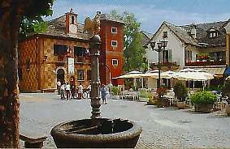

Arrivati
in località **Patqueso**
( 1108m ) circa a metà strada della **Val
Loana** dove la strada non è certo
larga ma un paio di piccole piazzole naturali permettono
di lasciare tre quattro macchine, noteremo che sul lato
destro della strada vi sono alcuni cartelli che indicano
l’imbocco di alcuni sentieri.

Quello che interessa a noi è il sentiero per il
**rifugio Al Cedo** meta della nostra escursione,
per effettuare un giro ad anello quello che abbiamo fatto
noi, sarebbe consigliabile farsi accompagnare sin qui per
tornare poi a **S.M. Maggiore**
a piedi sul versante opposto della valle, oppure lasciare
una macchina a valle per recuperare poi quella che ci ha
portati a metà valle.

Questa facile passeggiata ci porta attraverso una antica
mulattiera a conoscere gli alpeggi della **Val
di Basso** un tempo abitati tutto l'anno
ed oggi tra gli ultimi ancora in uso.

Un sentiero scende al **torrente
Loana** in corrispondenza di una bella
cascata con belle pozze di acqua e attraversato il ponte
ci si trova all'**alpe dei
Crott** ( 1030 m) (sulla sinistra il
cantinino per il latte ed il formaggio), subito dopo attraverso
un altro ponte attraversiamo il torrente della **Val
di Basso**, qui lasciamo il sentiero
che a destra torna a **Malesco**
e prendiamo il sentiero che a sinistra sale all'**alpe
Aglio**.

Da qui noi senza salire all’**alpe
Aglio** seguiamo la bella mulattiera
che con percorso in lieve pendenza attraversa le varie baite
dell'**alpe di Basso**
( 1150m ) fino a giungere all'**alpe
dell'Erta** ( 1300m ).

Prendiamo il sentiero che sale sopra l'alpe attraversiamo
il bel faggeto ( bosco ceduo che da il nome al rifugio )
qui la salita si fa impegnativa ma orami la meta non è
lontana, appena fuori dal bosco un tavolo con delle panche
ci permetterà di rifiatare dalla fatica appena fatta.

Alzando lo sguardo sopra di noi possiamo già veder
il prato dell'**alpe Cedo**
dove a meta' sulla destra e' posto il **rifugio
del Cedo** (per accedere al rifugio richiedere
preventivamente le chiavi in sede).

Ancora qualche minuto di dura salita ed eccoci al nostro
obbiettivo dopo circa 1:30h/2:00h dalla partenza.

Il **rifugio Al Cedo**
( 1560m ) di proprietà del C.A.I. Vigezzo è
senza ombra di dubbio il più bello della zona, con
suoi 22 posti letto divisi in due stanze, una da 8 e una
da 14 dotate di coperte, ricavate nel sottotetto ben isolato,
la sua cucina completa, i servizi igienici, un ripostiglio,
e l’ampio locale centrale riscaldato da una antica
stufa in ghisa, la bella fontana posta all’ingresso,
ne fanno un vero gioiello incastonato in questo angolo delle
**Alpi Lepontine**.

Un ampia terrazza si apre sulla **Val
Loana** che taglia lo sguardo orizzontalmente
mentre alla nostra destra possiamo vedere il bivacco dell’**alpe
Bondolo**, vera e propria porta alla
**Val Grande**,
che da il suo annuncio con il **Pizzo
Stagno** e il **Cimone
di Straolgio**.

Il giorno successivo chi volesse potrebbe salire con il
sentiero che parte dietro il rifugio al **Pizzo
Ragno** ( 2289m ) dal rifugio ci si porta
al **rio del Castello**
e dopo averlo attraversato si risalgono i prati fino a una
croce portandosi all’**alpe
Al Geccio**.

Con direzione nord-ovest si risalgono i pendii fino ad immettersi
in una delle vallette che in direzione del **Pizzo
Nona** portano ad un ampio vallone con
due laghetti (m. 2100).

Deviando a nord-est si risale il pendio piuttosto ripido
che porta quasi sulla cresta sud del **Pizzo
Ragno**.

Restando un po’ a sinistra della stessa si perviene
alla croce della vetta (m. 2289 – ore 3.00 circa dal
rifugio).

Ma questa è un’escursione che merita più
attenzione e ne parleremo più diffusamente in una
recensione dedicata.

La nostra resta un’escursione di medio/bassa difficoltà
e quindi prendiamo il sentiero di ritorno, dopo un giorno
e una notte passati al rifugio che resteranno nei nostri
ricordi per la bellezza del luogo e l’ammirazione
per chi ha così ben ristrutturato un pezzo di storia
delle nostre valli.

Il sentiero di ritorno parte proprio dietro il rifugio e
in falso piano si dipana per lungo tempo a mezza costa sul
lato opposto della valle rispetto al nostro arrivo.

Poco tempo dopo la partenza incontriamo l’**Alpe
Al Salde** ( 1510m ) nei pressi della
quale sono state ristrutturate alcune baite adibite a scuola
di montagna per i ragazzi.

Circa dopo 1h giungiamo sempre in costa su una punta dove
la cresta piega ad ovest, qui è posta una cappelletta
votiva, sotto di noi in direzione nord
**Malesco** e le **Centovalli**.

Ancora 30’/40’ di cammino in falso piano e arriviamo
all’**Alpe Cima**
( 1503m ), sino a qui non siamo in pratica scesi di livello
ma ci siamo portati sopra **S.M.Maggiore**
nostro punto d’arrivo.

Da questo punto in poi all’interno di un fitto bosco
il sentiero costituito da grezzi gradoni, che si alza sopra
la **cascata dei Camini**
e attraverso la cappella di **S.
Antonio** scende a precipizio mettendo
a dura prova le gambe, quando pensiamo che la meta sia irraggiungibile
eccoci sbucare a **S.M.Maggiore**
( 816 m ) proprio sulla famosa passeggiata della pineta.

La nostra escursione è terminata, ma se restano ancora
un po’ di forze raggiungete in breve la caratteristica
piazzetta per un po’ di relax in uno dei tanti bar
che si affacciano sulla stessa.

