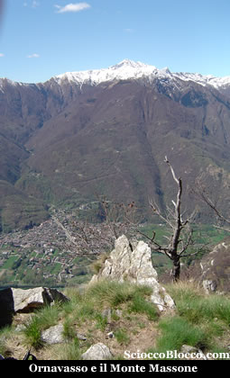

Lasciata la macchina poco prima dell'Alpe
Cortevecchio in breve si raggiunge il Rifugio Gravellona  (1518m) ( 23 posti letto, per informazioni rivolgersi al CAI di Gravellona Toce 0323/861264 ).

Da qui un evidente sentiero, che è poi segue la vecchia strada
militare Cadorna, raggiunge La
Bocchetta (1904m)(1h).

Questa bocchetta è il punto di contatto tra Val
d'Ossola e                      Val Strona.

Proseguire sul Sentiero
Cadorna, sino al punto dove il sentiero si dirama in due (2h).

Quello di destra porta all'Eyehorn.

Quello di sinistra,  raggiunge  la vetta del Monte
Massone (2161m)(3h).

La cima del Monte Massone
è sormontata da una croce in ferro con una campana (e non squadra
e compasso come ci si potrebbe aspettare).

Il Monte Massone è una cima molto conosciuta e frequentata nella zona.

È considerato uno dei più privilegiati osservatori
naturali delle Alpi.

Il panorama è a 360° .

Si possono vedere il Monte
Rosa,
il Mischabel,
la Weissmiess,
il Monte Leone, l'Adamello e il Bernina, la Pianura Padana e cinque laghi.

Da qui il ritorno avviene per lo stesso sentiero percorso
all’andata.

Volendo, a La Bocchetta prendendo a destra, con sentiero a tratti poco evidente in 30 minuti si raggiunge
l'Eyehorn (2131).

Da qui, verso
ovest, in cresta raggiungiamo il Massone in circa 20 minuti.

Per poi tornare, per un sentiero ben segnalato direttamente alla Bocchetta, e da qui di nuovo all'Alpe Cortevecchio.

Giretto poco impegnativo che però ci porta comunque
su una delle cime più alte nelle vicinanze e a visitare
il Santuario del Boden.

Un
ringraziamento speciale per la recensione a :

Daja

