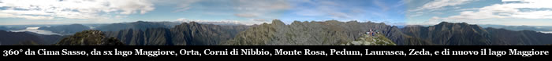

Questa escursione segue fino all’Alpe Prà lo
stesso percorso dell’escursione Cicogna-Alpe
Prà-Pogallo-Cicogna, che si trova in
questa sezione.

Nella piazzetta di Cicogna
( 732 m ), dove lasceremo la macchina nei pressi
del circolo ( berremo la nostra bella birra al ritorno),
proprio dietro la fontana ( fate scorta di acqua perché
poi scarseggierà), parte il sentiero con indicazioni
ben chiare per la nostra prima meta cioè Alpe
Prà ( Alpino ).

Il sentiero parte subito con buona pendenza snodandosi all'interno
di un bosco di latifoglie, tutto il percorso è punteggiato
da ben 20 cippi che indicano la strada e da otto bacheche
e quattro leggii che con immagini e brevi testi descrivono
alcune caratteristiche del luogo.

Affrontando con ritmo regolare la impegnativa salita, circa
a metà del percorso per l'Alpe
Prà ( Alpino ) si esce dal bosco,
si impone una sosta per riprendere fiato e per ammirare
la vista che si apre sotto di noi sulla valle sul fiume
e sui due laghi Maggiore
e Orta.

Il sentiero continua in salita ma allo scoperto e in giornate
di sole estivo il caldo accentuerà non poco le difficoltà
dell'ascesa.

Arrivati in un tratto dove al nostro fianco vedremo fare
la loro comparsa le felci, alzando gli occhi vedremo sopra
di noi l'Alpe Prà
e il rifugio dell'Alpino,
quì sulla sinistra del sentiero nei pressi di un
ciliegio vi è una famosa roccia coppellata, una roccia
piatta con la punta rivolta alla valle e al lago.

Le coppelle
sono cavità di varie dimensioni, eseguite su una
roccia in quantità e con disposizioni variabili.

Presenti in tutto il mondo, per alcuni studiosi potrebbero
essere collegate a luoghi di culto e di tradizione preistorica.

La stessa chiesa sin dai primi secoli dell'era cristiana
condannò coloro che veneravano certe rocce in luoghi
selvaggi e nascosti in fondo ai boschi, pietre oggetto di
falsità diaboliche e sulle quali si depositavano
ex-voto, candele accese e altre offerte.

Molte le ipotesi sul significato dei massi coppellati, tra
le quali che fossero rappresentazione di costellazioni,
mappe del territorio o massi altare per sacrifici.

Riprendiamo il sentiero e con un ultimo sforzo eccoci all'Alpe
Prà ( 1290 m ) conosciuta soprattutto
per la "Casa dell'Alpino",
rifugio aperto solo saltuariamente e di proprietà
dell'Associazione Nazionale Alpini.

Ci troviamo ad uno degli accessi più suggestivi ai
monti ed agli alpeggi della Val
Grande e della Val
Pogallo, con itinerari di vario impegno
e grande fascino.

Una sosta sulla balconata naturale del rifugio per ammirare
di nuovo sotto di noi la valle di Cicogna
e i laghi Maggiore
e Orta
è d'obbligo, ruotando lo sguardo di 90° verso
destra potremo vedere i bellissimi
Corni di Nibbio e dietro sullo
sfondo il Monte Rosa.

Ripartiamo attraversando il faggeto (e non il felciaio!!!),
qualche minuto dopo sulla destra incontriamo l'intaglio
nella roccia che ci porta in Val
Pogallo arriviamo, scendendo un poco,
all'Alpe Leciuri .

A questo punto torniamo indietro (pardon, mi sono sbagliato)
ed invece di scendere alle baite dell'alpe pieghiamo a sinistra
salendo nel bosco e sulla dorsale spartiacque tra Val
Grande e Val
Pogallo, un po' su un lato, un po'
sull'altro.

Si arriva ai macereti e alla Colma
Di Belmello (1589m).

Da qui il sentiero è un po ostico, procedendo a vista
verso la cima, ed è quindi meglio avere un po' di
allenamento.

Ecco Cima Sasso
(1916m).

Abbiamo
davanti a noi il dirupato versante sud del Pedum,
che è forse la montagna più imponente della
valle.

Pedum
che visto dalla valle ricorda (mah...) un "cammeo"
con le sembianze di testa umana (Napoleone secondo alcuni,
il Duce secondo altri).

Dalla
cima la vista è veramente gratificante, perchè
lo sguardo spazia a 360° sulla provincia del VCO,
sulla sponda lombarda del lago
Maggiore con i laghi
di Varese e Monate a sud, sul
lago d'Orta e il massiccio del Monte Rosa
a ovest, sull'Ossola
e i numerosi 4000m del Canton
Vallese a nord, e ancora sul lago
Maggiore e il Canton
Ticino a est.

Da qui il ritorno a Cicogna
avviene per lo stesso percorso fatto all’andata.

Uno
speciale grazie per la recensione e la simpatia a Daja.

Ultima escursione 26/09/2004 con gli amici del C.A.I.
Vigezzo.

