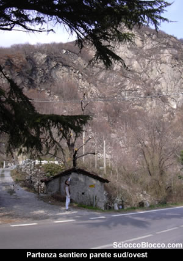
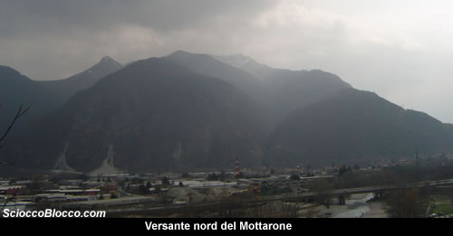
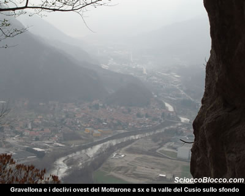
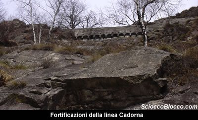
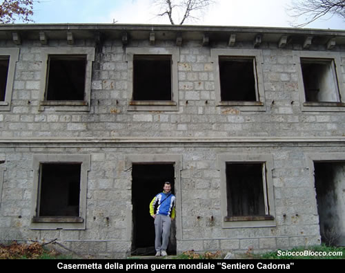
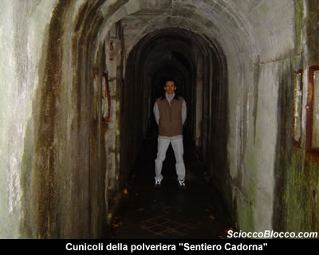
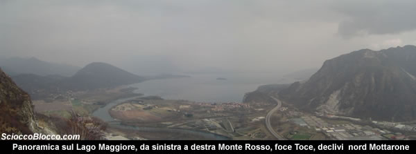
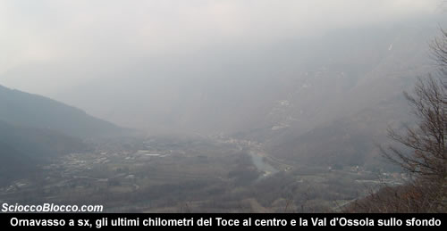

Il percorso
che andiamo ad affrontare è facile e relativamente
breve e permette anche di essere effettuato con bambini
al seguito.

Lasciata la macchina in uno slargo sulla sinistra poche
centinaia di metri dopo la curva a gomito che indica l’inizio
del sentiero in modo tale che si trovi a circa metà
strada tra la partenza e il punto di ritorno, partiamo per
la nostra gita.

Oggi io e l’amico Bilbo, non siamo stati molto fortunati
la giornata è nuvolosa e il sole fa capolino timidamente
con molta parsimonia.

Senza scoraggiarci imbocchiamo il sentiero, ben segnalato,
recentemente restaurato dal CAI di Omegna al quale va il
nostro plauso.

Subito vediamo la cava di marmo ancora attiva sulla nostra
sinistra.

Infatti, il **Mont’Orfano**
è un blocco granitico solitario, di circa 300 milioni
di anni, che è stato risparmiato dal ghiacciaio che
dall’Ossola scendendo verso Sud si è diviso
nei due rami che hanno formato il
**Lago Maggiore** e il **Lago
d’Orta**.

Il massiccio del **Mont’Orfano**
e quello del **Mottarone**
dovrebbe essere un corpo unico separato dalla piana alluvionale
del **Toce**.

Nel 1828 le cave del **Mont’Orfano** hanno fornito il
granito bianco, che ha formato le 84 colonne della basilica
di S.Paolo a Roma.

Dopo pochi minuti il sentiero mette in mostra ancora ben
conservati i muri a secco dell’antica via militare,
mentre sotto di noi si apre la piana del **Toce**.

Per un centinaio di metri il sentiero sale a mezza costa
poi, inizia ad arrampicarsi in tornanti stretti e a sbalzo
sul vallone.

Passiamo dopo circa 15min due ponticelli in legno e sempre
in rapida ascesa dopo 20/25 min il sentiero, sotto un imponente
parete, svolta a destra all’interno di una grossa
grotta, dove è posta una cappelletta votiva, e si
trova anche una sorgente.

Qui una sosta per la vista sulla piana del **Toce**,
**Gravellona**
e il **Cusio**
è d’obbligo.

Riprendiamo l’ascesa, alzando lo sguardo si vedono
le fortificazioni che dominano dall’alto il sentiero,
dopo circa 45/55 min dalla partenza, arriviamo a un bivio
ben segnalato.

Seguiamo il sentiero che diventa pianeggiante sulla destra,
in un minuto eccoci di fronte a una casermetta
ben conservata della prima guerra mondiale.

Questo percorso ripercorre le antiche vie militari , volute
dal **Generale Cadorna**,
durante il periodo della prima grande guerra, meraviglie
di architettura, costruite con la pietra della montagna
, il granito bianco, si incontrano oltre alla mulattiera
che in due punti entra in due distinte grotte naturali,
casermette adibite a ricoveri, depositi di munizioni, prese
di acqua, posti di sentinella e trincee.

Un po’ nascosto sulla destra della casermetta, vi
è l’ingresso del deposito polveriera,
scavato nella roccia, con tante stanze, si consiglia di
portarsi una torcia per esplorarlo, infatti alla fine del
corridoio superato un muretto e una scaletta si sbuca in
un piazzale che era adibito a poligono di tiro.

Per chi ha meno spirito d’avventura, sarà sufficiente
tornare al bivio e salire pochi metri, superando la punta
della balconata naturale ( tenete la destra) e in un paio
di minuti eccoci al poligono.

Tornati indietro al largo piazzale prendiamo il sentiero
che salendo si trova sulla sinistra.

Verso la vetta, la mulattiera sale dolcemente perché
serviva ad aiutare l’ascesa dei muli con l’artiglieria,
in circa 30/35 min siamo in cima.

Anche qui vi sono un paio di trincee e il panorama sul **Lago
Maggiore**, le **isole**,
la foce del **Toce**,
il **Mottarone**,
il **Monte Massone**,
il **Cusio**,
la **Val d’Ossola**
è straordinario.

Al ritorno scendiamo fino al bivio dove si trova la casermetta
( 30 min ) e invece di andare a sinistra da dove siamo saliti
prendiamo a destra, tra boschi di castagno, una larga strada
con opere di riparo e deviazione dell’acqua, in altri
25 min ci conduce a un bivio.

E’ consigliabile prendere a sinistra.

Siamo sul versante nord-ovest e la vista si apre su **Ornavasso**
e la **Val d’Ossola**.

Verso la fine del sentiero incontreremo un paio di casermette,
e in circa 20/25 min dal bivio eccoci tornati sulla carrabile
tra **Gravellona**
e **Mergozzo**,
in località **Prato
Michelaccio** a pochi metri dall’auto,
che se avete seguito i nostri consigli iniziali sarà
alla vostra sinistra.

Abbiamo terminato un facile giro nella storia locale, per
chi volesse affrontarlo con ancora più tranquillità
ad esempio con bambini è consigliabile affrontarlo
dal sentiero da noi percorso al ritorno.

