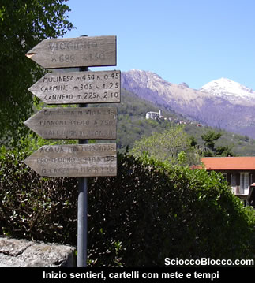
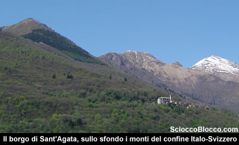
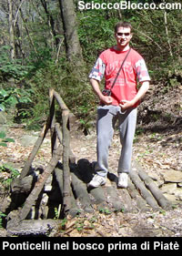
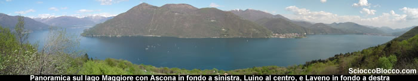
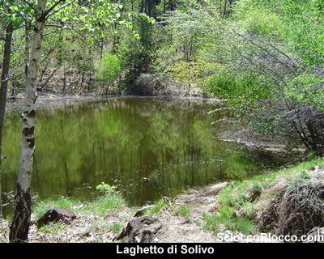

Qui a **Cannobio** (220m), all'imbocco della provinciale per la **Val Cannobina**, pochi metri più avanti del parcheggio, sulla sinistra parte una stradina asfaltata, con chiare indicazioni per i sentieri, che si inoltra tra le case costruite sui pendii finali del Monte Carza.

Oggi è una fantastica giornata di primavera, il sole risplende alto e il termometro supera ormai i 20° C, quale miglior viatico per questa facile escursione che ci porterà a vedere un simpatico laghetto molto poco conosciuto, ma così a portata di mano.

Partiamo, subito si presenta un bivio prendiamo la strada che sale a sinistra con buona pendenza e poche decine di metri dopo superata una cappelletta eccoci ad un altro bivio con cartelli indicatori, a sinistra per Viggiona e a destra per Acque Minerale-Pro Redond-Monte Carza.

Prendiamo a destra la strada che conduce ai **Casali Bagnara**, passate le ultime case, finisce l'asfalto e, stretto da un muretto di cemento inizia il sentiero.

Sulla nostra destra sul versante opposto, che con quello percorso da noi forma l'inizio della **Val Cannobina**, possiamo vedere il bel paesino di **Sant'Agata**.

Ci si immerge immediatamente in un bosco di castagni, si sale in discreta pendenza su un sentiero ricoperto dalle foglie in tutte le stagioni, e in poco tempo circa 15'/20' dalla partenza, dopo aver superato due caratteristici ponticelli in legno, raggiungiamo località **Piatè** (345m).

Qui si svolta a sinistra, e lasciati sulla nostra destra un paio di malmesse baite, continuiamo la nostra salita tra due canali in sasso per l'acqua e muretti a secco.

Il terreno si fa un po' più difficoltoso per la presenza molte pietre, e per un leggero aumento della pendenza, ma proseguiamo senza troppe difficoltà e dopo ancora un breve tratto ripido, sbuchiamo sulla strada sterrata.

Saliamo ora comodamente sulla larga strada per 100/150 m, nei pressi di un tornante che svolta a destra, proprio a meta curva sulla sinistra esce una leggera traccia che porta ad una breve scaletta in legno, ben visibile anche dalla strada.

Facciamo questa brevissima deviazione e non ve ne pentirete, saliamo sul promontorio oltre la scaletta e davanti a noi apparirà uno spettacolo mozzafiato che ripagherà mille volte questa divagazione.

Il **Lago Maggiore** nella sua maestosità occupa lo sguardo, da sinistra a destra **Brissago**, **Ascona**, i monti svizzeri, **Luino**, i monti lombardi con il **Cuvignone** e **Campo dei Fiori** e **Laveno**.

Tornati su i nostri passi, riprendiamo la salita e poche decine di metri dopo vedremo una strada che entra nel bosco sulla destra, imbocchiamola e noteremo anche i cartelli indicatori dei sentieri e della nostra meta ( i cartelli sarebbero più utili al bivio !!! ).

Superato un piccolissimo dosso, il sentiero scende piegando a sinistra in una evidente depressione naturale, facendoci ritrovare sulle sponde del **laghetto di Solivo** (494m, 30'/40' dalla partenza), contornato da castagni, salici e betulle, possiamo aggirarlo completamente in pochissimi minuti.

Questo laghetto, che nel periodo invernale resta spesso ghiacciato per la sua posizione a nord del versante del Monte Carza, è un raro caso che non si è trasformato in torbiera o stagno, ma ha mantenuto la sua natura originaria di lago che si è formato sui medi versanti dall' immensa escavazione del ghiacciaio cha ha formato il lago Maggiore, infatti ha conservato una buona profondità e quantità d'acqua dove si sviluppano molte forme di vita acquatica.

Volendo si può, tornando sulla strada, salire per raggiungere una sorgente di acqua minerale ferruginosa, che si trova in una valletta alle spalle di una larga radura con alcune baite, aggiungendo altri 15'/20' alla nostra gita.

Il ritorno è affrontato sullo stesso percorso dell'andata e ci ricondurrà a **Cannobio** dopo circa 1:00h/1.30h dalla partenza.

Abbiamo completato un facile giro a pochi minuti da i maggiori centri abitati del VCO, sconosciuto ai più ma che regala splendidi scorci e soprattutto alla portata di tutti, bambini compresi.
