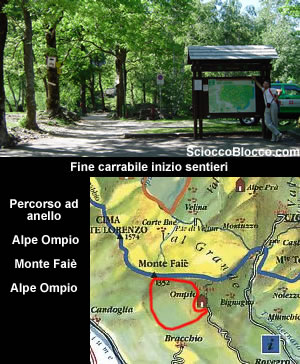
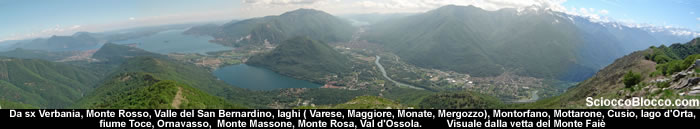
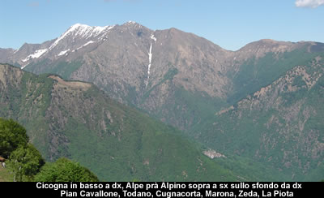
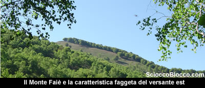

Il **Monte Faiè**, è uno dei più bei punti panoramici nonchè facilmente raggiungibili tra **Ossola** e **Verbano**. L'esposizione verso sud, la quota non elevata, e il comodo accesso ne fanno una meta usufruibile quasi tutto l'anno. Lasciata la macchina alla fine della carrabile, parte un largo sentiero (960m) al fianco del consueto cartello del Parco Nazionale **Val Grande**.

In parte sterrata e in parte pavimentata con ciottoli, la strada agricola sale rapidamente al margine di un bosco, alla nostra destra possiamo già scorgere ben delineate le creste che dividono la **Val Pogallo** dalla **Vall'Intrasca** e **Val Cannobina**, in breve (10 minuti) siamo all'**Ape Ompio** (990m).

L'**Alpe Ompio**, caratterizzato per il rifugio gestito A. Fantoli del CAI Pallanza (per informazioni tel. 330/206003), è costituito da un buon numero di baite ancora ben conservate. Qui potremmo rifocillarci al ritorno. Proprio dietro il rifugio parte il sentiero per la nostra meta, attraversa subito un gruppo di case in fantastica posizione panoramica sul lago, quindi riprende a salire diagonalmente immersi tra i castagni, raggiungendo in poco tempo (20/30 min) una sella (con una grande croce sulla destra) sul costolone che divide **Ompio** dalla **Val Grande**. Qui il sentiero si divide, dritti si va a **Corte Bue**, noi svoltiamo a sinistra e iniziamo a salire nella faggeta. Dove il pendio si alza sotto i piedi, il percorso sempre ben segnalato dai colori bianco-rosso del CAI, e da cippi e leggii, diventa più impegnativo. Seguendo tracce tra bosco e terreno aperto guadagnamo la vetta del **Monte Faiè**(1352m) ( 1h/1.15h).

Lo spettacolo che si presenta agli occhi nessuna foto potrà mai rendere appieno, ai nostri piedi il **Lago di Mergozzo**, l'**estuario del Toce** che sfocia nel **Lago Maggiore** con le sue **isole**, sulla sinistra **Verbania** e il **Monte Rosso** sullo sfondo la **costa lombarda** e i **Laghi di Varese** e **Monate**, al centro il monolite del **Montorfano** e dietro il **Mottarone**, sotto il quale si apre la **Valle del Cusio** con il **Lago d'Orta** che ne delimita l'orizzonte. Ancora verso destra i monti dei **Tre Gobbi** del **Quaggione** e il **Monte Massone** con ai suoi piedi **Ornavasso**, quindi l'inizio della **Val d'Ossola** con il **Massiccio del Monte Rosa** a dominare tutti dall'alto. Altissimo il livello di soddisfazione paesaggistica e ambientale. Questo è il punto di incontro tra **Verbano**-**Cusio** e **Ossola.** Verso nord corre scoscesa e dirupata la cresta dei **Corni di Nibbio** con i suoi picchi di **Cima Corte Lorenzo** e del **Lesino**, di cui il **Monte Faiè** è il picco terminale. Questa catena separa la **Val d'Ossola** a ovest dalla **Val Grande** a est, e anche due mondi quello degli uomini da quello della natura. Qui dalla vetta si legge facilmente la storia geologica della zona con il granitico **Montorfano** (banale da qui intuirne l'origine del nome) risparmiato dal ghiacciaio sceso da nord a formare il **Lago Maggiore** e **Orta**, e la piana sedimentaria del **Toce** che nei secoli ha diviso anche il **Lago di Mergozzo** dal Maggiore del quale era parte terminale del **golfo Borromeo**. Il cippo che troviamo in vetta, testimonia una antica storia, infatti indica il confine della concessione del versante ovest alla **"Veneranda Fabbrica del Duomo di Milano"** che tutt oggi provvede al restauro del Duomo. Concessione risalente al 1387 quando **Gian Galeazzo Visconti** *Conte di Virtù* avviò la costruzione del Duomo sfruttando il marmo di **Candoglia**. La concessione prevedeva l'estrazione del marmo e il taglio del legname necessario alle opere di trasporto, infatti con il legno della **Val Grande** venivano costruite la chiatte che trasportavano via **Lago Maggiore**, **Ticino** e **Naviglio Grande** il Marmo a **Milano**. L'astuto Conte aveva istituito una sigla che non pagava dazio ai vari passaggi, la sigla era A.U.F (*ad usum fabbrice*), e venne apposta su tutti i blocchi di marmo, tanto che ancora oggi nell'uso comune degli abitanti della zona si suole dire "mangiare auf" o "lavorare auf" ovvero gratis. Dopo questo tuffo nella storia, prendiamo la strada del ritorno che potrà essere la stessa dell'andata se volete, noi per fare un giro ad anello scegliamo di scendere verso sud sulla dorsale che guarda la **Val d'Ossola** e proprio sotto di noi **Mergozzo**. Il sentiero qui segnalato con vernice gialla ma meno evidente di quello dell'andata, scende velocemente tra prati aperti, fatte alcune decine di metri di dislivello volgiamo lo sguardo sinistra (est), nitida si staglia la cresta della **Zeda** e sotto **Cicogna**.

Possiamo infatti vedere giù in basso a destra **Cicogna** capitale della **Val Grande**, e sopra a sinistra i prati dell'**Alpe Prà (Alpino)**, e sullo sfondo da sinistra **La Piota**, **Monte Zeda**, **Pizzo Marona**, **Cugnacorta**,  **Todano**, **Pian Cavallone**. Proseguiamo la discesa entrando in un bosco (1.15h/1.30h dalla partenza) il sentiero piega a sinistra la vegetazione diventa fitta, quando il bosco inizia a diradarsi e sulla destra ricompare in parte la **piana del Toce**, proprio sul sentiero ci fa ostacolo una grossa betulla con il segnavia giallo (1,30h/1,45h dalla partenza). Pieghiamo a sinistra, e noteremo dei vecchi muri a secco, qui il bosco si dirada e guardando a sinistra in una piccola radura di pioppi ecco lassù il **Monte Faiè** appena lasciato.

Da qui si può ammirare la faggeta da cui appunto *Faiè*, che ricopre il versante est e che abbiamo attraversato all'andata, mentre il resto del monte è formato da prati aperti. Mentre sotto di noi davanti al sentiero riappare l'**Alpe Ompio** e il **Rifugio**.

Scendiamo tra i pioppi ad intersecare un altro sentiero, a sinistra torniamo all'**Alpe Ompio**, noi andiamo a destra e subito dopo scendiamo nel bosco a sinistra il sentiero con una larga curva ci riporta sulla strada agricola percorsa alla partenza. Verso sinistra si risale al rifugio a destra in pochi minuti superata la fontana torniamo sulla carrabile dove ci attende la macchina (2h/2.30h dalla partenza). Abbiamo completato una facile escursione sulle montagne della predera, dal nome delle cave di marmo, ma di grande appagamento panoramico e storico.
