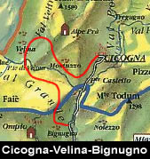

Giornata
che sembra dover rovesciare pioggia da un momento all'altro,
ma che premia il coraggio del cospicuo gruppo di partecipanti
a sorpresa.

Quindi grazie agli iscritti del forum, Daja, Bilbo, Msthic,
Shaggy, 40Passati, Du demon, Jimbotre, e Dr. Sublime e ai
loro amici che speriamo presto diventino nostri iscritti.

Abbiamo scelto un giro a ferro di cavallo da
**Cicogna** a **Bignugno**
con obbiettivo centrale **Velina**
e il suo **ponte**,
quindi è consigliabile lasciare una o due macchine
sulla strada asfaltata proprio nei pressi di **Bignugno** (chiare
indicazioni) poco prima della galleria e di **Ponte Casletto**,
che all'arrivo ci consentiranno di recuperare quelle lasciate
a **Cicogna** all'andata.

Qui a **Cicogna**(732m),
al fianco del Cimitero parte una strada gippabile che ci
conduce al nostro sentiero.

La
gippabile, in falsopiano passa subito sotto i prati dell'alpeggio
di **Merina**
(sopra a destra), e in breve supera il nucleo di **Cascè**
(sotto a sinistra) costituito da un gruppo di baite di recente
ristrutturazione, dopo circa 15min la sterrata finisce in
un piazzale adibito anche a eliporto e un cartello chiaro
e ben visibile segnala il nostro sentiero.

Il sentiero scende e si immerge in un bosco per piegare
subito a destra (nord) verso la **Val
Grande**, dopo 25min su un piccolo promontorio
il sentiero risbuca per un attimo dal bosco, facendoci assaporare
immediatamente la wilderness della **Val
Grande** che si apre di fronte a noi e alcuni
alpeggi sul versante opposto, quello del **Faiè**
che percorreremo al ritorno.

La
traccia, tra le insenature della montagna, scende di quota
fino a raggiungere il **"Torc
del Runchett"** meglio noto come il **Torchio
i Montuzzo**.

Dove veniva spremuta l'uva americana che cresceva tra gli
alpeggi della zona e che dava un vino assai grezzo ma apprezzato
dai muntagnin.

Poco dopo circa 40/50 min dalla partenza eccoci a **Montuzzo**(630m),
antico corte maggenale di **Cossogno**
piuttosto grosso che fino agli anni '50 tempo dell'abbandono
era secondo come presenze solo a **Pogallo**.

Usciamo
dal corte e teniamo il sentiero che sale a destra, sempre
ben segnalato dai colori bianco-rosso del CAI, passiamo **Crosane,**
e iniziamo a risalire
di quota fino a raggiungere **Uccigiola**(749m)
(1h/1.15h) dove i resti delle baite sono quasi totalmente
sommerse dalla vegetazione, sopra vi sono i resti dell'Alpe
Vota.

Qui dopo una costa, si inizia a scendere rapidamente, il
sentiero
manca in parte perchè franato tempo fa, e ci si aiuta
nella discesa con l'ausilio di catene ancorate alla roccia,
fino a raggiungere il guado del **Rio
Velina**(1.30h/1.40h).

Passaggio non difficile ma che richiede un minimo di attenzione,
anche se qualcuno accentua le difficoltà tecniche
!!!

Superato
il guado riprendiamo a salire, superiamo una fontana e quindi
**Baserga** poi in piano in pochi minuti eccoci
a **Velina di sotto**(660m)
(1.50h/2h) .

**Velina** è
formata da tre corti Curt fund, Curt mezz
e Curt dzura (sotto, mezzo, sopra) distribuiti
tra i 660m e gli 834m sulla cresta che scende da **Cima
Tuss**.

E' storicamente alpeggio della comunità di **Rovegro**,
anche se in territorio di **Cossogno**,
e questo nei secoli passati è stato causa di lunghissime
faide.

Anch'esso corte maggenale **Velina**
aveva tra le sue ricchezze le castagne che venivano lavorate
in ogni modo, popolato e vivissimo alpeggio iniziò
la sua decadenza nel dopoguerra, per essere abbandonato
dall'ultima famiglia nel 1977.

A tal proposito scrive il **Chiovini**:

"Per sopravvivere,
le risposte dei subalterni della montagna furono quelle
conosciute: l'abbandono della terra, l'emigrazione. E la
vita dei villaggi di montagna fu quasi interamente appannaggio
degli anziani che non volevano o non potevano staccarsene.
...Anno dopo anno, una famiglia dopo l'altra si liberava
di parte del bestiame bovino o anche di tutto, e in primavera
non risaliva più a caricare i corti. Oggi ciò
che rimane dei corti di **Velina**, sta lentamente, più
lentamente di una nave che affonda, ma inesorabilmente scomparendo,
inghiottito dal bosco spontaneo che ha invaso i già
fiorenti prati e che un giorno sommergerà tutto,
anche l'ultima casera."

Anche se purtroppo **Nino
Chiovini** ha ragione nella sua analisi storica,
un uomo da qualche anno ha scelto di vivere proprio a **Velina**
isolato dal mondo, è conosciuto come Gianfry,
e con la sua scelta impedisce che le previsioni del grande
storico verbanese si realizzino, per il momento, fino in
fondo.

Riprendiamo il sentiero che passa
proprio sotto l'alpeggio, secchi e ripidi tornanti scendono
veloci verso il fiume portandoci in breve
al mitico  **Ponte Velina**(2.15h/2.30h).

Questo **ponte** permette l'attraversamento del **Rio
Valgrande** tra il versante
di  **Cicogna**
territorio di **Cossogno**
e il versante di **Rovegro**
sotto le creste del **Faiè**
e dei **Corni di Nibbio**.

Punto di confine tra la bassa e l'alta **Val
Grande**, questo **ponte** è
stato teatro di scontri durante la seconda guerra mondiale
tra partigiani e tedeschi, e nel leggendario e drammatico
rastrellamento del giugno '44 i partigiani, su ordine di
**Dionigi Superti**
comandante del battaglione "Valdossola",
lo fecero saltare per rallentare l'avanzata nemica.

Tutto però fu quasi inutile perchè alla fine
del rastrellamento dei circa 300 partigiani ne sopravvissero
solo poche decine.

Qui
prendiamo il sentiero che sale svoltando a sinistra, quello
sulla destra è il sentiero che seguendo il **Rio
Valgrande** si inoltra nella valle portando
a Orfalecchio.

Poco dopo seguiamo quello che sale a destra, perchè
quello che si inoltra dritto in piano conduce a **ponte** Casletto
tra pericoli elevati.

Iniziamo gradatamente a prendere quota, tornando verso sud
ma seguendo le forre della montagna che scaricano i ruscelli
che ci costringono spesso a puntare per qualche decina di
metri verso nord.

Così in questo lungo avanti e indietro tra le rughe
montane, ammiriamo il tortuoso e stretto corso del **Rio
Val grande** che pochi chilometri più
a valle si unisce al **Rio Pogallo**
formando nei pressi di **Ponte
Casletto** il **torrente
San Bernardino**,
passiamo quindi alcune diroccate casere
avvolte dal bosco, poi raggiungiamo **l'Alpe
Bettina**(700m) (3.30h/3.45h) formata da baite
ancora in buone condizioni.

Quindi riprendiamo a scendere e in breve raggiungiamo **Or
Vergugn**(4h/4.15h) caratterizzato da una
cappelletta e da un belvedere sulla valle e il **Lago
Maggiore**.

Notiamo anche gli indicatori per il sentiero che porta all'**Alpe
Ompio**.

Ormai il più è fatto, il sentiero diventa
un ampia mulattiera e in breve ci porta a **Bignugno**(560m),
tappa finale della nostra escursione, e formato
da numerose baite di recente ristrutturazione, proprio pochi
metri sopra la carrabile dove abbiamo lasciato almeno un
auto all'andata(4.30h/5.00h).

Giro impegnativo più che altro per la lunghezza,
che porta ad assaporare la natura tornata padrona del territorio,
lontano da rumori e dalla vista di tutto ciò che
è modernità.

