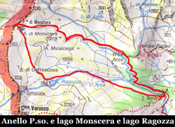
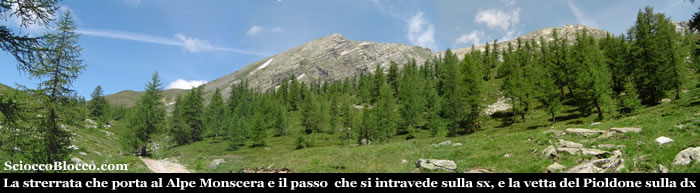
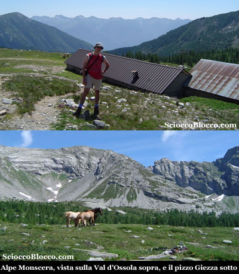
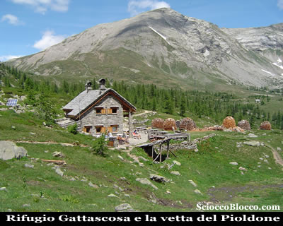
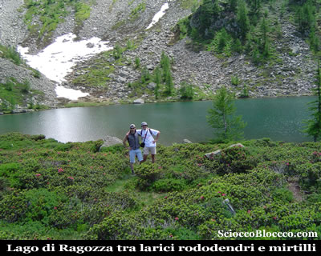

Qui all'Alpe San Bernardo
(1628m) uscendo dal parcheggio
sterrato, ignoriamo il sentiero che sale a sinistra
e che percorreremo al ritorno, e scendiamo a destra
alcune decine di metri dove al bivio troveremo chiare
indicazioni per la nostra prima meta.

Infatti,
svoltando a sinistra seguiamo il sentiero indicato con
la sigla (D8) e i colori rosso-giallo-rosso,
per il Passo Monscera.

Questa ampia strada sterrata in breve scende a superare
un ponte sul torrente
Rasiga (10min), per poi
tornare asfaltata e inerpicarsi in ripidi tornanti in
un bosco di abeti rossi.

Dopo circa 20/25min dalla partenza incontriamo la deviazione
per l'Alpe Paione, noi continuiamo sulla strada
principale, attraversiamo il torrente che scende
dal Lago di Agro che dopo circa 30/35min diventa
di nuovo sterrata ma gippabile proprio in prossimità
dell'uscita dal bosco.

Davanti
a noi si apre una mirabile vista, sul Passo
Monscera che si annuncia a sinistra,
e la cima del Pizzo Pioltone
lassù di fronte.

Attraversiamo ancora un piccolo ruscello, e valicato
un dosso eccoci all'Alpe
Monscera (1971m), 50/60min.

Qui
all'Alpe Monscera
possiamo comprare i tipici prodotti d'alpeggio e ammirare
splendidi cavalli che girano liberamente nell'ampio
pianoro tra una nutrita colonia bovina, e voltandoci
nella direzione dalla quale siamo appena arrivati spaziare
con lo sguardo sulle creste della Val
Bognanco che vanno a confluire giù
nella  Val d'Ossola
delimitata frontalmente dalle cime della Val
Grande.

Proseguiamo seguendo la strada gippabile che poco sopra
l'Alpe diventa un comodo sentiero che sale dolcemente
in una vasta sella pratosa, superata una breve salita
ecco pararsi di fronte a noi il Lago
di Monscera (2072m) e pochi metri sopra
l'omonimo Passo di Monscera
(2103m) 1.15h/1.30h dalla partenza.

Proprio
sotto la sella del Passo è posto il Lago
di Monscera,
collocato nel più
alto dei terrazzi naturali della valle glaciale del
Rio Rasiga,
questo laghetto occupa attualmente una superfice di
5600mq con una profondità massima di 4,5m, circondato
da bassa vegetazione perchè posto sul limite
altimetrico della vita arborea è comunque circondato
da rari larici e popolato da anfibi.

Alcuni resti di canalizzazioni testimoniano un passato
sfruttamento per l'irrigazione, oggi adibita solo a
pascolo.

Salendo pochi metri raggiungiamo il Passo
Monscera dove corre il
confine Italo-Svizzero
suggellato da un cippo di marmo, e di fronte a noi si
apre la vista sulle vette del Vallese
dominate da sinistra verso destra da
Weissmies(4023m), Lagginhorn(4010m) e Fletchhorn(3996m),
ricoperti dai ghiacci e che possiamo vedere nella foto
sullo sfondo a destra.

Iniziamo quindi il ritorno, costeggiando il lago sul
lato opposto all'arrivo, seguiamo ora gli indicatori
(D0) e i colori bianco-rosso-bianco, una
breve discesa ci porta su di una ampia strada sterrata
che seguiamo verso destra per raggiungere in breve (1.45h/2.00h)
il Rifugio Gattascosa
(1998m).

Il
Rifugio Gattascosa
dispone di 20 posti letto è gestito e può
essere un ottimo punto d'appoggio sia per mangiare nelle
gite di un giorno, sia per pernottare qualche giorno usandolo
come punto di partenza per il trekking dei laghi della Val
Bognanco.

Caratteristico il modo di accatastare la legna tagliata
in piccoli pezzi a forma di panettone che ricorda le vecchie
carbonaie.

Ammiriamo ancora il profilo del Pizzo
Pioltone che ci sovrasta, e dopo esserci
rifocillati ripartiamo con il sentiero che scende proprio
sotto il rifugio.

Affrontiamo una brevissima e ripida salita e sbuchiamo di
fronte ad una conca che ospita in uno scenario fantastico
il Lago di Ragozza
(1958m) (1.50h/2.05h).

Scendiamo
brevemente al Lago di Ragozza,
possiamo notare l'immensa frana scesa dalla Cima
di Verrosso, che ha occluso
l'uscita del lago che formava il bacino sottostante oggi
solo torbiera.

Questo lago immerso in un ambiente stupendo, ha una superficie
di 10.000mq e una profondità di 3,5m, è circondato
da larici e da una infinità di rododendri e cespugli
di mirtilli.

Posto mozzafiato che può essere scelto come luogo
di sosta in sostituzione al vicinissimo rifugio.

Passato il lago il sentiero scende in ripidi tornanti tra
un rado boschetto per poi approdare in breve in una vasta
piana, che ci accorgeremo presto essere solcata da numerosi
rigagnoli.

E' questa la Torbiera di Gattascosa
(1831m) (2.10h/2.25h).

Attraversata la torbiera ci si rinfila in un bel bosco,
dove il sentiero riprende a scendere, per confluire più
in basso su di una larga strada sterrata, proprio qui troviamo
una biforcazione, se seguiamo la strada che sale in pochi
minuti raggiungiamo il piccolo Lago
d'Arza (1742m), di 1500mq e una cinquantina
di centimetri di profondità, circondato da torbiere.

Proseguendo invece in discesa in breve raggiungiamo di nuovo
l'Alpe San Bernardo
(3.00h/3.30h) proprio nei pressi del parcheggio dal quale
siamo partiti.

Abbiamo così concluso un giro di medio-facile difficoltà
in questa magnifica valle, molto aperta che regala scorci
notevoli e una flora e fauna belle ed intense.

Molte altre sono le possibili escursioni che dispone la
Val Bognanco con i suoi più di 20 laghi alpini.

