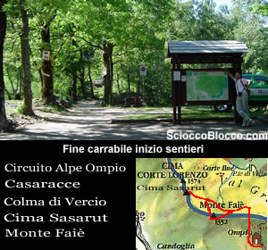
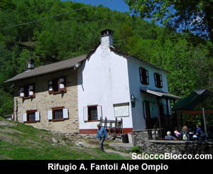
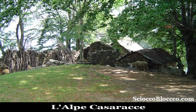
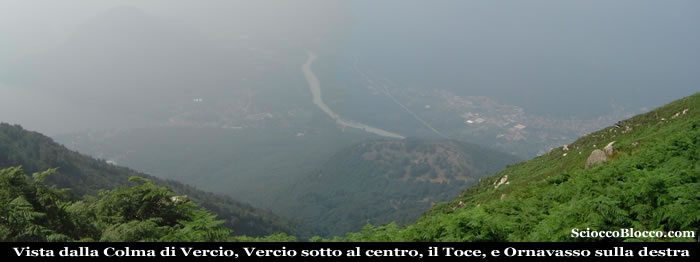
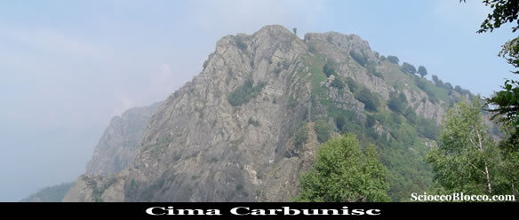
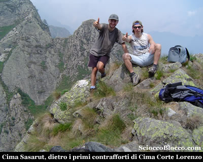
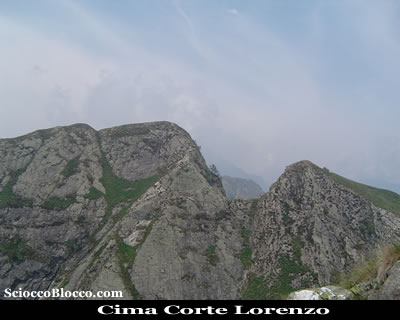

Questa
recensione ricalca nella prima parte quella al Monte
Faiè che trovate in questa sezione (recensione
Monte Faiè).

Giornata torrida e con una bassa cappa di umidità
che preclude la mirabile vista che si gode dalle guglie
dei Corni di Nibbio.

Lasciata la macchina alla fine della carrabile, parte
un largo sentiero (960m) al fianco del consueto cartello
del Parco Nazionale Val Grande.

In
parte sterrata e in parte pavimentata con ciottoli,
la strada agricola sale rapidamente al margine di
un bosco, alla nostra destra possiamo già scorgere
ben delineate le creste che dividono la
Val Pogallo dalla
Vall'Intrasca e Val
Cannobina, in breve (10 minuti) siamo
all'Ape Ompio (990m).

L'Alpe
Ompio, caratterizzato per il rifugio
gestito A. Fantoli del CAI Pallanza (per informazioni
tel.
330/206003),
è costituito da un buon numero di baite ancora
ben conservate.

Qui potremmo rifocillarci al ritorno.

Proprio dietro il rifugio parte il sentiero per la
nostra meta, attraversa subito un gruppo di case in
fantastica posizione panoramica sul lago, quindi riprende
a salire diagonalmente immersi tra i castagni, raggiungendo
in poco tempo (20/30 min) una sella (con una grande
croce sulla destra) sul costolone che divide Ompio
dalla Val Grande.

Qui il sentiero si divide, dritti si va a Corte
Bue, noi svoltiamo a sinistra e iniziamo
a salire nella faggeta.

Dove il pendio si alza sotto i piedi, il percorso
sempre ben segnalato dai colori bianco-rosso del CAI,
e da cippi e leggii, diventa più impegnativo.

Seguendo tracce tra bosco e terreno aperto, circa
a tre quarti della ripida ascesa ci taglia orizzontalmente
la strada un sentiero dove è posizionata anche
una bacheca.

Imbocchiamolo quindi verso destra in piano, abbandonando
la salita che in breve ci porterebbe alla vetta del
Monte faiè, che raggiungeremo al ritorno su
altro sentiero.

Quindi in falsopiano sul versante della Val
Grande raggiungiamo l'Alpe
Casaracce 1247m (45/55min).

Questo
alpeggio è posto su di un dosso in fantastica
posizione panoramica su la Val
Grande che si apre da nord a sud sotto
di esso.

Lo sguardo può spaziare dal selvaggio
Pedum fino a Velina
e dietro sullo sfondo le creste che dividono la Val
Pogallo dalla Val
Cannobina con la
Zeda a farla da padrone.

Sopra le baite il sentiero prosegue sempre in falsopiano
addentrandosi nella valle, poi in facile ascesa tra
i faggi arriviamo alla Colma
di Vercio 1250m (1.15/1.30h).

D'ora
in poi
l'itinerario si è pienamente convertito in
(EE) e l'ascesa sia per ripidità che per passaggi
un poco scabrosi è tutt'altro che semplice.

Qui vi sono i resti della teleferica che scendeva
a Mergozzo,
lasciamo sulla destra il sentiero che scende a Corte
Buè e sulla sinistra quello
che scende a Vercio,
e saliamo sulla cresta di fronte a noi per poi di
nuovo in piano passare i resti della grande teleferica
che portava il legname da Orfalecchio
a Mergozzo.

Questo mastodontico impianto che è rimasto
attivo negli anni venti del secolo scorso, aveva una
capacità di 12q e 150 vagoni e permise una
vera e propria disboscazione dei boschi valgrandini.

Oggi pochi sono i resti di questi pesanti interventi,
mentre non esistono più i fitti reticoli dei
fil a sbalz che portavano dalle valli laterali
il legname alle stazioni della teleferica.

Da qui il percorso diventa impegnativo e richiede
attenzione, sempre sul versante valgrandino
ma facendo sporadicamente capolino sulla Val
d'Ossola da dove giungono i rumori
della vita che scorre a fondo valle, passiamo in leggera
salita alcuni picchi aggirandoli sul fianco.

Quindi saliamo tra rocce e scarso prato alla Cima
di Carbunisc (1.45/2.00h).

Da qui scendiamo su di uno stretto e ripidissimo sentiero
che però risulta meno impegnativo di quello
che appare, di fronte a noi abbiamo già la
Cima di Sasarut.

Giunti in pochi minuti all'attacco dell'ultima salita,
noteremo proprio di fronte noi sopra qualche metro
un segno giallo anche se un po sbiadito.

Qui, come d'altronde nella precedente, la salita necessita
l'uso della mani e di molta attenzione, ma con buono
sforzo e non molto tempo eccoci in vetta alla Cima
Sasarut 1490m (2.15/2.30h).

Il
nome di questa cima è dovuto alle caratteristiche
rocce scheggiate che ricoprono la vetta e che dal
toponimo dialettale discende Sasarut appunto
"Sassi Rotti".

Alle nostre spalle imponente ecco Cima
Corte Lorenzo, ultima vetta raggiungibile
dagli escursionisti che giungono da sud su i Corni
di Nibbio, che da qui sino al Lesino
devono lasciare il passo ai rocciatori.

I Corni di Nibbio
sono una catena montuosa che divide la
Val d'Ossola ovest dalla Val
Grande a est, sono montagne frequentate
raramente ma che anche per questo meritano grande
attenzione.

Gli ultimi tratti sono impegnativi e aerei, ma il
panorama è straordinario (per noi giornata
sfortunata), tutta la Val
Grande si apre ai nostri piedi, con
il Pedum
affascinate ad un passo, verso nord proseguono i Corni
di Nibbio sempre più arditi
sino al Lesino,
ad ovest la Val d'Ossola
e il Monte
Rosa così vicino e sovrano,
verso sud lo sguardo si apre sul
Lago Maggiore i laghi lombardi
e quello d'Orta.

Torniamo sui nostri passi prestando attenzione alla
discesa che è sempre più pericolosa
che la salita, e percorrendo lo stesso itinerario
torniamo fino alla Colma
di Vercio 1250m (3.15/3.30h).

Seguiamo il sentiero con il cartello per l'Alpe
Pianezze quindi il cartello per il
Monte Faiè
e proprio alla bocchetta noteremo che un sentiero,
segnavia bianco-rosso, si inerpica sulla cresta che
guarda giù verso Mergozzo.

Imbocchiamolo, lasciando sulla sinistra il sentiero
fatto all'andata che scende all'Alpe
Casaracce, con una
ripida salita in breve eccoci alla vetta del Monte
Faiè 1352m (3.45/4.00h).

Dove
se avete la fortuna di una giornata limpida potrete
godere di un panorama quasi pari a quello di Sasarut
e Corte Lorenzo
e del quale troverete come sopra detto una recensione
dedicata in questa sezione (recensione
Monte Faiè).

Infiliamoci nel sentiero che attraversa la faggieta
e pochi minuti più in basso troveremo il sentiero
percorso all'andata, continuiamo a scendere sino alla
bocchetta con la croce e il bivio per Corte
Buè prendiamo a destra ed in
breve eccoci all'Alpe
Ompio dove potremo ristorarci al rifugio.

Ancora qualche minuto sulla stradina ed eccoci di
nuovo sulla strada asfaltata nei pressi dell'auto
(4.30/5.00h).

Giro impegnativo sia per la lunghezza che per le difficoltà,
ma che regala grandi soddisfazioni.

