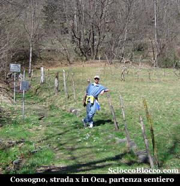
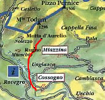
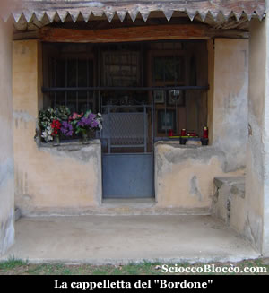
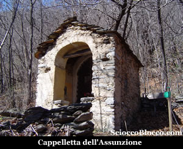
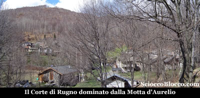
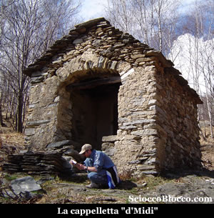
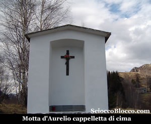
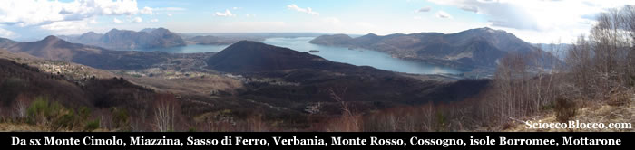

Qui a Cossogno (398m) pochi metri sotto la cappelletta presso la quale abbiamo parcheggiato, parte il sentiero segnalato dai colori bianco-rosso e dal n°7 della Comunità Montana Valgrande, per la nostra prima escursione stagionale.

La mulattiera per lunghi tratti rudemente pavimentata, si alza subito con buona pendenza all'interno di un bosco, raggiungendo rapidamente una bella casa con ponticello di recente ristrutturazione, e poco dopo una strada sterrata che sbuca di fronte ad una cappelletta, proprio nei pressi di un agriturismo (10/15min).

E' questa la cappelletta costruita da Pasquale Massera noto come il "Bordone" nel 1824, al ritorno a Cossogno dopo essere emigrato in Repubblica Ceca, dove pose un quadro con impressa la Madonna Nera del XVII sec.

Poi ritirato dopo il 1950 nella chiesa di Cossogno, da dove venne trafugato dai soliti ignoti.

Il nostro sentiero continua alla sinistra della cappelletta, salendo in modo regolare nel bosco in cui il castagno la fa da padrone.

Raggiungiamo così un'altra cappelletta (25/30min).

In questa piccola edicola è raffigurata l'Assunzione, siamo ad un vero e proprio incrocio, a sinistra si va a Miunchio, a destra ad Ungiasca, noi proseguiamo dritti nel bosco e poco più su ignoriamo una traccia che si inoltra a destra, per raggiungere in breve Rugno (741m) (40/45min).

Qui a Rugno, all'ingresso del vero e proprio paese che è diventato, con le sue numerosissime baite rifatte modernamente, superiamo il lavatoio comune e il minuscolo oratorio eretto in nome della Madonna del Buon Consiglio.

Possiamo vedere sul piccolo promontorio da dove si spazia già sul Lago Maggiore e su Verbania alcune coppelle su gli affioramenti rocciosi e la struttura per il falò che viene acceso ogni ultima domenica di luglio per la festa dell'alpeggio.

Addentriamoci nel corte e arriviamo alla piccola piazza con alcuni giochi, dove nei giorni di festa le voci dei bambini si inseguono tra gli stretti vicoli, riportando in vita questo antico insediamento.

Voltiamo a destra dove troveremo una fontana in sasso, qui sulla sinistra, cartello segnavia n°7 , riprende il sentiero.

Riprendiamo a salire immersi tra le betulle e superiamo un canale di recente costruzione e ritroviamo la mulattiera selciata.

Dopo poco incontriamo una cappelletta
(50/55min).

E' questa la cappelletta"d'Midi" (di Emidio), tutto intorno e in particolare qualche decina di metri più su affioramenti rocciosi con incisioni rupestri, coppelle e incisioni di croci, strani simboli e figure umanoidi.

Le coppelle sono cavità di varie dimensioni, eseguite su una roccia in quantità e con disposizioni variabili.

Presenti in tutto il mondo, per alcuni studiosi potrebbero essere collegate a luoghi di culto e di tradizione preistorica.

La stessa chiesa sin dai primi secoli dell'era cristiana condannò coloro che veneravano certe rocce in luoghi selvaggi e nascosti in fondo ai boschi, pietre oggetto di falsità diaboliche e sulle quali si depositavano ex-voto, candele accese e altre offerte.

Molte le ipotesi sul significato dei massi coppellati, tra le quali che fossero rappresentazione di costellazioni, mappe del territorio o massi altare per sacrifici.

Riprendiamo il cammino in breve troviamo un bivio, teniamo la sinistra, inizia l'erta finale corta ma un po' impegnativa, usciamo dal bosco e alzando lo sguardo vediamo la prossima meta.

Infatti in pochi minuti eccoci all'Alpe Aurelio (1.00/1.05min).

Superiamo tenendole sulla destra le prime baite e portiamoci sopra il corte, al bivio prendiamo il sentiero che entra in piano sulla sinistra, l'altro sale alla Colma di Cossogno, Pizzo Pernice e Pian Cavallone.

Se guardiamo il promontorio che da sul lago vediamo già la nostra meta finale.

Rapidamente scendiamo in un avvallamento e risaliamo sulla sinistra, improvvisa sbuca la cappelletta della Motta d'Aurelio (934m) (1.10/1.15).

Lo sguardo si apre su una  vista magnifica.

Da sinistra Miazzina, il Monte Cimolo, il Sasso di Ferro, Verbania, Monte Rosso, la pianura lombarda con i laghi di Varese e Monate, il lago Maggiore e il golfo Borromeo con le isole (Madre, Bella, Pescatori), sotto al centro Cossogno, poco sopra Bieno e sulle pendici del Monte Rosso Cavandone, infine la piana con l'estuario del Toce dominato dal Mottarone.

Dopo aver riempito gli occhi e il cuore di cotanta bellezza, facciamo ritorno per lo stesso percorso fatto all'andata, fino a tornare a Cossogno (2.30/3.00min).

Abbiamo completato un giro di  facile  accessibilità in quasi tutte le stagioni, che regala tuttavia scorci di grande appagamento.

