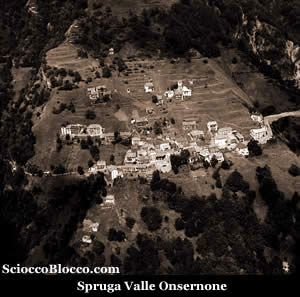
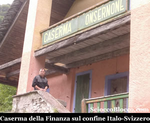
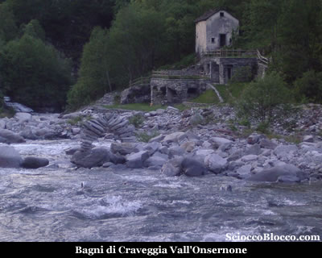
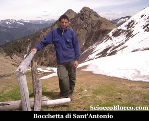
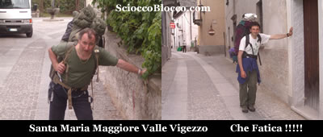

A Spruga(1113m) si scende l'unica strada asfaltata che porta verso la valle dopo alcuni Km si incontra sulla sinistra un ponte che attraversa il fiume **Onsernone**.

Lo si attraversa e si sale sino alla vecchia caserma della finanza.

Si prosegue sulla destra seguendo il sentiero che porta in pochi minuti ai Bagni di Craveggia (986) 30/40min.

Si consiglia di fare attenzione perchè la struttura è molto vecchia e malridotta, infatti l' albergo stabilimento dei Bagni di Craveggia, sorto nel 1823, venne distrutto da un incendio nel 1881, ricostruito e poi chiuso definitivamente nel 1925, travolto da una valanga nell'inverno del 1951, per non parlare dell'alluvione del 1978 che innondò la zona.

Nei sotterranei, agibili con circospezione, una grossa
vasca in pietra piena d'acqua tiepida che sgorga da
un canaletto nel muro, vi permetterà di rilassarvi
e di combattere le malattie della pelle, erano per
queste affezioni in particolare che venivano proposte
le cure .

Sulla destra del torrente **Onsernone**, in regione **Fondo Manfracchio** (m 998), sgorga da un filone di pegmatite, una sorgente di capacità di circa 12 litri al minuto.

L'acqua minerale ha una temperatura media di 30°, è untuosa al tatto, emette odore di nafta ed ha gusto sgradevole.

Lasciata raffreddare all'aria libera diventa inodore limpida e potabile.

Sulla destra del Rio della Vasca e a circa 150 metri dalla rotabile, alla base di un macigno, sgorga una sorgente perenne acidulo-ferruginosa della portata di poco più di un litro al minuto.

L'acqua minerale è limpida, incolore, inodore.

Ha una temperatura di 12°; è ricca di carbonato di ferro e di ossido carbonico e raccomandata quale ricostituente.

Esposta all'aria, si copre di un velo iridescente, dovuto al biossido di manganese, di cui abbondano le soprastanti rocce.

Non è ben certa la sua origine, dovuta, forse, all'azione chimica dei vari ossidi di ferro che entrano nelle composizioni di alcune rocce limitrofe.

Le "**Aquae calidae di Craveggia**" sono già ricordate in pergamena del 1352.

Il 18/19 ottobre 1944, questo luogo fu teatro di un feroce scontro tra alcune colonne partigiane in ritirata verso la svizzera e un comando nazifascista, il tutto fini con alcuni caduti tra i partigiani grazie soprattutto all'intervento dell'ufficiale elvetico al comando dello sparuto presidio di confine, che riuscì a prendere tempo sino all'arrivo di rinforzi dalla vicina Bellinzona, che indussero i nazifascisti alla ritirata.

Alcuni vecchi ruderi della zona, portano ancora i segni dei colpi sparati dai militi della "Folgore" e della "X Mas".

Appena sopra i Bagni si possono vedere due baite adibite a rifugio, una sempre aperta, l'altra "Ul Baitin dul Saraca" chiusa chiedere chiavi al CAI Vigezzo  Tel.0324/94737 (il venerdì sera).

Dietro ai Bagni di Craveggia, parte il sentiero che si inoltra nella valle del Rio Isornia, supera un bacino per la presa dell'acqua e attraversa un piccolo torrente.

Bisogna prestare attenzione perchè la traccia è esile
e facile da smarrire.

Si scende ora al Rio Strecchio, lo si risale brevemente per poi prendere il versante opposto (segnavia giallo).

Qui il sentiero diventa largo e facile, all'interno di un bosco, passa sotto le baite dell'alpe Isornia di Sotto per arrivare alla radura dell'alpe Isornia (1478m).

Proprio sopra le baite riparte il sentiero, che ripido uscito dal bosco, conduce alla Bocchetta di Sant'Antonio (1841m) (4.00/4.30h).

Si scende ora su evidente sentiero all'alpe Cortignasco (1681m), si attraversa un bosco e tenendosi alla destra del Rio Rondeggia si divalla sino a giungere a La Vasca.

Siamo ora sulla strada asfaltata che in circa 4Km ci conduce prima a Craveggia e infine a Santa Maria Maggiore(816m) 7.00/8.00h.

Escursione di grande appagamento ma assai impegnativa e consigliata a escursionisti esperti.

Un ringraziamento speciale a Elia e Flavio per la recensione e le fotografie.

