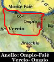
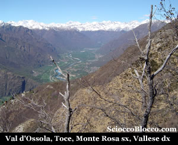
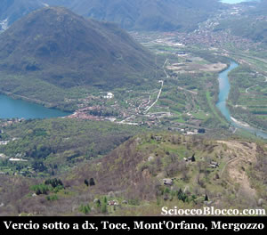
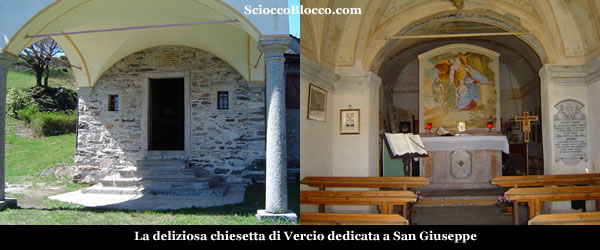

Questa recensione ricalca nella prima parte quella al **Monte Faiè** che trovate in questa sezione ([recensione **Monte Faiè**](http://www.scioccoblocco.com/recensioni/montefaie.htm)). Lasciata la macchina alla fine della carrabile, parte un largo sentiero (960m) al fianco del consueto cartello del Parco Nazionale **Val Grande**.

In parte sterrata e in parte pavimentata con ciottoli, la strada agricola sale rapidamente al margine di un bosco, alla nostra destra possiamo già scorgere ben delineate le creste che dividono la **Val Pogallo** dalla **Vall'Intrasca** e **Val Cannobina**, in breve (10 minuti) siamo all'**Ape Ompio** (990m).

L'**Alpe Ompio**, caratterizzato per il rifugio gestito A. Fantoli del CAI Pallanza (per informazioni tel. 330/206003), è costituito da un buon numero di baite ancora ben conservate. Qui potremmo rifocillarci al ritorno. Proprio dietro il rifugio parte il sentiero per la nostra meta, attraversa subito un gruppo di case in fantastica posizione panoramica sul lago, quindi riprende a salire diagonalmente immersi tra i castagni, raggiungendo in poco tempo (20/30 min) una sella (con una grande croce sulla destra) sul costolone che divide **Ompio** dalla **Val Grande**. Qui il sentiero si divide, dritti si va a **Corte Bue**, noi svoltiamo a sinistra e iniziamo a salire nella faggeta. Dove il pendio si alza sotto i piedi, il percorso sempre ben segnalato dai colori bianco-rosso del CAI, e da cippi e leggii, diventa più impegnativo. Seguendo tracce tra bosco e terreno aperto, circa a tre quarti della ripida ascesa ci taglia orizzontalmente la strada un sentiero dove è posizionata anche una bacheca. Ignoriamo il sentiero incrociato, e in breve continuando a salire guadagnamo la vetta del **Monte Faiè**(1352m) ( 1h/1.15h).

Lo spettacolo che si presenta agli occhi nessuna foto potrà mai rendere appieno, ai nostri piedi il **Lago di Mergozzo**, l'**estuario del Toce** che sfocia nel **Lago Maggiore** con le sue **isole**, sulla sinistra **Verbania** e il **Monte Rosso** sullo sfondo la **costa lombarda** e i **Laghi di Varese** e **Monate**, al centro il monolite del **Montorfano** e dietro il **Mottarone**, sotto il quale si apre la **Valle del Cusio** con il **Lago d'Orta** che ne delimita l'orizzonte. Ancora verso destra i monti dei **Tre Gobbi** del **Quaggione** e il **Monte Massone** con ai suoi piedi **Ornavasso**, quindi l'inizio della **Val d'Ossola** con il **Massiccio del Monte Rosa** a dominare tutti dall'alto. Altissimo il livello di soddisfazione paesaggistica e ambientale. Questo è il punto di incontro tra **Verbano**-**Cusio** e **Ossola.** Verso nord corre scoscesa e dirupata la cresta dei **Corni di Nibbio** con i suoi picchi di **Cima Corte Lorenzo** e del **Lesino**, di cui il **Monte Faiè** è il picco terminale. Questa catena separa la **Val d'Ossola** a ovest dalla **Val Grande** a est, e anche due mondi quello degli uomini da quello della natura. Qui dalla vetta si legge facilmente la storia geologica della zona con il granitico **Montorfano** (banale da qui intuirne l'origine del nome) risparmiato dal ghiacciaio sceso da nord a formare il **Lago Maggiore** e **Orta**, e la piana sedimentaria del **Toce** che nei secoli ha diviso anche il **Lago di Mergozzo** dal Maggiore del quale era parte terminale del **golfo Borromeo**. Il cippo che troviamo in vetta, testimonia una antica storia, infatti indica il confine della concessione del versante ovest alla **"Veneranda Fabbrica del Duomo di Milano"** che tutt oggi provvede al restauro del Duomo. Concessione risalente al 1387 quando **Gian Galeazzo Visconti** *Conte di Virtù* avviò la costruzione del Duomo sfruttando il marmo di **Candoglia**. La concessione prevedeva l'estrazione del marmo e il taglio del legname necessario alle opere di trasporto, infatti con il legno della **Val Grande** venivano costruite la chiatte che trasportavano via **Lago Maggiore**, **Ticino** e **Naviglio Grande** il Marmo a **Milano**. L'astuto Conte aveva istituito una sigla che non pagava dazio ai vari passaggi, la sigla era A.U.F (*ad usum fabbrice*), e venne apposta su tutti i blocchi di marmo, tanto che ancora oggi nell'uso comune degli abitanti della zona si suole dire "mangiare auf" o "lavorare auf" ovvero gratis. Riprendiamo il nostro cammino scendendo sulla cresta che sta alla destra della direzione del nostro arrivo, proprio pochi metri dopo il cippo di vetta i colori bianco e rosso del cai ci indicano la direzione. Scendiamo ora di fatto sul confine tra **Val d'Ossola**, che vediamo sotto di noi alla sinistra, e **Val Grande** che possiamo intuire nascosta dal bosco sulla nostra destra. Prestando attenzione a qualche roccia che affiora di taglio dal terreno, approdiamo rapidamente alla Colma di Vercio (1300m) (1.15/1.30h) . Qui dove vi sono i resti dell'antica teleferica che portava il legname da Orfalecchio a Mergozzo, il sentiero per Vercio lo si vede precipitare giù nella gola che guarda la **Val d'Ossola** alla sinistra del nostro arrivo. Non fatevi impressionare il sentiero è meno difficile di quel che sembra, ma prestate molta attenzione perchè il pendio fuori sentiero è veramente scosceso. In pochi minuti scendiamo di dislivello e in falsopiano superiamo l'angolo dello sperone montuoso che ci immette sulla trasversale che ci porterà a Vercio. Proprio qui lo sguardo si apre su una mirabile vista.

La **Val d'Ossola** appare in tutta la sua bellezza, il corso del **Toce** al centro, i piccoli centri sparsi ai lati del fiume alla pendici dei monti, il Monte Rosa lassù a sinistra a sorvegliare tutti dall'alto e le vette innevate del canton Vallese a far da cornice giù in fondo. Il sentiero si dipana in falsopiano tornando verso sud, per portarsi sopra la nostra prossima meta, che possiamo già vedere sotto di noi.

Infatti ecco sotto di noi il promontorio di Vercio, il fiume **Toce** a destra, in alto Gravellona, Omegna, e uno spicchio del lago d'**Orta**, a sinistra il Mont'Orfano, Mergozzo e il suo lago. Entriamo ora in un bosco e iniziamo decisamente a scendere, su sentiero ben evidente, arriviamo abbastanza velocemente a Vercio (828m)(2.15/2.30h). Simpatico e verde alpeggio con parecchi tavoli in legno per pic-nic, una bella vista sul lago di Mergozzo e il Golfo Borromeo. Una deliziosa chiesetta guarda il lago Maggiore su un balcone naturale.

Dietro la chiesa nei pressi di una fontana in legno parte il sentiero per il ritorno, che con una ascesa non proibitiva ma costante, e attraversando alcuni rigagnoli riporta all'interno di un bosco a **Ompio** (960m) (3.00/3.15h) proprio alla fine della carrabile dove abbiamo lasciato la macchina alla partenza. Bel giro di modeste difficoltà, da farsi preferibilmente in primavera o autunno quando le giornate limpide di questi periodi donano panorami mozzafiato.
