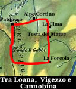
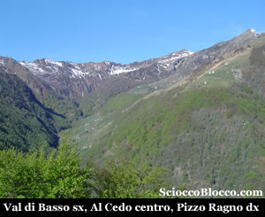
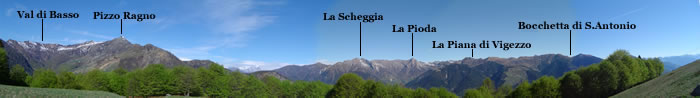
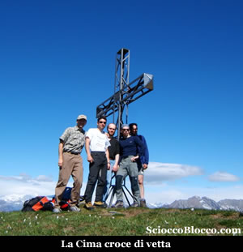
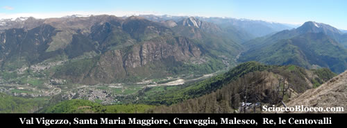
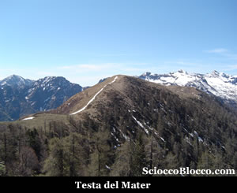
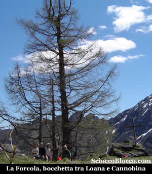

A Patqueso (1108m),  dove noterete la nuova strada per l'Alpe Cortino ora in costruzione, troveremo uno spiazzo abbastanza largo sulla sinistra dove lasciare l'auto.

Tornando pochi metri sui nostri passi, alla destra, sostenuto da un muretto in sasso parte il nostro sentiero.

Il sentiero parte subito con buona pendenza, all'interno di un bosco di faggi, in pochi minuti si raggiunge un piccolo balcone naturale dove è posta una baita e la vista si apre già su un bel panorama (15min).

E' questa alle spalle della nostra salita, la Val di Basso con i suoi disseminati alpeggi, nella radura sulla destra è posto il rifugio Al Cedo del C.A.I. Vigezzo al quale abbiamo dedicato una recensione (Al Cedo), dominato dal Pizzo Ragno.

Ripartiamo,  un piccolo capriolo incrocia la nostra strada, ma è più veloce lui delle nostre macchine fotografiche.

Continuiamo a salire nel bosco tagliando in alcuni punti la strada in costruzione, in uno scorcio tra imponenti faggi ecco un'altra bella visione (35/40min).

La Val Loana si apre sotto di noi, Fondi Gabbi la all'imbocco della spianata, e su in alto da sinistra, il Cimone di Cortechiuso di cui parliamo nella recensione specifica (Cimone Cortechiuso), il Laurasca, Cimone di Straolgio, Pizzo Stagno.

Continuiamo a salire e in breve eccoci sbucare sui prati del Alpe Cortino (1477m) (55/60min) in uno scenario stupendo.

Lo sguardo si apre da sinistra a destra sulla Val di Basso, il Pizzo Ragno, La Scheggia, La Pioda, La Piana di Vigezzo, la Bocchetta di Sant'Antonio, da dove si entra abitualmente in Vall' Onsernone alla quale abbiamo dedicato una recensione (Vall' Onsernone).

Qui all'Alpe Cortino vi è il rifugio NIGRITELLA  di Melini Giordano
tel. 0324 92456 6 posti letto .

Subito dietro l'alpeggio parte il sentiero tenere quello sulla destra, si rientra nel bosco e la salita si fa impegnativa, alla nostra sinistra ci fa compagnia la Valle Vigezzo con i suoi piccoli centri.

Al bivio seguire il colore rosso e il sentiero sulla destra.

Sempre su pendenze impegnative usciamo dal bosco e raggiungiamo su larghi prati La Cima (1810m) (1.50/2.00h).

Ivi è posta una bella croce, il panorama va dalla Val Loana, alla Val Vigezzo, alle Centovalli, alla Val Cannobina.

Possiamo già ben vedere alla destra del nostro arrivo, verso sud, la nostra prossima meta, scendiamo rapidamente sul crinale ora tra Val Cannobina sulla sinistra e Val Loana sulla destra.

Risaliamo quindi sempre in cresta, su ripidi prati scoperti che il sole può rendere ancora più faticosi, sino a raggiungere in poco tempo la Testa del Mater (1846m) (2.10/2.20h).

Sotto di noi alla sinistra verso est si apre la Val Cannobina, con Finero, una miriade di alpeggi sparsi sui due lati della valle e la traccia della carrozzabile che scende verso il lago Maggiore.

Mentre sulla destra di  nuovo la Val di Basso, e quasi di fronte, seguendo la dorsale percorsa, ancora la Val Loana, con il loro alpeggi e il fiume che scorre giù in fondo.

Proseguiamo ancora in cresta dapprima in falsopiano, poi risaliamo tra roccette una ripida punta denominata La Forcola, quindi una vertiginosa discesa ancora tra piccole rocce a rendere più difficoltoso il cammino.

E' questo il punto in cui è richiesta maggiore prudenza ed attenzione.

Giungiamo in fine ad una bocchetta, con cartelli indicatori, Bocchetta della Forcola (1735m)(3.10/3.30h).

Qui alla sinistra del nostro arrivo a pochi metri vi è una bella radura affacciata sulla Cannobina, dove si può mangiare all'ombra di un imponente larice, dove è posta una croce lignea sembra a memoria di alcuni compianti escursionisti.

Riposati riguadagnamo la bocchetta e scendiamo dalla parte opposta ovvero alla destra del nostro precedente arrivo.

Sotto si vede già ben chiara la spianata della Val Loana.

In principio allo scoperto dove superiamo alcuni ruderi dell'Alpe Forcola, poi all'interno di un bosco dove il sentiero è ricoperto di foglie in ogni stagione raggiungiamo Fondi Gabbi (1238m) (4.10/4.30h).

E' questa la località dove finisce la strada asfaltata e partono i sentieri per l'alta valle.

La Valle Loana, con il suo fiume che la divide a meta', costituisce una delle zone piu' belle della Valle Vigezzo, in particolar modo per la sua conformazione, e per la sua posizione, che si caratterizza per le sue cime.

La Valle Loana, con le sue fornaci, ed i suoi boschi che hanno fornito di legname la Valle Vigezzo, e arredato la residenza borromea all’isola Bella, sul lago Maggiore, una valle dove anche qui il tempo ha lasciato il segno di un passato ricco di eventi calamitosi devastanti, che ne hanno solcato il verde pascolo, ma che non sono comunque riusciti a cancellarne ed a nasconderne la bellezza unica ed esclusiva.

Una valle, al centro dell’ interesse locale ove le amministrazioni pubbliche, hanno dedicato particolare riguardo all’ambiente.

Non e' un fatto strano, essere accolti all’ imbocco della valle dalle sue stupende bovine di razza "Bruna", che pascolano indisturbate sul meraviglioso tappeto verde.

L’agriturismo,aperto dal mese di giugno, al mese di settembre, ha una capacità ricettiva di 40 posti, e permette al turista di assaporare i piaceri della cucina vigezzina: il formaggio ossolano, il prosciutto tipico vigezzino, la polenta vigezzina, e specialità locali cucinate secondo una antica tradizione gastronomica.

Prendiamo ora la strada carrabile, e con un paio di chilometri ammirando lo scorrere dell torrente Loana con le sue cascatelle, torniamo a Patqueso (4.30/5.00h) dove abbiamo lasciato l'auto.

Giro ad anello di media difficoltà, per la lunghezza e per alcune brevi ma ripetute rampe.

Una antica leggenda, di cui si è persa l'origine, fa riferimento a questo percorso con la definizione "Sulle orme della Sacra suola" , qualsiasi sia il motivo resta un fantastico itinerario denso di panorami gratifcanti.

