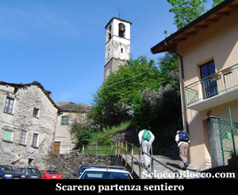
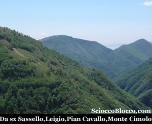
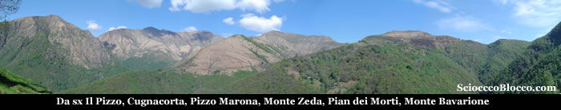
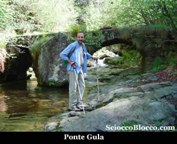
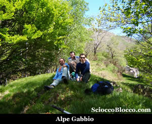
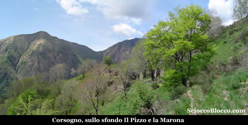
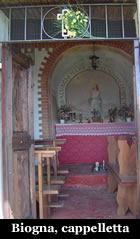
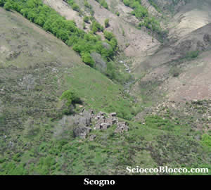
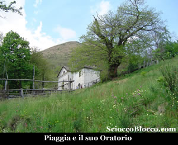
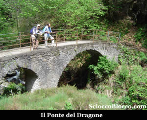

Qui a Scareno (694m), il più isolato paese della Valle Intrasca, valle appartata e meno conosciuta dai turisti che forse per questo conserva ancora una aura selvaggia, parte il nostro sentiero proprio dietro la Chiesa.

Subito in salita e per i primi metri ben pavimentato, il sentiero supera le case alte di Scareno, e si infila in un fitto bosco di castani. La traccia è labile e spesso scompare, prestiamo quindi attenzione, tra piccole rocce e rigagnoli avanziamo sulla costa della montagna, mentre il fiume San Giovanni scorre sotto di noi a sinistra. Superate alcune piccole forre, le tracce e la conformazione montuosa ci portano verso l'alto a sbucare dal bosco, in una bella radura. E' questa Sassello (950m) (50/60min).

Cospicuo corte ancora caricato, con baite ben tenute, prato falciato e una caratteristica pietraia. Qui il sentiero diventa ben evidente, e compaiono i tipici segnali bianco-rossi del C.A.I. Uscendo in costa dalla radura, prima di entrare nuovamente nel bosco, si apre verso ovest una notevole vista.

Da sinistra a destra si apre un fantastico panorama, sulla cresta che divide la Val Pogallo dalla Valle Intrasca. Il Pizzo, Cugnacorta, Pizzo Marona, Monte Zeda, la vallata dei Belmi e del torrente San Giovanni, chiusa dalla dorsale che scende da Pian dei morti e da Pian Vadà, che approda in quel di Piaggia, quindi la vallata che scende da passo Folungo, delimitata a sua volta dal costolone del Monte Bavarione, con i numerevoli alpeggi che lo caratterizzano, ed infine la valle della Gula solcata dall'omonimo rio. Addentriamoci nel bosco e nella valle della Gula, iniziamo a perdere quota sino a giungere al solco della valle al Ponte della Gula (873m)(1.20/1.40h).

Particolare il grosso masso che fa da pilone centrale del ponte. Siamo ora passati sul versante del Monte Bavarione, e riprendiamo decisamente a salire, sempre nel bosco tra castani, faggi e betulle, abbastanza rapidamente arriviamo a Gabbio (978m)(1.50/2.00h).

Alpeggio semi nascosto nel bosco, ma che lascia alcuni squarci sui monti circostanti ed in particolare una vista tetra sul Pizzo Marona e la sua cappelletta, forse a causa del gioco di ombre causato dal passaggio di alcuni cumuli di nubi scure. Buon posto per il pranzo, tra il fresco e i colori scintillanti della vegetazione di questo periodo primaverile. Ripreso il sentiero ben segnalato alle spalle dell'alpeggio, torniamo a salire sempre nel bosco per raggiungere brevemente Corsogno.

Appena fuori dal bosco il panorama torna imponente e i colori di questo scorcio di stagione addirittura fosforescenti. Corte corposo e totalmente abbandonato, con una struttura con delle colonne in pietra a secco di notevole fattura indicanti una data del 1808. Pochi metri sopra vediamo subito una piccola cappelletta bianca, che raggiungiamo velocemente poco sotto il nucleo di Biogna(1107m)(2.20/2.30h).

Questa cappelletta, porta la scritta, *"Salvaci o Maria dai fulmini e le tempeste"* , sullo sfondo dell'affresco l'alpeggio colpito dai fulmini e la linea di cresta di passo Folungo e del Monte Bavarione, alle pareti vecchie foto in bianco e nero di vita rurale. Passiamo Biogna, quindi in falso piano ormai su magri prati arriviamo a Corte Bavarone(1127m)(2,45/3.00h). Posto al centro della V che scende da passo Folungo e a cavallo tra i due versanti. Iniziamo ora a tornare verso sud, dapprima incotriamo Scogno(3.15/3.30h)(1030m).

Alpeggio totalmente in decadenza, da dove guardando verso il passo Folungo, con o senza binocolo può capitare di vedere le macchine parcheggiate alla fine della sterrata qualche centinaio di metri dopo l'agriturismo dell'*Alpe Archia*. Poco dopo passiamo L'Or di Casè (Orlo delle Casere), e sempre in discesa arriviamo a Piaggia(910m)(3.45/4.00h).

Piaggia, a monte di un grosso castagneto, è stato il più grosso corte della Valle Intrasca, da dove affluivano alpigiani di un po tutti i paesi della valle, ancora in ottimo stato con baite ristrutturate per le vacanze e un bell'oratorio del XIX sec. Vi si tiene ogni seconda domenica di luglio una festa rinomata e frequentata, che riporta vecchi abitanti e discendenti per un giorno a ripopolare la valle da cui sono partiti. Da qui il sentiero si fa ampio, punteggiato da belle panchine in legno, e da castani e faggi secolari si scende rapidamente al Ponte del Dragone(4.15/4.30h).

Ponte che sembra derivare il nome da *"Dragone"* una famiglia titolare di una vicina cava d'oro che lo costruì per il trasporto del minerale. Risaliamo dapprima a Leigio(652m).

Quindi riguadagnamo Sareno(694m)(4.30/5.00h). Dove sbucheremo un poco più in basso della piazza dalla quale siamo partiti. Bel giro che porta a conoscere i poco conosciuti alpeggi dell' alta Valle Intrasca , un po impegnativo per la lunghezza e soprattutto nella prima parte per l'orientamento, consigliato a chi ha un minimo di allenamento e di conoscenza della montagna.
