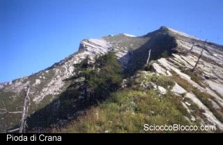
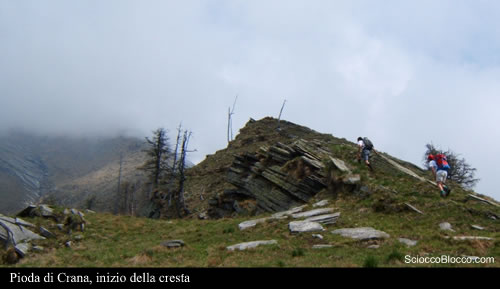
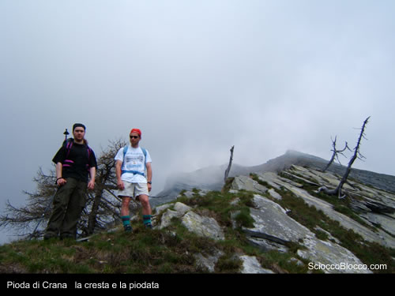
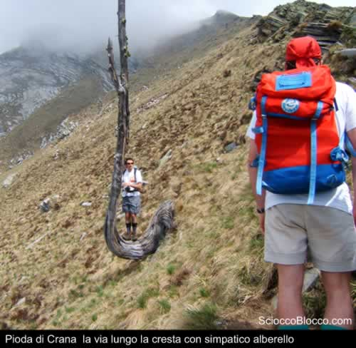
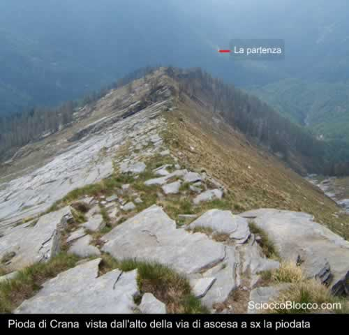
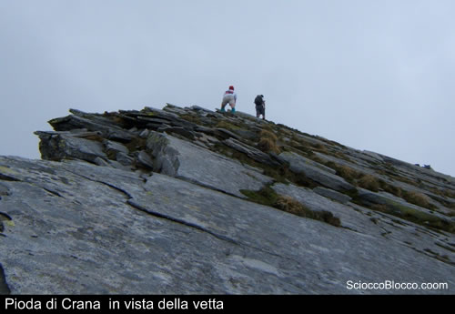
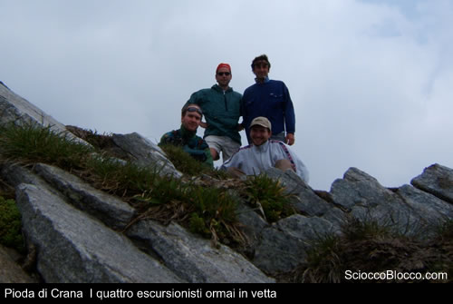
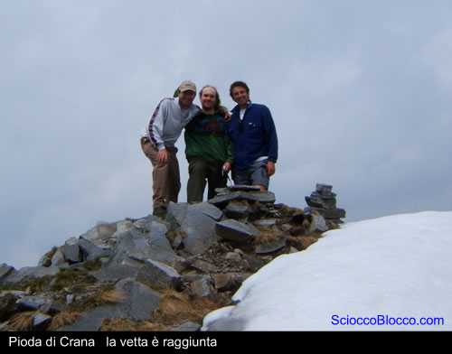
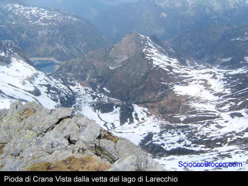

Arrivati ad Arvogno(1247m) si prosegue lungo la strada sino all'attraversamento del ponte, sulla destra si nota subito un sentiero che si inerpica sino a raggiungere un secondo ponte dove c'è una deviazione per raggiungere S.Gerolamo, noi attraverseremo il ponte fino a raggiungere un primo gruppo di baite ed un cartello con l'indicazione per raggiungere la Pioda, da qui seguiremo un sentiero segnato in giallo e rosso.

Il sentiero si inerpica immediatamente lungo un pratone in direzione di un folto bosco di faggi, lasciata alle nostre spalle l'ultima baita ci addentriamo nel bosco, qui le tracce si fanno rade ma il sentiero ci guida sicuri.

Dopo una buona mezz'ora di cammino usciamo dal folto del bosco e continuando l'ascesa, il sentiero è ben visibile ma la salita non è delle meno faticose, raggiunta una piccola radura caratterizzata da larici colpiti dai fulmini ci fermiamo per la colazione a base di salame nostrano e pane.

Ci rimettiamo in marcia e dopo circa 20 minuti il cammino si fa più difficoltoso, la via si restringe, costringendoci alla fila indiana, e piano piano saliamo in cresta.

Il panorama è davvero mozzafiato ma il burrone a sinistra ci obbliga alla massima attenzione, e così sarà sino alla vetta e per tutto il ritorno.

Comincia anche la piodata a destra e diviene via via più imponente.

Il cielo si annuvola e dal canalone salgono banchi di nebbia, la cima è avvolta da foschia ma il vento porta a momentanee , e a volte prolungate, schiarite.

Arrivati in cima alla cresta troviamo un piccolo spiazzo dove riposare brevemente ed ammirare il panorama ed il cammino sin qui fatto, la foto qui sotto rende bene l'idea del cammino.

Si riprende la salita ma la via diviene più difficile e bisogna prestare la massima attenzione ad ogni passo e a dove si mettono le mani, infatti abbiamo avuto un piacevole incontro con una vipera a 2000m.

Adesso camminiamo sulla piodata sino ad una vetta minore dove possiamo godere di una fantastica vista su entrambi i versanti.

Per raggiungere la vetta dobbiamo attraversare un difficile passaggio aereo di circa una decina di metri che si affaccia da un lato su notevole salto e dall'altro sulla sommità della piodata, questo passaggio è bene farlo solo se si è sicuri e se la via non è bagnata, dopo un'ultima breve ascesa eccoci sulla vetta, dopo 3 ore dalla partenza.

Il panorama è davvero eccezionale, si può vedere il lago di Larecchio, la cima dei Casaletti, la Scheggia, il lago Panelatte ed i vari alpeggi nelle sue vicinanze.

Possiamo cominciare la discesa, stando sempre bene attenti, lungo gli stessi sentieri seguiti nella ascesa, dopo circa 3 ore (naturalmente ci siamo fermati a pranzare) arriviamo alla macchina pronti per una birretta al rifugio.

Un ringraziamento speciale a   Fabrizio, Flavio, Francesco e Stefano per la recensione e le fotografie.

