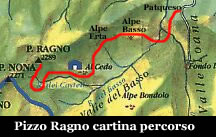
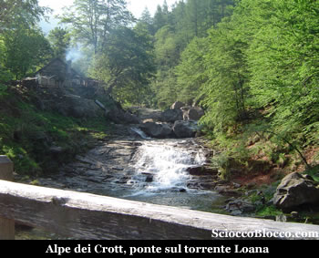
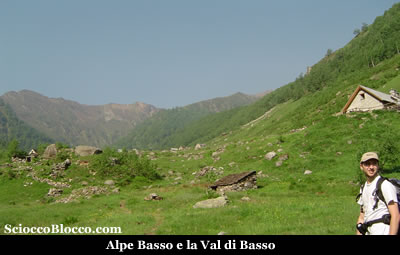
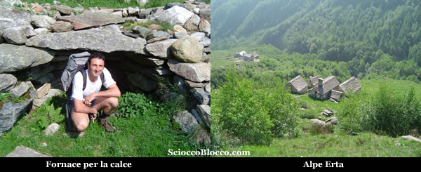
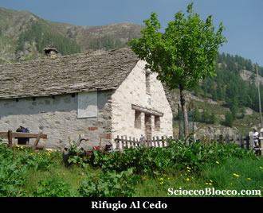
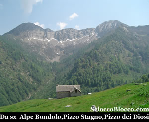
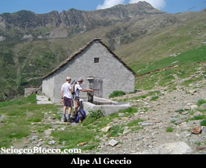
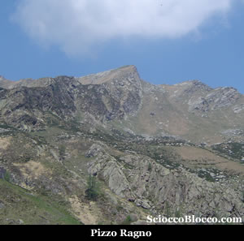
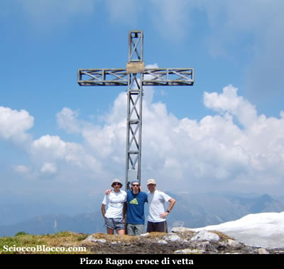
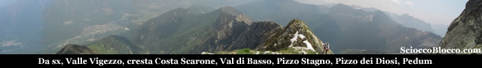

Arrivati in località ***Patqueso*** ( 1108m ) circa a metà strada della ***Val Loana*** dove la strada non è certo larga ma un paio di piccole piazzole naturali permettono di lasciare tre quattro macchine, noteremo che sul lato destro della strada vi sono alcuni cartelli che indicano l’imbocco di alcuni sentieri. Quello che interessa a noi è il sentiero per il*** Pizzo Ragno***.

Dal ciglio della strada, un sentiero scende al ***torrente Loana*** in corrispondenza di una bella cascata sorvegliata da una caratteristica baita, sopra belle pozze d' acqua e attraversato il ponte ci si trova all'***alpe dei Crott*** ( 1030 m) (10min) (sulla sinistra il cantinino per il latte ed il formaggio).

Subito dopo attraverso un altro ponte attraversiamo il torrente ** di Basso**, qui lasciamo il sentiero che a destra torna a *Malesco* e prendiamo il sentiero che a sinistra si inoltra nella Val di Basso. Da qui, seguiamo la bella mulattiera che con percorso in lieve pendenza attraversa le varie baite dell'**alpe di Basso** ( 1150m )(30min).

La Val di Basso e i suoi alpeggi sono tra i pochi ancora caricati dagli alpigiani della Val Vigezzo, e se come è capitato a noi passate da queste parti tra gli ultimi giorni di maggio e i primi di giugno, potreste incappare tra mandrie di mucche e capre che vengono portate ai vari alpeggi, e un elicottero che rifornisce di viveri e utensili gli alpigiani per la stagione. Proseguiamo con ascesa costante ma abbordabile, addentrandoci nella valle, superiamo alcuni ruderi di una antica fornace per la cottura della calce, quindi attraversiamo il rio dell'Erta, e in breve raggiungiamo l'Alpe Erta (1279m) (50/60min).

Qui all'Alpe Erta sparsa su tre nuclei, dietro a quello superiore, dove vi sono posti dei cartelli segnalatori e anche un posto di sosta, prendiamo il sentiero che sale sopra l'alpe ed entriamo nel bel faggeto ( bosco ceduo che da il nome al rifugio ) qui la salita si fa impegnativa, la mulattiera con larghi tornanti sbuca dal bosco nei pressi di un tavolo con panche che ci permetterà di rifiatare dalla fatica appena fatta. Alzando lo sguardo sopra di noi possiamo già vedere il prato dell'***alpe Cedo***, dove a meta' sulla destra e' posto il ***rifugio Al Cedo*** al quale abbiamo dedicato una recensione ([recensione Al Cedo](http://www.scioccoblocco.com/recensioni/rifugiocedo.htm)) (per accedere al rifugio richiedere preventivamente le chiavi in sede). Ancora qualche minuto di dura salita ed eccoci al rifugio Al Cedo (1560m)(1:30h).

Il ***rifugio Al Cedo*** ( 1560m ) di proprietà del C.A.I. Vigezzo è senza ombra di dubbio il più bello della zona, con i suoi 22 posti letto divisi in due stanze, una da 8 e una da 14 dotate di coperte, ricavate nel sottotetto ben isolato, la sua cucina completa, i servizi igienici, un ripostiglio, e l’ampio locale centrale riscaldato da una antica stufa in ghisa e la bella fontana posta all’ingresso, ne fanno un vero gioiello incastonato in questo angolo delle ** *Alpi Lepontine***. Un ampia terrazza si apre sulla ***Val Loana*** che taglia lo sguardo orizzontalmente mentre alla nostra destra possiamo vedere il bivacco dell’***alpe Bondolo***, vera e propria porta alla ** *Val Grande***, che da il suo annuncio con il ***Pizzo Stagno ***e il ***Pizzo dei Diosi ***.

Saliamo ora sopra il rifugio e pieghiamo a sinistra, andiamo verso la forra del rio del Castello, costeggiamo il torrente per alcuni metri dove il sentiero in parte franato è sostenuto dalla posa di alcune piode e assicurato da alcune cordine metalliche (prestare attenzione). Attraversato il rio, risaliamo sulla sponda opposta e aggirato un piccolo motto arriviamo all'Alpe Al Geccio (1796m)(2.00h).

L'Alpe Al Geccio è caratterizzato da una lunga baita in parte ristrutturata, che deve aver avuto un passato da stalla, e da una fontana di recente foggia. Pochi metri sopra di noi, ci osserva incuriosito un piccolo capriolo, che non sembra molto disturbato dalla nostra presenza. Da qui, il sentiero lascia posto più che altro a tracce, e si naviga a vista, saliamo in direzione dell'acquedotto ben evidente poco sopra l'alpeggio, e tenendo verso destra nord-est, superiamo un promontorio erboso. Dopo qualche minuto appare chiara la nostra meta.

Seguiamo una traiettoria tra magri prati e rocce, ormai a quota 2000m, e arriviamo nella conca che con una ascesa assai dura, dove ogni passo fa guadagnare mezzo metro di dislivello, ma svuota le riserve di energia, porta fino alla bocchetta, qui sopra alla sinistra appare la croce di vetta che risalendo un canalino di roccette e terra franosa ci conduce non senza fatica, ma in breve, alla vetta del Pizzo Ragno (2289m)(3.30h)

La vista è grandiosa, sotto di noi verso nord tutta la Valle Vigezzo e le Centovalli, a est la Val d'Ossola con la piana di Masera e un po più a sud il Monte Rosa , a sud i **laghetti del Geccio** sotto il **Pizzo Nona**, i Corni di Nibbio, il Pedum, la Laurasca e il lago Maggiore in lontananza, a est la Val Cannobina, il Gridone o Limidario.

Il ritorno avviene per lo stesso percorso fatto all'andata, oppure tornati all'inizio del canalone finale tenendo la sinistra, scendere dritti verso il **rifugio Al Cedo**, discesa alquanto ardita che richiede più volte l'uso delle mani e di molta prudenza e che non fa guadagnare praticamente tempo, quindi sconsigliata. In entrambe le soluzioni, si ritorna a **Patqueso** dopo circa (6.00h). Escursione molto impegnativa per la durata e per la asprezza della salita, di grande soddisfazione finale ma consigliata a escursionisti esperti.
