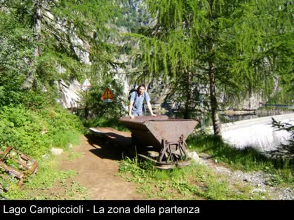
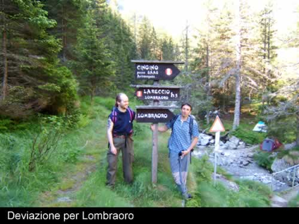
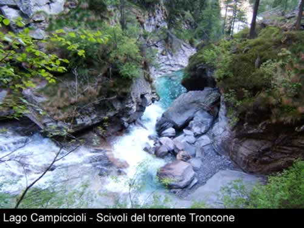
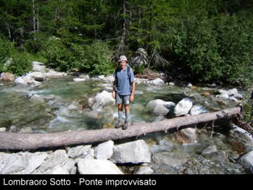
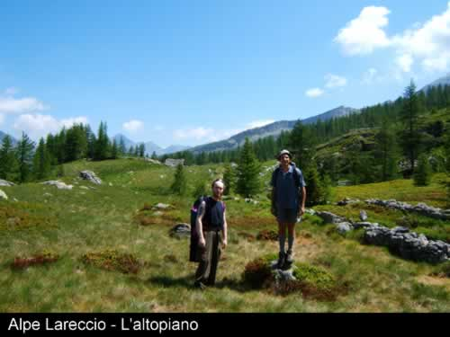
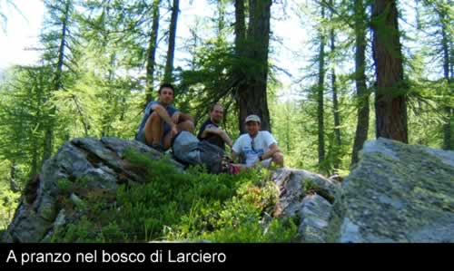
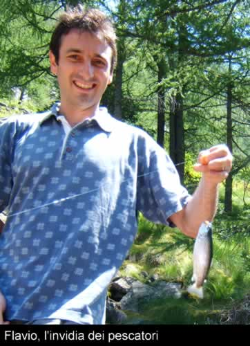
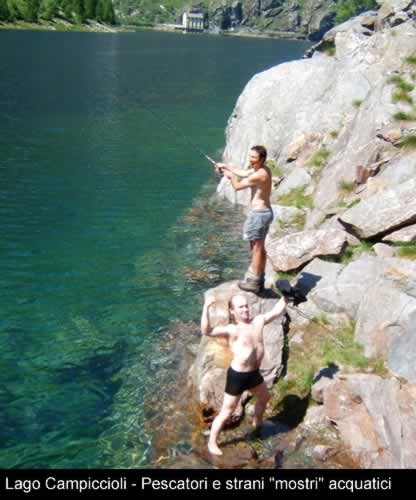

Partiamo nella zona sinistra della diga di Campiccioli, in corrispondenza della vecchia ferrovia, il percorso è davvero suggestivo infatti il sentiero segue il percorso ferroviario e attraversiamo alcuni tunnel artificiali e alcune sporgenze rocciose, alla nostra destra e 30m più in basso c'è il lago in cui si possono notare le bollate delle trote.

Proseguiamo fino a raggiungere l'estrema punta del lago dove il torrente Troncone si immette nel bacino, da questo punto possiamo ammirare come le differenti acque si mescolano.

Continuando il sentiero giungiamo in corrispondenza di un ponticello dove il sentiero si divide, qui ci sono delle chiare indicazioni per le molte escursioni che si possono effettuare in zona; attraversiamo il torrente a andiamo verso Lombraoro.

La via si snoda in mezzo ad un bosco di larici e con un imponente sottobosco di mirtilli e rododendri, questa caratteristica la ritroveremo lungo tutto l'itinerario.

Consiglio di ammirare il torrente ed il suo corso disseminato di pozze realmente cristalline e con degli scivoli rocciosi da fare invidia agli acqua-parco.

Attraversiamo l'alpe Casaravera dove incontriamo due simpatici scoiattoli che si rincorrono sui larici, da questa posizione si apre innanzi a noi una conca davvero fantastica, siamo circondati da alte cime su cui è ancora presente abbondante neve che genere delle cascate incantevoli.

Dopo circa 90 minuti arriviamo a Lombraoro sotto qui attraversiamo facilmente il torrente, anche su ponti improvvisati, e sostiamo per la colazione; fino a questo momento il percorso,in falsopiano, non ha presentato alcuna difficoltà rilevante ma ora ci aspetta un' ascesa lungo un rio laterale che, per via del sentiero e della fiorente vegetazione e anche delle scarne indicazioni, non è facilissima.

Lungo la salita possiamo ammirare ancor meglio la splendida conca che ci ospita e la notevole vegetazione che borda il sentiero.

Giunti al termine della salita ci troviamo su di un altopiano che ospita gli alpeggi di Lareccio e Larciero, la caratteristica di questo luogo è la grande quantità di acqua che origina ampi spazi torbosi.

Abbandonato Lareccio proseguiamo al limitare del bosco, per evitare il terreno eccessivamente gonfio d’acqua, fino a giungere, dopo circa 1 ora, a Larciero dove comincerà la discesa fino al lago Campiccioli.

Da Larciero è difficile trovare il sentiero corretto perché poco segnato, comunque sia ne seguiamo uno ben visibile nel sottobosco che va in salita, non abbiate timore perché dopo circa 10 minuti di cammino si ritrovano i segni gialli e rossi che caratterizzano questa escursione che ci conducono nel fondovalle.

La discesa è simile alla salita che ci ha portato a Lareccio, nella prima parte ,infatti, dobbiamo seguire il corso di un rio ma poi ci inoltriamo in una boscaglia di larici che ci porterà prima all’alpe Torgna e dopo circa 30 minuti al ponticello che abbiamo attraversato circa 5 ore addietro, a questo punto andiamo verso il lago Campiccioli per terminare l’escursione. A questo punto potete trascorrere una parte del pomeriggio a pesca oppure, se la stagione è quella giusta, a raccogliere mirtilli.

Scarica la recensione
