Qui ad Arvogno (1247m), lasciamo la macchina qualche centinaio di metri dopo i rifugi, nei pressi della seggiovia.

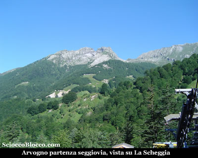

Seggiovia inaugurata nel 2004 che permette il collegamento con la soprastante Piana di Vigezzo, che con  questa nuova pista e la nuova cabinovia di Prestinone, ha notevolmente ampliato e rimodernato il proprio comprensorio.

Scendiamo su  strada asfaltata ad attraversare in pochi minuti il ponte sul fiume Melezzo (1202m)(5min).

Subito dopo il ponte, sulla destra, imbocchiamo una mulattiera che permette di tagliare la strada, che ora diventata sterrata sale ancora per alcune centinaia di metri.

Tornati sulla strada, la seguiamo per pochi minuti e attraversiamo sulla sinistra un largo ponte sul rio Verzasca.

Riprende la larga mulattiera che in breve ci conduce all'Alpe Verzasca(1333m)(20min).

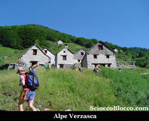

Dove vi è un cospicuo gruppo di baite in buone condizioni, anche favorite dalla vicinanza della strada carrabile.

Si scende per poco, per poi riprendere in costante ma non proibitiva ascesa, su di una larga e abbondantemente lastricata mulattiera.

Tra faggi e poi abeti rossi e larici saliamo   protetti dal sole, fino a sbucare all'Alpe Villasco (1642m)(1h).

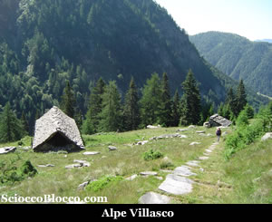

Qui troviamo sul sentiero una fontana dall'acqua gelida che ci permette di ricaricare le borracce, tra alcune diroccate baite.

Sempre ben pavimentato, il sentiero rientra nel bosco ormai dominato dalle conifere, per approdare alla radura dell' Alpe ai Motti (1810m)(1.30h).

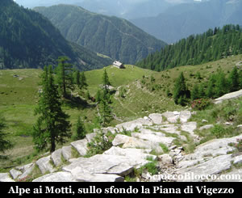

Alpeggio caratterizzato da due lunghissime stalle, ancora caricato, infatti si può vedere nei prati circostanti una nutrita colonia bovina, mentre alcuni esemplari abituati agli escursionisti non disdegnano incontri ravvicinati sul sentiero.

Guardando verso la direzione del nostro arrivo, si ammirano chiaramente gli spiazzi tra il bosco, degli impianti sciistici della Piana di Vigezzo.

Riprendiamo il cammino ora allo scoperto, che in giornate di sole estivo, può diventare impegnativo.

Infatti, giunti a questa quota la vegetazione rarefatta, permette finalmente di ammirare le cime che ci circondano e su tutte il profilo straordinario della Pioda di Crana.

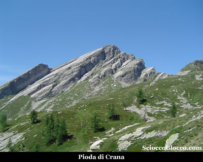

Proseguiamo in salita regolare, sino alla cappella di San Pantaleone (2026m)(1.50/2.00h).

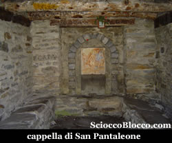

Qui troviamo alcuni cartelli segnavia, noi saliamo verso sinistra, sempre su sentiero ben evidente e segnalato dai colori bianco-rosso, in breve approdiamo alla conca che ospita il Lago Panelatte (2063m) (2.00/2.15h).

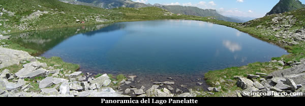

Il nome curioso di questo lago ha origini ignote, tuttavia proprio questo nome così accattivante  attira molti escursionisti fino alle sue sponde.

Il Lago Panelatte che appare all'ultimo momento dal sentiero, è un lago di circo.

Genericamente i laghi
vallivi in roccia,  quelli di gradinata, di circo, di terrazza,
sono pure detti di erosione, in quanto la conca che li ospita fu scavata da
masse glaciali in movimento o meglio dalle acque sub glaciali di fusione.

Dominato a est dalla punta del Corno(2280m), il Panelatte è popolato da anfibi e rare trote, privo di vegetazione ad alto fusto
le sue sponde sono caratterizzate da materiali detritici sotto la parete della montagna e da magri prati e rododendri dal lato verso valle.

Anche se convenzionalmente considerato parte della Val Vigezzo in realtà è compreso nella parte alta del bacino della Valle Onsernone, ovvero geograficamente in territorio svizzero ma politicamente ancora in quello italiano.

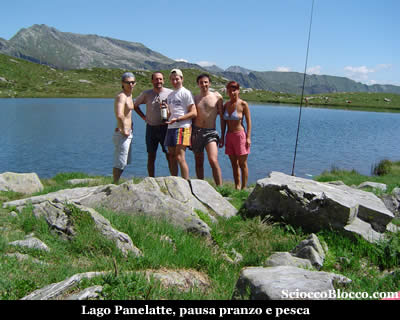

Per chi volesse aggiungere un opzione in più nella stessa gita, dal lago Panelatte è possibile raggiungere la diga del Lago di Larecchio in circa 2h di cammino ( di corsa e senza zaini ci vuole 1 ora andata e ritorno), il sentiero da imboccare è quello che abbiamo percorso per raggiungere il lago Panelatte e che si inerpica fino a raggiungere il passo Forcola di Larecchio (2146m).

Arrivati alla Forcola si apre sotto di noi una bella valletta, decisamente più ricca di vegetazione,in particolare di sottobosco, rispetto a quella che abbiamo alle nostre spalle.

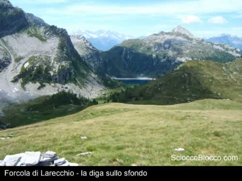

Da qui possiamo vedere in lontananza la diga e possiamo trovare un percorso per raggiungere agevolmente e velocemente la meta.

Prendiamo il sentiero segnato e cominciamo la discesa, è abbastanza agevole anche se il terreno presenta delle sconnessioni e molti sassi.

Arrivati in fondo possiamo continuare a seguire il sentiero segnato oppure, come abbiamo preferito, tagliamo verso sinistra e ci dirigiamo verso i torrenti visti dall'alto, dobbiamo stare attenti perchè non esiste un vero e proprio sentiero ma solo delle tracce sparse in mezzo ad un mare di rododendri.

Raggiunto il torrente ne seguiamo il corso finchè non avvistiamo dall'altra parte un bel sentiero molto marcato, lo seguiamo ed in 10 minuti ci troviamo sulla riva del lago di Larecchio(1855m)(3.00/3.15h).

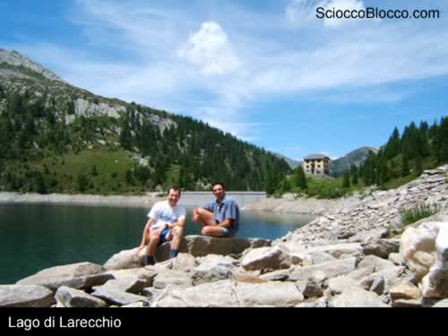

Da questa posizione godiamo di un magnifico panorama e, se il livello del lago lo consente, è possibile vedere le tracce delle abitazioni presenti prima della costruzione della diga; purtroppo da qui non è possibile raggiungere la casa del custode per via delle pendici scoscese, per poterla raggiungere dobbiamo seguire il sentiero segnato usato nella discesa dalla Forcola.

Il lago artificiale di Larecchio infatti, come altri invasi ossolani (Agaro, Morasco, Vanino...) ha sommerso antichi alpeggi, nel caso specifico Larecchio Dentro e Larecchio Fuori, sacrificio che ha consentito di fornire di energia elettrica alcune industrie di Villadossola.

Costruita tra il 1936 e 1938, questa diga ha una capacità d'invaso di 2,66 milioni di metricubi, una profondità di 31,5m e 17 ettari d superficie

Dopo una rinfrescata ripercorriamo la via a ritroso ed in circa 1h ci ritroviamo nuovamente alla Forcola dove, poco più avanti, possiamo ammirare il Panelatte dall'alto (4.00/4.15h).

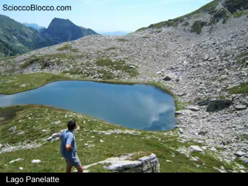

Da qui il ritorno avviene
per lo stesso sentiero dell'andata e ci riconduce ad Arvogno
(1247m) (5.30/6.00h) partenza ed arrivo della nostra gita
dove possiamo rinfrescarci in uno dei rifugi.

Escursione di media difficoltà che può diventare
impegnativa in caso di temperature elevate a causa della
poca vegetazione negli abbondanti tratti sopra quota 1800m.