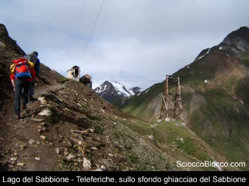
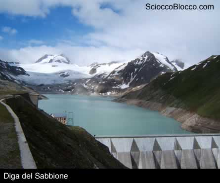
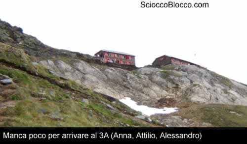
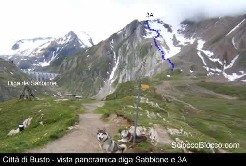
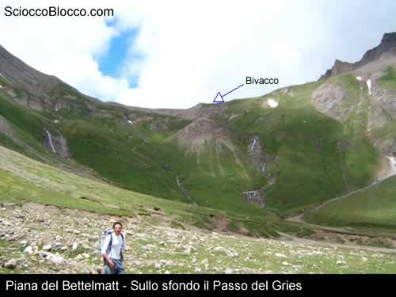
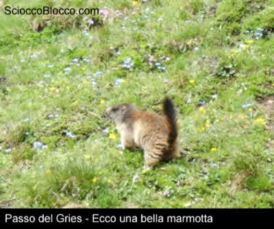
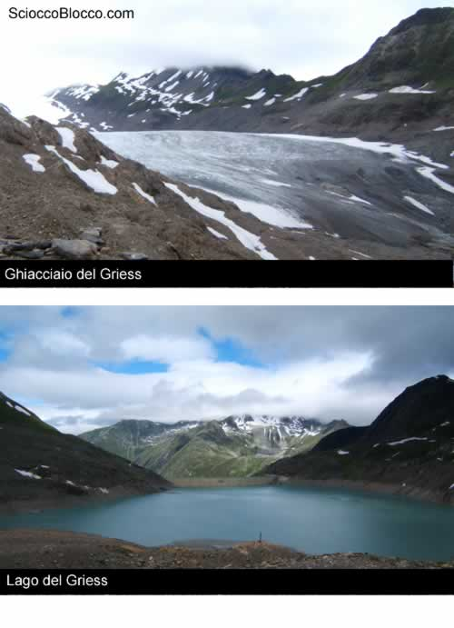
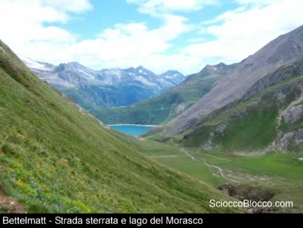

La
partenza di questa bella escursione è proprio sotto
la diga del Morasco ,
da qui risaliamo lungo la strada asfaltata a destra e, percorrendo
il sentiero sterrato che costeggia il lago, arriviamo in
fondo all'invaso in corrispondenza del rio
del Sabbione.

Adesso non dobbiamo far altro che seguire il corso del rio
sino alla diga del Sabbione;
il primo tratto è piuttosto impegnativo a causa della
pendenza ma di breve durata, circa 15 min., a questo punto
ci troviamo in un bel pianoro dove ,in corrispondenza di
una baita, il sentiero si divide, andando a destra ci inerpichiamo
verso il rifugio
Città di Busto mentre a sinistra,
costeggiando il monte Immel, andiamo al rifugio
Mores e quindi la lago del Sabbione.

La conformazione del territorio ci impedisce di vedere la
diga ma appena vediamo gli impianti della teleferica possiamo
rilassarci, la diga è a pochi passi.Siamo in marcia
da circa 1h e 10 min.

Attraversiamo la diga e andiamo in direzione del ghiacciaio,
il sentiero è ben segnato ma le tracce di vernice
sono rare e ormai scolorite; a circa 2700m, lungo un pianoro,
il sentiero si divide in due, proseguendo dritti andiamo
verso il rifugio Claudio Bruno
mentre a destra andremo verso il 3A,
a questo punto non manca molto ma le pendenze sono decisamente
elevate.

Finalmente dopo 3h di marcia arriviamo in questo bel rifugio
dove vi consiglio di fermarvi a fare una bella colazione.
Il rifugio sorge a fianco del ghiacciao
del Sidel ed è possibile sciare anche in estate
lungo una pista di circa 900m servita da impianti di risalita.

Da qui partono molte escursioni verso il Blinnenhorn
( Corno cieco) o sul ghiacciaio del
Gries verso l'omonimo lago.

Ripartiamo con l'obiettivo di andare direttamente dal 3A
al rifugio Città di Busto scendendo lungo
il ghiacciaio, questa è la parte più "pericolosa"
infatti non esiste un sentiero vero e proprio però
stando attenti e camminando sugli affioramenti rocciosi
possiamo farcela.

Scendiamo stando a destra verso gli impianti di risalita
che vediamo in fondo al ghiacciaio, da qui seguiamo la morena
dove qua e là intravediamo degli ometti di roccia,
saliamo su una cresta, da cui possiamo vedere la diga
del Sabbione, e la percorriamo fino a trovare un
rio che nasce dal ghiacciaio ed un piccolo sbarramento in
muratura, qui attraversiamo e ci troviamo sul sentiero usato
dai gatti delle nevi che ci porterà prima al Piano
dei Camosci e poi al Rifugio Città di Busto
dove potremo gustare una bella polenta con latte ed un bicchiere
di vino.

Nella foto possiamo vedere in blu il percorso
che abbiamo fatto durante la discesa dal 3A

Dopo
esserci rifocillati e riposati partiamo per l'ultima fatica
della giornata, adesso dovremo scendere fino alla piana
del Bettelmatt e poi risalire
sino al passo del Gries per
vedere l'omonimo lago. C'è un secondo possibile percorso
che evita la discesa nel fondovalle, si tratta di un sentiero
che parte da questo rifugio e che costeggia il Battelmatthorn
sino ad arrivare al passo del Gries,
non l'abbiamo fatto perchè ci sono alcuni passaggi
su ghiacciaio e altri con catene e non avendolo mai fatto
non abbiamo voluto rischiare.

Scendiamo
verso il Bettelmatt di corsa,
il pendio non presenta grosse pendenze e non ci sono ostacoli
naturali che possono darci fastidio; dopo circa 15 minuti
siamo in fondo e ci accingiamo all'ultima salita della giornata.

Affrontiamo
l'ascesa con decisione nonostante alcuni passaggi con notevoli
pendenze ed in circa 30 minuti siamo già arrivati
al passo, lungo il cammino ci siamo imbattuti in moltissime
marmotte alcune delle quali abituate alla presenza umana,
tanto che si sono messe in posa per una bella foto.

Ci
dirigiamo verso un bivacco che abbiamo addocchiato già
dal Città di Busto,
è piccolino ma per cambiarsi la maglietta madida
di sudore è l'ideale tanto più che fuori tira
un vento gelido; Adesso possiamo ammirare il lago
del Gries e il fantastico ghiacciaio che ormai, come
quello del Sabbione, non si
getta più nelle acque del lago.

Da questo passo è possibile proseguire l'escursione
e andare verso il rifugio Corno Gries
e poi al Passo S.Giacomo per
poi tornare, dopo molte ore di marcia, al lago
di Morasco.

Ormai
stanchi cominciamo la discesa, lungo lo stesso sentiero
appena percorso, ma anche in questo caso vince l'entusiasmo
e ce la facciamo tutta di corsa, durante il ritorno incontriamo
ancor più marmotte di prima e scorgiamo anche dei
piccoli che giocano fra loro.

Siamo
tornati sulla piana del Bettelmatt
adesso non ci resta che percorrere la larga strada sterrata
che ci condurrà sul lago di
Morasco e poi alla macchina.

**Un ringraziamento a Flavio,Stefano e Fabrizio**