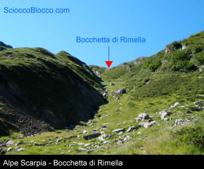
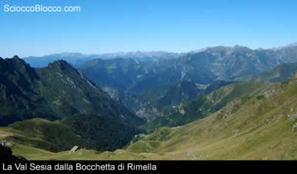
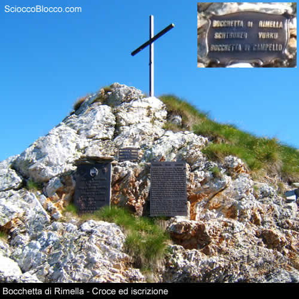
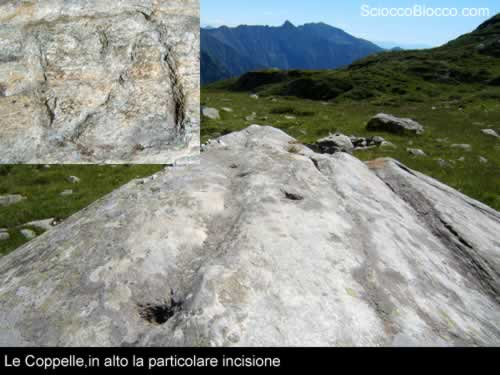
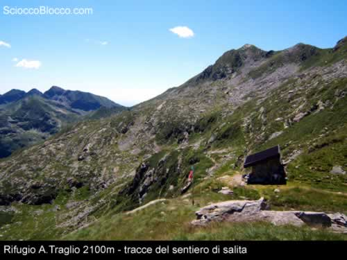
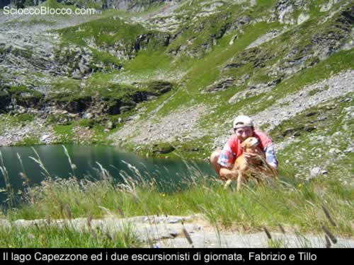
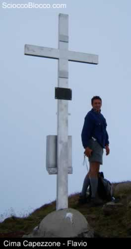
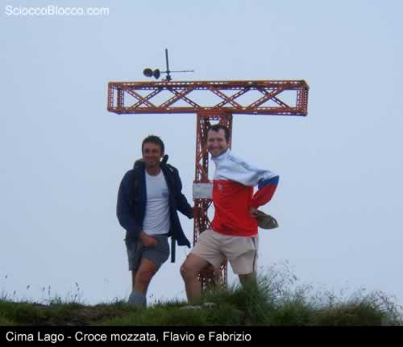
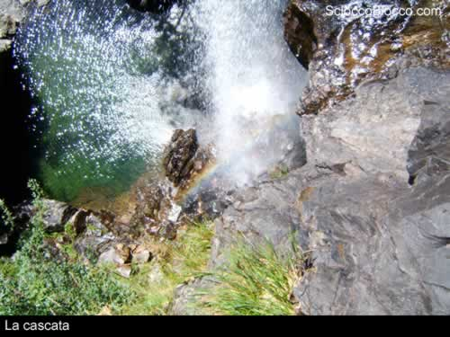
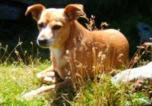

Campello Monti,pur essendo in Valstrona,è sempre stato considerato come un'appendice etnica della Valsesia e parte integrante della civiltà di quest'ultima. Campello fu fondato nel lontano 1300, anche se taluni lo ritengono ben più antico, da una comunità di pastori di Rimella che lo utilizzava come alpeggio estivo per le greggi, il paese ben presto si ingrandì e,pur conservando forti legami con Rimella, divenne indipendente. Restava un solo problema, a Campello non c'era una chiesa e nemmeno un Campo Santo per cui per ogni cerimonia si doveva andare dai vicini Valsesiani, ma avvenne un fatto, il 14 aprile 1551 il vescovo Umbertino, in visita a Rimella, incontrò verso la Colma un corteo funebre proveniente da Campello Monti, il vescovo fece tornare indietro il corteo e andò con loro, benedì un piccolo Campo Santo e consacrò una piccola chiesetta. L'escursione di oggi vuole seguire le tracce di quegli antichi cortei sino alla Bocchetta di Rimella, dove la prima domenica di agosto avviene l'incontro tra la comunità di Rimella quella di Campello,e poi andare alla ricerca di massi coppellati,antichi luoghi di culto. Si parte da Campello Monti (1305m) ,dove potete giungere anche in bicicletta seguendo le indicazioni che trovate in questa sezione (Recensione per bici). Dirigendosi verso la chiesa, in fondo al paese, si prende la scalinata e in breve si arriva al bivio che conduce al Capezzone(a destra) o Scarpia e Rimella (a sinistra) ,noi pieghiamo a sinistra seguendo le indicazioni per l'Alpe del Vecchio e Bocchetta di Rimella, stiamo seguendo il sentiero della GTA (Gran Traversata Alpina). Il sentiero è ben segnato e non ci sono grosse asperità da superare, è da segnalare il notevole numeo di rii e torrenti che vanno tutti ad immettersi nello Strona ed alcuni lo fanno con spettacolari cascate. Dopo una buona mezz'ora di cammino arriviamo in vista di Scarpia, da qui possiamo seguire tutto il cammino che ci resta da fare per giungere alla Bocchetta.

Riprendiamo il cammino ed in poco più di 20 minuti arriviamo a destinazione, dalla partenza circa 1 ora. Il panorama è davvero impressionante, grazie anche alla splendida giornata,possiamo dare uno sguardo alla Val Sesia ed ai tanti alpeggi che caratterizzano questa zona. Se continuassimo il sentiero verso Rimella arriveremmo alla Posa dei Morti, il cimitero che usavano i campellesi prima dell'incontro col Vescovo Umbertino.

In questo magnifico panorama trova anche posto una croce che ricorda l'incontro tra le popolazioni delle due valli.

E' anche il momento di rifocillarci per poi partire alla volta del lago del Capezzone; per questo itinerario ci sono molti sentieri, quello che troviamo sulle cartine consiste in un lungo giro ad anello in cresta che ci porta fino alla Bocchetta delle Vacche e quindi al lago, come al solito ho scelto una via scarsamente segnata in alcuni punti che permette di accorciare i tempi, come sentiero non è difficile solo che non è ben visibile, comunque sia se volete vedere le coppelle dovete seguirmi. La via comincia poco sotto la croce e taglia orizzontalmente tutto il fianco della montagna,più in basso possiamo vedere il GTA fatto all'andata, andiamo di buon passo stando attenti a dove mettiamo i piedi. Dopo circa una ventina di minuti raggiungiamo un ampio piano erboso puntellato qua e la da grossi massi,proprio in mezzo ne scorgiamo uno a forma di punta di freccia, ecco il masso coppellato. Sono presenti 5 coppelle ed un bel disegno, naturalmente non è possibile sapere, almeno per noi profani, se siano state fatte da antiche popolazioni o da qualche pastore annoiato però ci sono e non costa nulla dagli una bella occhiata.

Ripartiamo e arriviamo poco sopra l'Alpe Calzino da qui le tracce si fanno rade ma, facendo attenzione e avendo un minimo senso dell'orientamento, non corriamo rischi;cartina alla mano dobbiamo ricordarci che vogliamo arrivare all'Alpe Capezzone.Oltre ai segni bianchi e rossi seguite anche le frecce bianche che sono il tracciato di una gara di corsa in montagna. Dopo circa trenta minuti arriviamo all'alpe Capezzone,il sentiero è già ridiventato un'autostrada e abbiamo già incontrato un cartello che indica la via che prenderemo più tardi per tornare a Campello, adesso dobbiamo dirigerci al rifugio A.Traglio seguendo il segnavia Z17. Ci aspetta circa 1 ora di camminata per un dislivello di 255m. Siamo finalmente arrivati al rifugio, è davvero piccolo ma accogliente e dietro troviamo il Lago del Capezzone, davvero splendido, incastonato come una gemma tra alte montagne, di fronte riconosciamo la Cima Lago per la sua caratteristica croce in vetta, a destra di questa il Capezzone mentre a sinistra la Cima Altemberg.

Dato che abbiamo fatto una certa fatica per arrivare sino a qui mi sembra uno spreco non fare un paio di cime,di buona lena ci incamminiamo per raggiungere la Cima Capezzone e Cima Lago. Attraversiamo l'asse in legno che fa da ponticello e seguiamo i segni bianche e rossi. Dopo aver costeggiato il lago per circa un quarto il sentiero piega verso sinistra e comincia l'ascesa, i segni sono ben evidenti però bisogna fare attenzione quando si entra nella pietraia. Dopo circa 20 minuti arriviamo in una sella che separa le due cime, qui troviamo un chiaro cartello che indica le direzioni da seguire per arrivare in vetta, da questo punto ci vuole circa una quindicina di minuti per arrivare alla meta. Andiamo verso la cima del Capezzone e giunti in vetta(2400m) ci aspetta un notevole panorama, possiamo distinguere l'Alta Valsesia, la Valle Anzasca, il massiccio del Rosa e molto altro.

Dato che comincia a salire una bella nebbia ci affrettiamo a scendere per andare alla conquista di Cima Lago, raggiungiamo il bivio precedente e prendiamo a sinistra, saliamo seguendo i segni lungo la pietraia ed in poco tempo (15 min.)giungiamo anche alla croce mozzata di questa cima, purtroppo la nebbia è ormai alta e non possiamo goderci lo spettacolo del lago del Capezzone 300 m più in basso, dopo le foto e la firma del libro di vetta scendiamo e torniamo al lago.

Siamo quasi al termine, dopo aver pranzato percorriamo a ritroso il sentiero che ci ha portato sino a qui e scendiamo fino all'Alpe Capezzone, poco più avanti c'è il bivio già incontrato in precedenza, prendiamo la strada per Campello. Durante la discesa passiamo da Piana di Via dove incontriamo un giovane pastore della valle che porta al pascolo le mucche, in questo alpeggio è possibile acquistare del buon formaggio. Quando siamo quasi giunti in vista del bivio che stamane abbiamo preso a sinistra,ci troviamo proprio in cima ad una delle cascate della zona, la tentazione è tanta ed io voglio una foto spettacolare...

.....ma purtroppo non sono un fotografo per cui i risultati sono solo questi, pazienza. Siamo ormai al termine, adesso ripercorriamo la mulattiera del mattino, possiamo ammirare Campello con i sui faggeti, la chiesa e una torre del Castello, anche se nascosta dalla vegetazione.

Scarica recensione

**Un ringraziamento a Flavio,Fabrizio e Tillo** 

 
