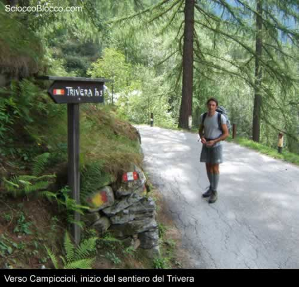
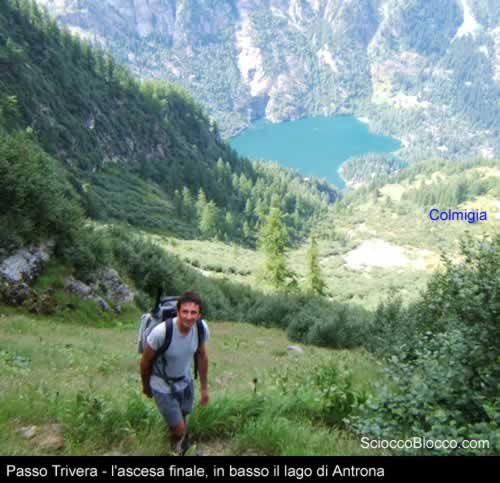
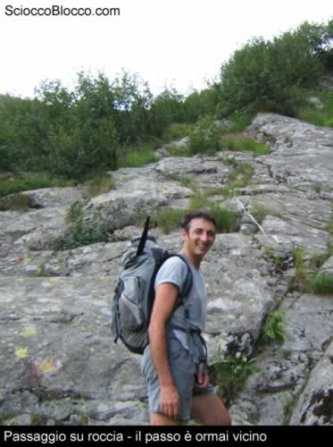
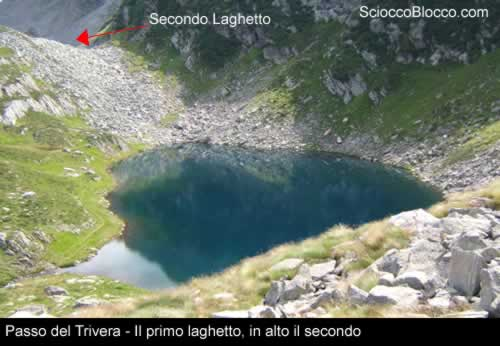
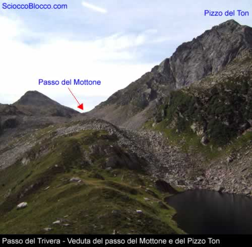
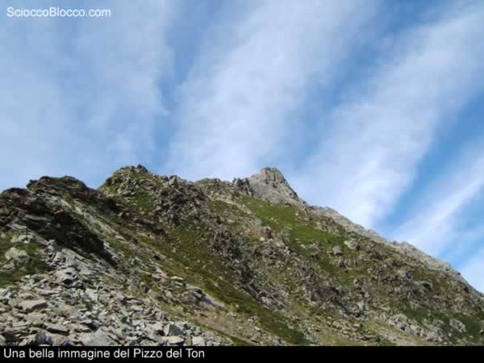
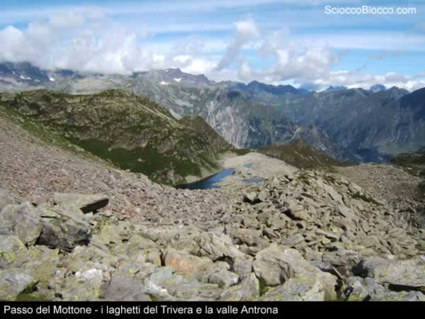
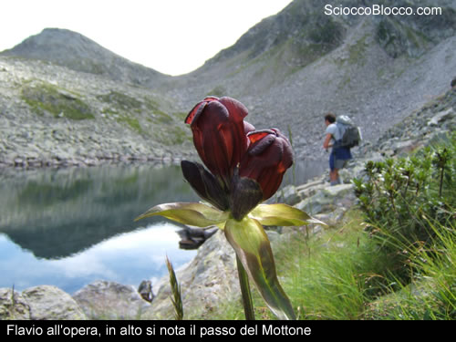
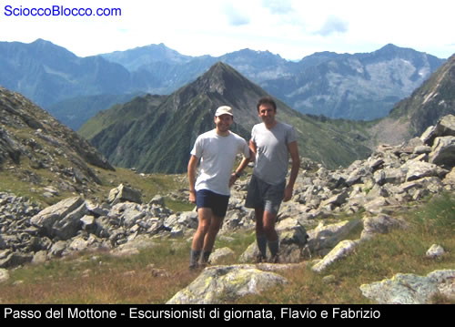

Raggiunto il **Lago di Antrona** saliamo, lungo la strada ENEL, verso il **Lago di Campiccioli**. Dopo aver superato i numerosi tornanti dobbiamo stare attenti perchè l'inizio del sentiero è proprio sulla strada alla nostra sinistra e ben segnalato da un cartello,l'auto o la moto la possiamo lasciare in un piccolo spiazzo adiacente l'inizio del sentiero.

Adesso comincia il bello, dobbiamo farci 920m di dislivello in circa 3km di marcia, il cartello indica un tempo di 3 ore ma noi siamo riusciti a compiere l'ascesa in 1h e 7 minuti senza alcuna sosta. Inizialmente ci "arrampichiamo" in un fitto bosco che sembra essersi mangiato il sentiero, giunti in vista dell'alpe **Crevalastra** , ormai diroccata, le pendenze si fanno più dolci e possiamo anche gustarci qualche specialità del sottobosco,lamponi e mirtilli. Purtroppo riprendiamo subito a salire ma il passo è buono ed in una ventina di minuti arriviamo all'alpe **Colmiggia**, anch'essa diroccata, e da qui, in un bel pianoro ricco di mirtilli,possiamo vedere la nostra meta. Continuiamo l'ascesa, adesso non c'è vegetazione che possa proteggerci dal sole ma, fortunatamente, la giornata è velata e leggermente ventilata per cui non soffriamo troppo per il caldo. Il sentiero è praticamente dritto ed in alcuni tratti ci sono delle lastre rocciose da superare arrampicandocisi sopra, ma comunque nulla di preoccupante.

Dobbiamo fare ancora qualche minuto di fatica ma ormai il passo è in vista; attraversiamo ancora un fitto boschetto di tigli o faggi (purtroppo in botanica siamo veramente scarsi) ed eccoci arrivati al **Passo del Trivera**, tempo 1h10'.

Scendiamo dal passo e seguiamo il sentiero ben visibile che porta al **Passo del Mottone**.Ben presto ci troviamo in mezzo ad una maestosa pietraia per cui stiamo attenti a dove mettiamo mani e piedi; la via è segnalata da ometti e da segni gialli e rossi, comunque sia è difficile perdere l'orientamento in questo luogo. Adesso rallentiamo la marcia e ci godiamo la bella giornata e questo posto, inoltre i moltissimi massi non ci consentono di proseguire di buon passo.

Dopo circa un'altra ora di marcia arriviamo finalmente al  **Passo del Mottone** dove ci concediamo una meritata pausa per la colazione.Questo passo si trova tra la **valle Antrona e la valle Anzasca**, la zona che stiamo battendo è piuttosto solitaria, non vediamo molti alpeggi ed i pochi che vediamo sono abbandonati, anche i sentieri sono poco battuti e pian piano stanno scomparendo come quello che costeggia il **Pizzo delTon** e porta al **Pizzo di S.Martino**.

Adesso possiamo scendere verso i laghetti e cercare la cattura di qualche esemplare di trota alpina.

Arrivati ai laghetti notiamo subito delle bollate e ci gettiamo nella pesca, la giornata non sembra fortunata ma alla fine qualcosa cambia e le prime catture arrivano, la giornata non può andare meglio ma purtroppo a 2000m ci sono anche le zanzare che cominciano a devastarci.....

Alla fine dobbiamo scendere, rifacciamo la stessa strada fatta qualche ora prima, nella piana dei mirtilli possiamo rimpinzarci....sempre che non abbiamo già rastrellato......

Scarica recensione

**Un ringraziamento a Flavio e Fabrizio.**

**
