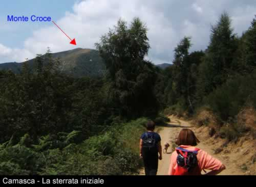
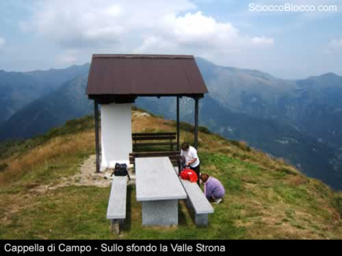
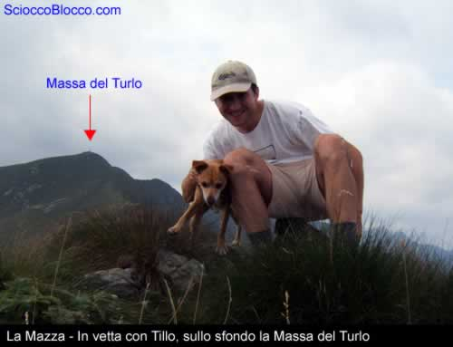
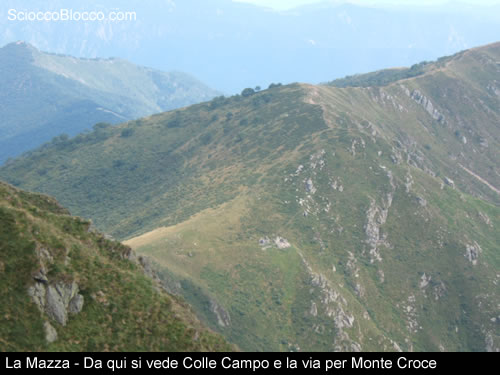
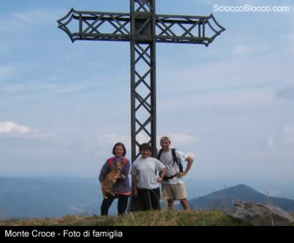

Arrivati alla fine di questa sterrata ci troviamo in località Bocchetta di Foglia (1272m) da qui, sempre seguendo le chiare indicazioni per monte Croce, ci inoltriamo in un bel faggeto. Da qui il sentiero comincia a restringersi e le pendenze aumentano ma non c'è nulla di difficoltoso. Usciti dal bosco comincia un tratto abbastanza impegnativo ma davvero suggestivo, per via di alcuni passaggi in mezzo a grossi massi, e che ci porterà al bivio del Monte Croce, qui prenderemo a destra seguendo le indicazioni per Alpe Campo, in questo tratto il sentiero è pianeggiante e potrete notare i lavori di ampliamento del CAI di Omegna. Dopo circa una mezz'ora arriviamo a Cappella di Campo, qui possiamo sostare per una merenda sul bel tavolo in marmo, di fronte vediamo il Colle Campo sovrastato dalla Mazza, in basso a sinistra si apre tutta la valle Strona con i sui paesini aggrappati ai monti, da Forno a Loreglia.

Riprendiamo il cammino e scendiamo ad Alpe Campo per poi risalire fino a Colle Campo, qui entriamo in provincia di Vercelli, infatti questo colle segna il confine tra Valle Strona e Val Sesia. Seguiamo il sentiero e andiamo alla conquista della Mazza, la via è abbastanza impegnativa per via delle notevoli pendenze ma non abbiate timore.Dopo circa una ventina di minuti e 250m di dislivello arriviamo in vetta, da qui possiamo continuare il cammino ed arrivare fino alla Massa del Turlo.

La vista è davvero notevole, a sinistra si stende la Val Sesia da cui possiamo distinguere il fiume Sesia e molti alpeggi che la costellano, di fronte abbiamo la Massa del Turlo e la Forcolaccia mentre a destra si stende la Valle Strona.

Torniamo a Colle Campo seguendo la stessa via dell'andata, arrivati in fondo seguiamo le indicazioni per Monte Croce, da qui in avanti è una passeggiata, godiamoci il panorama.

Giunti a Monte Croce proseguiamo lungo il sentiero che scende verso il bivio incontrato un paio d'ore prima e rifacciamo il sentiero dell'andata a ritroso fino ad arrivare a Camasca dove abbiamo lasciato l'auto. Come avete potuto capire l'escursione è davvero semplice ed adatta a tutti inoltre i sentieri sono sempre ben segnati, l'unica raccomandazione che vi faccio è quella di portare acqua, infatti ne troverete solamente lungo la via per Cappella Campo ed all'Alpe Campo.

**Un ringraziamento a Tillo,Fabrizio,Maddalena,Pia.**
