A **Scarliccio** (978m), troviamo un piazzale dove parcheggiare le auto, anche se la strada prosegue, un cartello indica il divieto di accesso e l'indicazione "strada non collaudata", quindi chi volesse raggiungere l'**Alpe Cortino** in auto tra tratti asfaltati e sterrati, lo dovrà fare a proprio rischio di eventuali multe e danni alla vettura. Noi per festeggiare il ferragosto, dividiamo in due questa nostra escursione, prima tappa **Rifugio Regi** con pernottamento, seconda tappa per chi vuole, **La Scheggia** il mattino successivo, quindi rientro. La strada parte subito benchè asfaltata con buona pendenza, e qualche rampa accentuata, diviene sterrata nei pressi di una fontana, per poi intervallare tratti asfaltati a tratti sterrati. Alla nostra destra per tutto la percorrenza di questa carrabile, ci fa compagnia **Arvogno** che cattura lo sguardo sul lato opposto della valle.

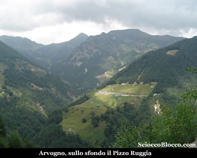

Superiamo dopo circa un paio di chilometri una cappelletta, poco dopo il percorso spiana e quindi in discesa ci porta in circa altri 1,5/2 km all'**Alpe Cortino** (1285m) (50/60min).

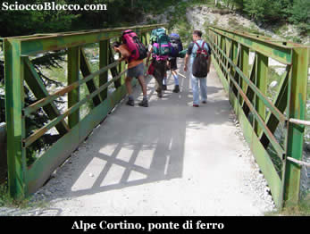

L'**Alpe Cortino** è costituito da un nucleo di baite ben ristrutturate, che forse a definire solo baite gli si fa torto per la loro bellezza, dovuta certamente anche grazie alla comodità della strada. Superiamo il ponte in ferro , dove qualche pescatore tra noi sostiene di aver visto delle trote nelle pozze sottostanti, qui la strada finisce, e proprio al termine seguiamo il sentiero che entra nel bosco lasciando l'alpe sulla destra. Dopo qualche minuto, all'interno del bosco arriviamo a un bivio nei pressi di una stele con croce, prendiamo il sentiero a sinistra che sale lungo il crinale coperto da un fitto faggeto. La salita si fa impegnativa, usciamo per poco dal bosco e attraversiamo un torrentello, sopra di noi appare magnifica la meta finale del giorno successivo.

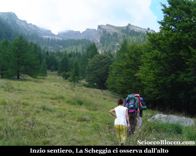

Rientriamo quindi nel bosco, le pendenze sono sempre buone ma non proibitive, e se siete fortunati potreste fare simpatici incontri come noi.....

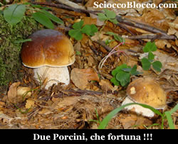

E si !! Due sodi porcini ci osservano da bordo sentiero, e rallegrano il gruppo come allieteranno il sugo del pranzo !!! Usciamo nuovamente dal bosco, in una larga radura, sulla motta poco sopra appaiono le baite dell'**Alpe Anfirn** (1524m)(1.50/2.00h) che raggiungiamo in breve.

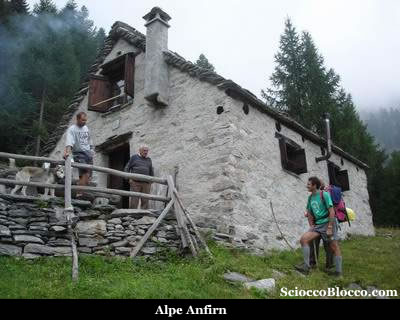

Qui dei gentili signori, proprietari di una deliziosa baita, ci confermano di essere sul sentiero giusto e ci ragguagliano sul dislivello ancora da fare (circa 300m). Rabboccate le borracce alla vicina fontana, ripartiamo rientrando nel bosco ormai più rado e dominato dai larici alle spalle dell'alpeggio. La salita si fa davvero impegnativa, le pendenze sono notevoli e gli zaini carichi di viveri ci costringono ad una bella sfacchinata. Riemergiamo finalmente dal bosco, superiamo un ultimo motto, e davanti a noi appare in uno scenario eccezionale la nostra meta Alpe Forno **Rifugio Regi** (1888m)(2.45/3.00h).

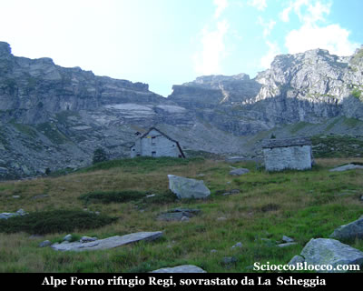

La fatica è ampiamente ripagata, al centro di un vero e proprio anfiteatro naturale, caratterizzato dalla inconfondibile finestra di roccia de **La Scheggia**, è posto il **Rifugio Regi** di proprietà del *CAI Vigezzo*, dotato di 9 posti letto su tavolato, con materassi e coperte, un bel camino, fornello a gas e fontana all'ingresso, presto munito di pannello solare e quindi di luce elettrica. A fianco piccolo bivacco invernale sempre aperto. Per informazioni rivolgersi al CAI **Valle Vigezzo**, piazza Risorgimento, 28038 S. Maria Maggiore (VB), tel. 032494737 ( il venerdì sera ) per accedere al rifugio ritirare chiavi in sede. Il tramonto è già iniziato diamo uno sguardo giù verso il bellissimo panorama della **Valle Vigezzo**.

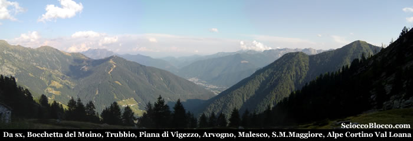

La vista è grande, da sinistra vediamo la **bocchetta del Moino** uno degli accessi alla *Vall'Onsernone*, quindi il **Trubbio** dove si possono vedere gi impianti di risalita, della sottostante e ben visibile **Piana di Vigezzo**, nella radura in basso **Arvogno** con sopra la traccia della nuova pista da sci che lo collega alla Piana, e laggiù in fondo la **Valle Vigezzo** con **Malesco** e **Santa Maria Maggiore**, sopra i quali spicca la radura dell'**Alpe Cortino** con il suo rifugio poco sotto la croce de **La Cima**. Vediamo anche l'inizio della **Val Loana** e sullo sfondo le cime che ne fanno da testata. Cala il buio, prepariamo finalmente la cena con tutto ciò che ci ha fatto sudare tanto in salita.

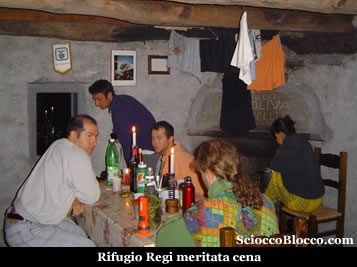

La notte si presenta magnificamente stellata, ma freddina, in lontananza una piccola nube temporalesca con i suoi lampi, accende la nostra fantasia più di 100 spettacoli pirotecnici.

Poco prima dell'alba sveglia e abbondante colazione, preparativi per la partenza alla seconda meta di questo piccolo trekking. Appena il cielo si schiarisce lasciamo il rifugio, imbocchiamo il sentiero che passa poco sopra e ci dirigiamo verso la cresta di sinistra dell'anfiteatro.

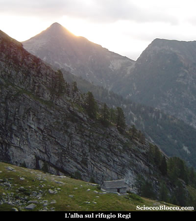

Il sole fa capolino dietro le vette, il rifugio è ancora immerso nell'ombra e nel sonno (per qualcuno). Raggiunta in breve l'inizio della cresta, prestiamo attenzione, il sentiero è un po nascosto e si inerpica dritto lungo il crinale, non fatevi trarre in inganno dal sentiero che prosegue in piano, il quale con ampio giro riconduce poi di nuovo alla cresta ma allunga il percorso. Iniziamo così la salita che si presenta subito impegnativa per la pendenza che solo in brevissimi tratti da un po di respiro. Sempre poco sotto il filo di cresta, che sulla nostra destra strapiomba giù nella larga radura dove è posto il rifugio, il sentiero si inerpica verso la cima aprendosi spesso su precipizi mozzafiato. Nell'ultimo tratto di salita la traccia piega più verso l'interno, e su magri e impervi prati, frequentati solo da capre e pecore, si porta sotto la vetta a costo di buona fatica. Qui tra sfasciumi e prestando attenzione a scivoloni su i sassi mobili e al vuoto che si apre di fronte a noi guadagnamo in breve la vetta de **La Scheggia** (2466m)(1.45/2.00h dal rifugio)(6.00/6.30 da **Scarliccio**).

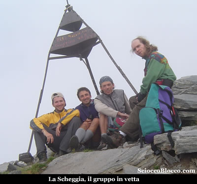

**La Scheggia** è la montagna più alta del comprensorio vigezzino, e forse la più bella esteticamente sia vista da lontano che da sotto le sue pareti verticali, unica che può rivaleggiare è forse la **Pioda di Crana**. La giornata per noi non è delle migliori le nuvole sono molto basse e noi ci siamo dentro, in qualche squarcio possiamo ammirare in parte lo splendido panorama che si gode da quassu. Di fronte al nostro arrivo la **Pioda di Crana**, e in una carrellata verso destra (sud), in basso riappare il **rifugio Regi** splendido al centro del emisfero formato dalle pareti de **La Scheggia**, la **Piana di Vigezzo** con le sue piste da sci, **Arvogno**, la **Val Vigezzo** la infondo, la **Val Loana** e le sue cime, la **Val di Basso**, il **Pizzo Ragno**, **Cima Mater**, la **Val Agarina** e dietro sullo sfondo come un apparizione il **Monte Rosa**, quindi i 4000 del vallese **Weissmies**, **Lagginhorn** e **Fletchhorn**. Torniamo per lo stesso sentiero al rifugio, dove ci attende un lauto pranzo. Il tempo non promette nulla di buono, e anticipiamo un poco il rientro, salutando l'accogliente **rifugio Regi** che ci ha ospitato.

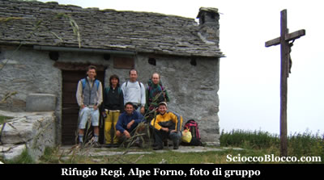

Ripercorriamo il sentiero fatto il giorno precedente, accompagnati per un po da una pioggerella battente, raggiungiamo dapprima l'**Alpe Cortino** e quindi su la strada sterrata di nuovo **Scarliccio** partenza e arrivo del nostro micro trekking. Bella escursione alla portata di tutti anche se a costo di qualche fatica per i meno allenati sino al rifugio, consigliata ad escursionisti esperti nel tratto dal rifugio alla vetta a causa delle pendenze impegnative ma soprattutto dei pericoli presentati da strapiombi e rocce instabili.

Scarica recensione

Un ringraziamento a Barbara,Fabrizio,Flavio,Dario,Francesco e [Matteo](http://baccan.it).**
