La
partenza di questa bella escursione si trova davanti ad
una galleria di servizio,lunga circa 1,5 km,che ospita le
tubazioni che portano l'acqua della diga fino alla centrale
ENEL di Goglio.

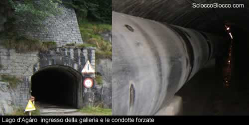

Entriamo nella galleria e accendiamo le luci, l'interruttore
si trova a sinistra, e percorriamola fino in fondo, ci metteremo
circa 10 minuti.

Una volta sbucati dalla parte opposta ci troviamo ai piedi
della maestosa diga di Agaro;
fu costruita nel 1938 in un'ampia pianura alluvionale lunga
più di 2 km che ospitava i paesi di Agaro
e Margone, ancor oggi,quando la diga viene
svuotata, si possono vedere i resti di questi insediamenti.

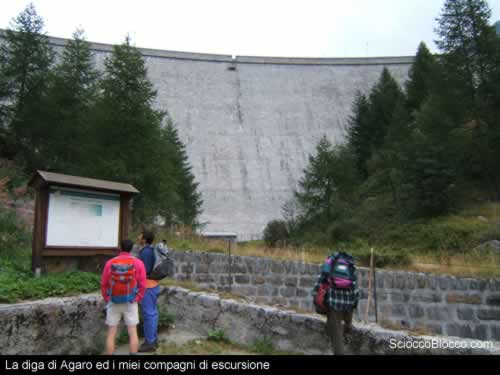

Prendiamo il sentiero che porta alla casa del guardiamo
e proseguiamo lungo l'ampia via che costeggia sulla sinistra
il lago e che porta verso gli alpeggi all'estremità
settentrionale del bacino.

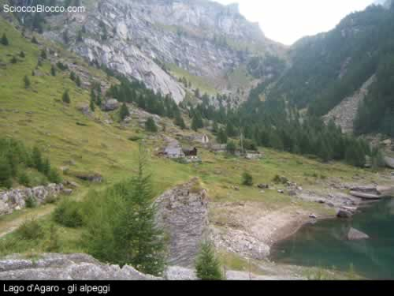

Proseguiamo la camminata attraversando il primo gruppo di
baite e raggiungiamo il secondo gruppo, qui attraverseremo
un improvvisato ponte di legno e cominceremo la salita tenendoci
alla destra del torrente.

La salita non è difficile ma ci sono dei tratti con
delle pendenze impegnative, comunque sia il paesaggio ci
ripaga della fatica, stiamo attraversando un bel bosco di
larici con un fitto sottobosco di mirtilli, alle nostre
spalle si stende il lago.

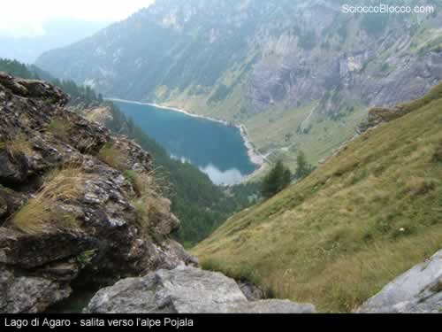

Usciamo dal bosco di larici e ci ritroviamo ad un incrocio,
a destra andiamo verso l'alpe
Topera mentre a sinistra verso Pojala,
se proseguiamo dritti ci troviamo di fronte a delle stalle costruite apposta dall'ex Enel ai pastori del luogo in cambio dei pascoli   tolti con l'invaso del lago d'Agaro, come ci fa sapere l'amico Paolo.

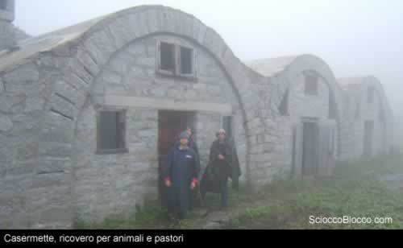

Proseguiamo prendendo il sentiero di sinistra, adesso le
pendenze non sono più impegnative però dobbiamo
fare attenzione a dove mettiamo i piedi, infatti a sinistra
troviamo dei pendii erbosi tutt'altro che dolci....

Lungo la strada non mancano le sorprese, troviamo numerose
tracce delle attività militari qui svolte durante
le due guerre, ci sono piccole grotte e anfratti per cecchini,
troviamo anche le meraviglie della natura come questo fiore.

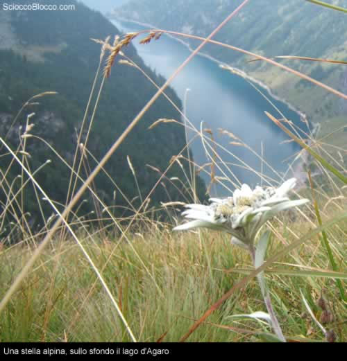

Dopo circa 2 ore di cammino arriviamo in cima alla conca
di Agaro e
proseguiamo in falsopiano fino a raggiungere  l'alpe
Pojala;questo falsopiano è davvero
fantastico, è ricco di sottobosco e di piccoli larici,
saranno gli ultimi alberi che vedremo d'ora in avanti.

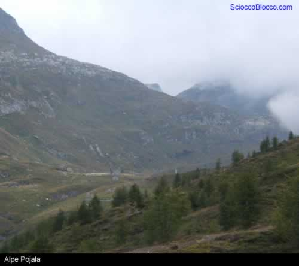

Arrivati all'alpeggio proseguiamo oltre cercando di seminare
il numerosissimo gregge di pecore che circonda le baite;
su di un dosso ritroviamo il sentiero che conduce al lago
di Pojala, da lontano possiamo vedere la
valle in cui si trova questo lago alpino.

Il sentiero non è segnato però è molto
chiaro e comunque basta seguire il corso del torrente alla
nostra destra.

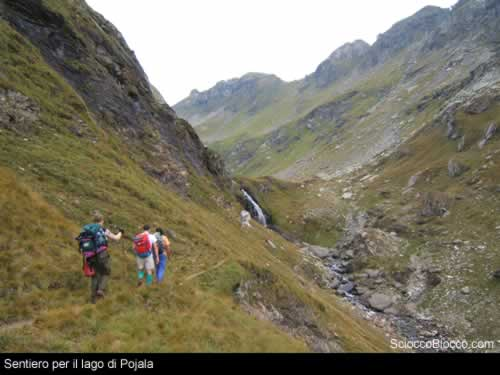

Dopo circa 2h30' di cammino siamo finalmente arrivati a
destinazione, purtroppo il tempo inclemente non ci permette
di ammirare appieno la bellezza di questo luogo però
non viene a mancare il fascino di questa bella conca, sembra
di essere in terra scozzese, la giornata fredda, il terreno
brullo e la nebbiolina rendono il paesaggio affascinante.

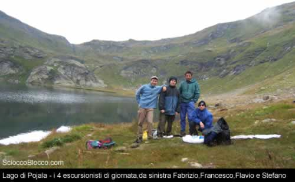

Dopo un veloce pranzo ed una pescata (con scarse catture...purtroppo)
cominciamo la discesa a valle accompagnati da una pioggerellina
che aumenta il fascino di questa nostra escursione.

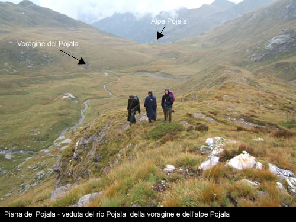

Percorriamo a ritroso lo stesso sentiero seguito in precedenza
spostandoci però sulla cresta e sui pendii scoscesi
che danno sul torrente Pojala,
luogo ideale per trovare stelle alpine.

Arrivati in vista delle baite notiamo, dall'altra parte
del pianoro, la famosa voragine
del Pojala, questa è una depressione
calcarea del terreno in cui viene inghiottito il torrente
emissario del Pojala le cui acque si perdono nelle viscere
della terra per poi ricomparire 2km più avanti, nelle
vicinanze dell'alpe Bionca.

Un gruppo di speleologi di Novara hanno monitorato questa
voragine ed hanno sperimentalmente misurato che il percorso
nelle viscere della terra delle acque dura circa 2 giorni.

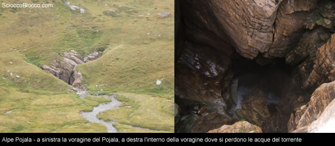

Abbiamo visto tutto e possiamo finalmente tornare verso
la macchina, noi abbiamo percorso il sentiero fatto poche
ore prima è però possibile prenderne un'altro
che porterà ugualmente alla diga
di Agaro, questo sentiero parte dall'alpe
Pojala e prevede l'attraversamento della
Bocchetta di Scarpia
e una lunga camminata sulla Corona
di Traggi per poi scendere fino ad Agaro.

Durante il ritorno abbiamo incontrato delle nubi molto basse
e la visibilità si è ridotta moltissimo,in
queste condizioni si deve prestare molta più attenzione
a dove mettere i piedi; a parte questo piccolo inconveniente
l'escursione è davvero affascinante e questi luoghi
vanno visitati ma senza fare i vandali e lasciando le stelle
alpine dove si trovano.

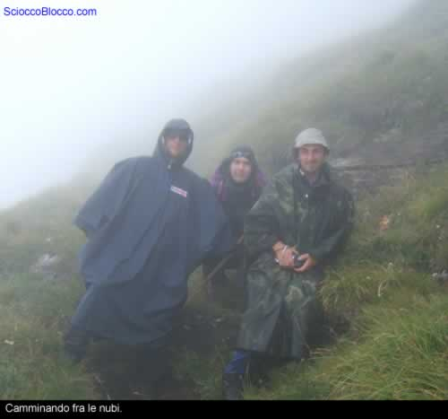

Scarica
recensione

Un
ringraziamento a Fabrizio,Flavio,Stefano,Francesco

