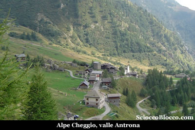
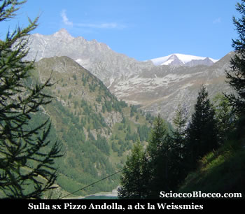
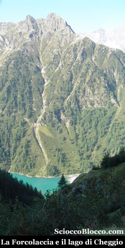
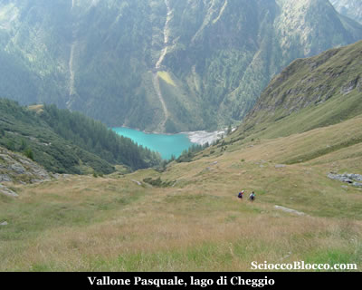
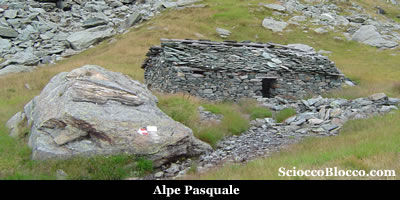
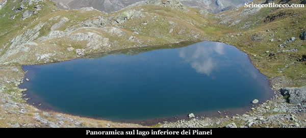
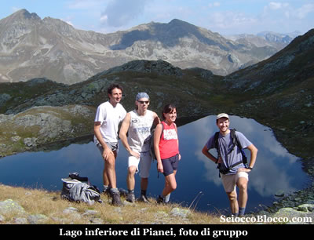
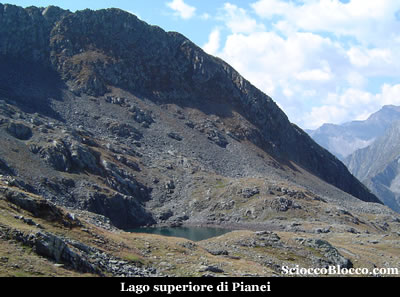

A **Cheggio**(1497m), splendido alpeggio costituito da belle e ben rifinite case per le vacanze e da un paio di piccole ma accoglienti strutture alberghiere, lasciamo la macchina alla fine della strada in un comodo parcheggio sterrato.

Di
fronte a noi cattura subito lo sguardo il muraglione gradonato
della diga del **lago di Cheggio**
o **lago dell'alpe dei Cavalli**,
e proprio sulla destra pochi metri prima dello sbarramento
artificiale parte il nostro sentiero ben segnalato dai colori
bianco e rosso del CAI e dalla sigla C26.

Il
lago artificiale di **Cheggio**, che chiude il bacino dell'alta
valle Loranco, era già in precedenza un piccolo lago
naturale dove era posta l'alpe Cavalli ora sommersa
dalle acque della diga.

Diga realizzata tra il 1922 e il 1926 dalla società
Edison, come scritto al centro della murata.

Il bacino ha una superficie di 5 ettari e una capacità
di 6,9 milioni di metri cubi.

Il sentiero parte subito su pendenze impegnative, alzandosi
sopra la diga, al limitare di un bosco dominato dai larici
raggiunge rapidamete l'**alpe
Curzel**(1626m)(10/15min).

Qui poco sopra l'alpe il sentiero spiana, e in un traverso
all'interno del bosco costeggia alto il **lago di Cheggio**,
fino a trovare l'intersezione con la traccia che sulla destra
sale verso i laghetti.

Qui tra gli squarci del bosco si può ammirare una
fantastica vista sul **Pizzo
Andolla** e piu a destra sulla **Weissmies**,
per l'occasione sotto una incredibile nuvola che sembra
voler fargli da coperta.

Il
sentiero torna a farsi impegnativo, tra i prati di un canalino
perveniamo su di un piccolo motto, a ciò che resta
dell'**alpe Bisi**(1806m)(40/45min).

Lo sguardo è attratto giù dal verde smeraldo
del **lago di Cheggio**, sovrastato dalla **Forcolaccia**.

Imbocchiamo
ora il vallone Pasquale,
la salita è abbordabile, la vista sul fondo valle superlativa.

Superiamo
ora un ruscello e su sentiero che si fa ripido arriviamo
all'**alpe Pasquale**(1956m)
(1.00/1.15h).

Proseguiamo
sulla sinistra del torrente, ci immettiamo ora in un canalone
erboso assai irto che ci conduce ai ruderi dell'**alpe
Pianei**(2179m)(1.35/1.50h).

Puntando ora verso destra, si procede verso la Bocchetta
di Pianei, nel piano sottostante il passo voltando ancora
a destra si arriva al **Lago
inferiore di Pianei** (2323m)(2.00/2.15h).

Il
panorama è notevole cime di altitudini rispettabili
ci circondano, la val Bognanco si apre verso nord.

Buon posto per il meritato pranzo.

Da
qui tenendo ancora la destra e in lieve salita arriviamo
brevemente al **lago superiore
di Pianei**(2345m)(2.15/2.30h).

I due
laghi di Pianei che prendono il nome dall'alpe sottostante
sono di origine glaciale e si trovano nei declivi pianeggianti
(appunto "Pianei") del **Pizzo
Montalto**, e sono perlopiu alimentati dai
piccoli nevai che resistono fino a tarda stagione a causa
dell'esposizione a nord-ovest.

Da qui il ritorno avviene per lo stesso percorso dell'andata,
che ci riporta a **Cheggio**
dopo (4.30/5.00h).

Escursione di media difficoltà, e a causa delle frequenti
e ripide rampe consigliata a chi ha un minimo di allenamento.

**Grazie
agli escursionisti di giornata Elisa, Flavio, Fabrizio e
Dario.**

