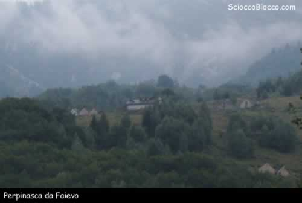
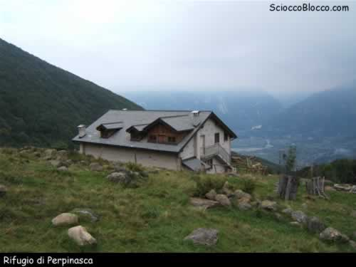
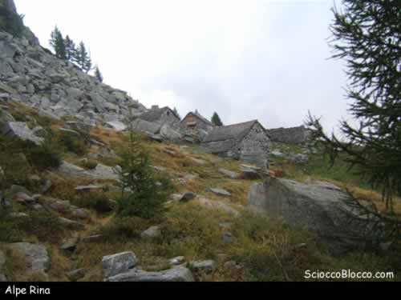
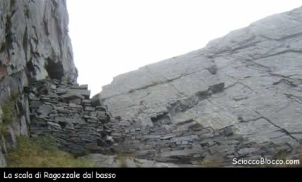
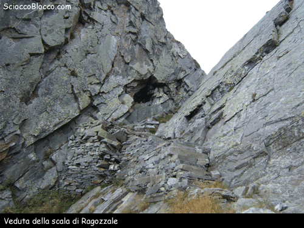
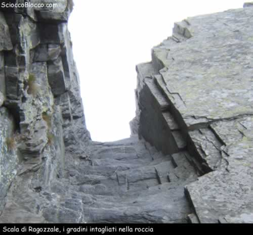
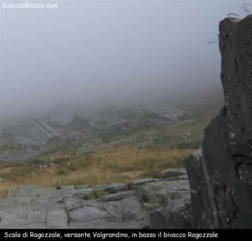
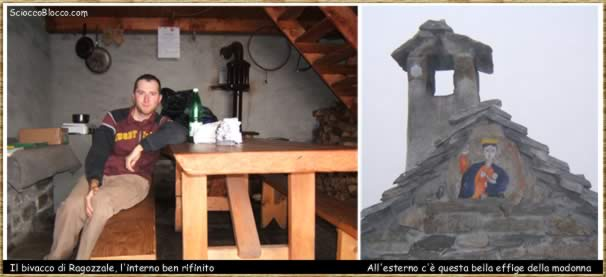

Lasciamo il parcheggio e andiamo dritti oltrepassando l'incrocio appena fatto in auto, dopo un centinaio di metri alla nostra destra, e ben nascosta, comincia una strada sterrata che ci condurra' sino a Faievo; questa strada e per 80% sterrata ma in buone condizioni per cui sarebbe possibile percorrerla in auto, ci vuole però un permesso, se volete rischiare potete andare anche senza e vi risparmierete 40 minuti di cammino. Lungo la strada è possibile incrociare il sentiero natura che sale da Trontano e che porta proprio a Faievo, passa interamente nel bosco e accorcia un pochino la strada ma in alcuni tratti è più ripido, comunque durante la discesa lo percorreremo tutto. Arrivati al termine della gippabile ci troveremo di fronte un grosso cartello del parco ValGrande e alla sua sinistra un largo sentiero,imbocchiamolo. Arrivati ad un grande alpeggio, che fa parte del circondario di Faievo,possiamo vedere di fronte a noi ,in cima ad una collinetta, il grande rifugio di Perpinasca, inconfondibile.

Proseguiamo lungo il sentiero sino a raggiungere un'altra gippabile e proseguiamo su questa via finchè non incrociamo un piccolo sentiero a sinistra che si inoltra nel bosco in direzione di Perpinasca;arriveremo in un piccolo alpeggio ed in alto possiamo già distinguere la sagoma del grande rifugio, proseguiamo seguendo tracce di sentiero. Dopo 1h 10' dalla partenza raggiungiamo finalmente Perpinasca, il rifugio è davvero grandioso ed in ottime condizioni, peccato che resti sempre chiuso.

Riprendiamo il cammino stando sulla destra e cercando i segni bianchi e rossi che ci condurranno fino a destinazione;sono stato davvero fortunato perchè la via è stata segnata agli inizi di settembre ed inoltre il sentiero nel bosco,che percorreremo a breve, è stato completamente pulito ed anche sistemato. Trovati i segnavia proseguiamo di buon passo tra i pascoli e le molte baite che costellano questa zona; arrivati a Pieso pieghiamo a sinistra e ci inoltriamo in un bellissimo bosco di faggi ben tenuto dove possiamo apprezzare il lavoro di sistemazione del sentiero.

Dopo circa 2h dalla partenza usciamo dal bosco e ci troviamo su una cresta, Punta i Pisoni, da cui possiamo vedere tutta la zona di Domodossola; pieghiamo a sinistra e proseguiamo, tra vari sali e scendi, in direzione dell'Alpe Rina. Il sentiero è ben segnato e facile inoltre siamo circondati da larici ed un folto sottobosco di mirtilli e rododendri,habitat ideale per il gallo forcello che infatti avvistiamo per ben 3 volte.

Arriviamo a Rina dopo 2h20' minuti di cammino, facciamo la prima pausa e mangiamo qualcosa.

Ripartiamo di buona lena seguendo il sentiero che si snoda fra sali e scendi in questo bel paesaggio reso ancor più suggestivo dalla nebbia che a tratti mi investe. Dopo aver superato un costone si comincia a vedere in lontananza un alpeggio, è l'alpe Menta, la meta non è lontana ma non ancora visibile.

Arrivati a Menta ,dopo 2h55,' ancora non si vede la scala di Ragozzale, continuiamo la marcia a testa bassa. Il sentiero comincia a farsi più duro e la quota sale, andiamo verso un costone di roccia della Testa di Menta e dopo averlo superato vediamo lassù in alto la famosa scala di Ragozzale incastrata fra spioventi rocce e nascosta alla vista, davvero emozionante.

Gli alpigiani di Trontano nei secoli passati per raggiungere l'omonimo alpe sul lato valgrandino, costruirono la porta di "Raguzzal", nome che deriva da ragozza, equivalente dialettale di radice (nome dato anche ad un lago in Val Bognanco “lago di Ragozza” da noi [recensito](Bognanco_Monscera.htm)).

Con sforzo biblico intagliarono nella piodata una vera e propria scala di circa 20m di dislivello e con due tornanti per una lunghezza di 35m, e aprirono sulla cresta anche una "porta" per consentire il passaggio di mucche e pastori. Ancora più chiare appaiono le dimensioni dell'impresa se si tengono in considerazione gli scarsi mezzi tecnici a disposizione all’epoca (ultimo restauro fine '800) e la notevole distanza che separa l'alpe Ragozzale il più alto della Val Grande, dai paesi di fondovalle. "Manufatto che resta a muta testimonianza come altri, della storia della Val grande e dei suoi poveri abitanti, disposti ad incidere la roccia pur di strappare alla montagna un ennesimo esiguo spiazzo d'erba dove pascolare poche bestie."

Adesso possiamo scendere al Bivacco di Ragozzale (dopo 3h10' di marcia)per riposare e rifocillarci prima di gettarci nella discesa; questa struttura è stato risistemata dall'Ente Parco Val Grande e dal comune di Trontano il 6 giugno del 1999 e ,seppure sia spartana, diviene un comodo luogo di ristoro per gli escursionisti soprattutto in giornate come questa.

Dopo aver pranzato possiamo tornare a casa, seguiremo lo stesso sentiero di prima;in questa zona guardate molto bene sulle creste e sui pendii scoscesi magari avrete la mia stessa fortuna di incrociare lo sguardo con un bel camoscio.

Scendiamo rapidamente dai sentieri appena calcati e dopo 5h10'(pause comprese) dalla partenza siamo nuovamene a Trontano.

Scarica recensione

**Escursionista di giornata Fabrizio. **
