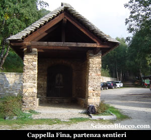
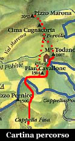
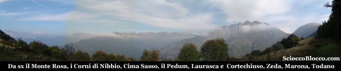
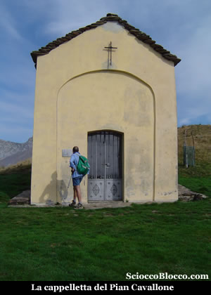
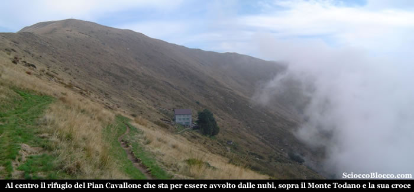
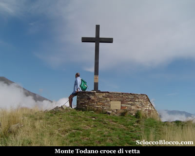
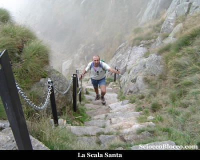
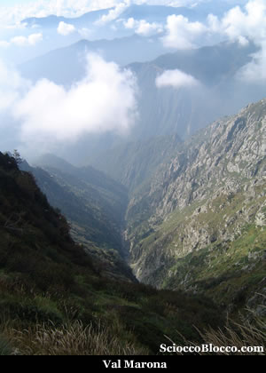
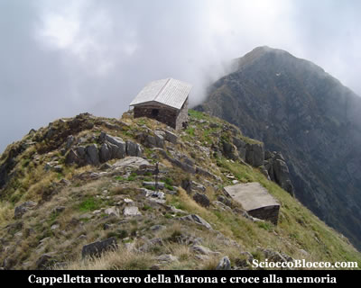
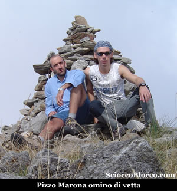

Qui nell'ampio parcheggio sterrato contraddistinto al centro dalla **cappella Fina** (1100m), lasciamo l'auto e imbocchiamo il largo sentiero gippabile che parte sul fondo.

Ignoriamo il sentiero che subito sulla destra prosegue in piano, il quale porta alla cappella di Porta a **Caprezzo**, e dritti saliamo sulla comoda strada che si immerge in un bosco. Superiamo una cappelletta dedicata da un padre alla memoria del figlio, quindi la deviazione per l'*Alpe Cavallotti*, la strada diviene comoda mulattiera, quindi marcatissimo sentiero, e arriviamo nei pressi di una fontana ormai fuori dal bosco (30').

Se il tempo vi assiste il panorama è già notevole, **Verbania** si stende sulle rive del **Lago Maggiore**, il **Monte Rosso** appare sulla destra e i monti lombardi fanno da sfondo. Per noi la giornata non è delle migliori in breve una densa umidità coprirà totalmente la vista sulla valle del lago. Proseguiamo ora su battutissimo sentiero tanto che i bordi risultano spesso 40cm più alti del centro, da far sembrare il camminamento più una trincea che una traccia. Aggiriamo il *Pizzo Pernice* e ai margini di un fittissimo e scuro bosco di abeti rossi arriviamo alla lunga spianata che precede la prima meta *(1.00h)*. Qui troviamo chiare indicazioni di un sentiero che scende a **Cicogna** *. Se a sud ormai la visibilità è nulla a nord verso l'ossola il cielo è ancora buono e il panorama che si apre mirabile.

Dalla nostra sinistra, il massiccio del **Monte Rosa** sgombro da nubi svetta maestoso, più vicino a noi corre la linea di cresta dei **Corni di Nibbio** che termina nel **Proman**, ancora più vicina la dorsale spartiacque tra **Valgrande** e **Val Pogallo** con **Cima Sasso** il **Pedum** e la testata frontale della **Laurasca** e del **Cimone di Cortechiuso**, sulla destra la cresta del **Monte Zeda** e del **Pizzo Marona**, per finire con il **Monte Todano**. Continuiamo ora in falsopiano, superiamo prima ciò che resta dell'antico albergo cavallone nei pressi del quale si trova un bivacco invernale, quindi in pochi minuti eccoci alla **cappelletta del Pian Cavallone** (1528m)(1.15/1.30h).

Dritti di fronte a noi poco più in basso vediamo il **rifugio del Pian Cavallone** appena sotto la vetta del **Monte Todano**.

Il **rifugio del Pian Cavallone** di proprietà del *CAI Intra* costruito nel 1882 e gestito dalla *Cooperativa **Valgrande** è la meta più classica dell'escusionismo *verbanese* per la sua facile accessibilità da molti paesi della **Valle Intrasca** come **Miazzina**, **Intragna**, **Caprezzo** e anche da **Cicogna** ma con un po più di sforzo. Testimone di questo è una foto posta su di un pannello all'ingresso del rifugio, che ritrae centinaia di persone che ricoprono totalmente la montagna in un escursione popolare di inizio '900. Il rifugio ben curato offre circa 30 posti letto, un paio di ampie sale da pranzo, la luce elettrica a mezzo di pannello solare e ottima cucina. Può essere scelto come meta per merende e facile gita o come punto di partenza per escursioni più impegnative alle vette circostanti. Resta aperto ogni fine settimana da aprile a ottobre e tutti i giorni dall'ultima settimana di luglio alla fine di agosto, apre su prenotazione e solo per gruppi in ogni periodo dell'anno. Dietro la cappelletta partono due sentieri uno indica **Cicogna** ma può essere utilzzato per raggiungere la *Marona* senza salire al **Monte Todano** dove conduce il secondo sentiero. Noi saliamo la croce è ben visibile e la traccia con una linea pressoche diretta punta alla vetta, in circa 15' eccoci sul **Monte Todano** (1667m)(1.30/1.45h).

La croce di vetta è di recente posa da parte di una associazione donatori di sangue. La vista si apre giù sul versante opposto, tra i numerosi alpeggi dell'alta **Valle Intrasca** che noi abbiamo percorso e descritto in una nostra [recensione](http://www.scioccoblocco.com/recensioni/scareno.htm).

Alla nostra sinistra si dipana la cresta che si conclude nel **Monte Zeda**. Sino a qui le difficoltà sono state di tipo (E) ma ora si tramutano in (EE), la prudenza e l'attenzione devono aumentare. Scendiamo ora verso sinistra rispetto al nostro arrivo, il percorso è sempre ben marcato dai colori bianco-rosso del CAI, la discesa è alquanto ripida e la traccia spesso è avvolta tra i rododendri che provvedono a bagnarci bene scarpe e gambe, quindi muoversi con circospezione gli scivoloni sono in agguato e sarebbe difficile fermarsi su queste pendenze. Arriviamo alla **Forcola** (1518m)(1.45/2.00h). In questo punto troviamo indicazioni per il sentiero che scende a **Onunchio** e poi a **Piaggia** in **Valle Intrasca**. Noi saliamo diagonalmente il versante est della **Cima Cugnacorta**, abbandonando la cresta e restando in pratica orograficamente in **Valle Intrasca**. Di fatto aggiriamo la **Cima Cugnacorta** restando sulla destra del nostro arrivo, e con stretti tornanti su impervi prati frequentati da una colonia di capre, arriviamo ai piedi della **Scala Santa** (2.30/2.45h).

Una vera e propria scala gradonata con lastre di pietra e perfettamente assicurata con paletti e catene metalliche, fa guadagnare in breve parecchi metri di dislivello, riportandoci in cresta. Fatti pochi metri bisogna superare un breve intaglio protetto da catene, è questo il **Passo del Diavolo**. Alla **Scala Santa** e al **Passo del Diavolo** la credenza popolare associa una antica leggenda. Un ragazzo della zona trovatosi di fronte al vuoto che gli impediva di proseguire il cammino, fece un patto con il diavolo, in cambio di un ponte avrebbe potuto prendersi l'anima del primo passante. Il ponte fu costruito, ma l'astuto giovane fece transitare per primo il cane, facendosi beffe di Satana. Alla nostra sinistra si apre impervia e arcigna la **Val Marona**.

Proseguiamo l'ascesa, superato il passo grazie all'aiuto di Belzebu, saliamo per diagonali sempre poco sotto il filo di cresta dal lato est, dopo alcuni minuti se il tempo è clemente vediamo apparire sopra la nostra testa la cappelletta. L'ultimo tratto come sempre è verticale e faticoso ma in breve raggiungiamo la **cappelletta della Marona**.

Luogo affascinante e che senza le nubi basse di oggi concederebbe una grandiosa vista sul **Lago Maggiore** e la **Pianura Lombarda**. La **cappelletta della Marona** deve la sua costruzione alla leggenda appena riportata ed è dedicata alla **Madonna della Brascarola**, la tipica padella per fare la caldarroste. In pochissimi minuti raggiungiamo la vetta del **Pizzo Marona** (2051m)(3.00/3.15h).

Seconda vetta del comprensorio verbanese dopo il **Monte Zeda**, ma sicuramente la più ardita per la sua forma aguzza e per il percorso non facile. Il ritorno avviene per lo stesso percorso, ricordando che alla **Forcola** anzichè tornare sulla vetta del **Monte Todano** si può prendere il sentiero che in falso piano sulla destra lo costeggia e che ci riporta alla **cappelletta del Pian Cavallone**. Da qui dopo una pausa ristoratrice al Rifugio torniamo a **cappella Fina** e all' auto dopo circa 5.30/6.00 dalla partenza. Escursione impegnativa per durata e dislivello, che richiede un discreto allenamento e in qualche punto assenza di vertigini, ma di grande soddisfazione.

**Grazie agli escursionisti di giornata Alberto e Dario.**
