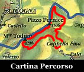
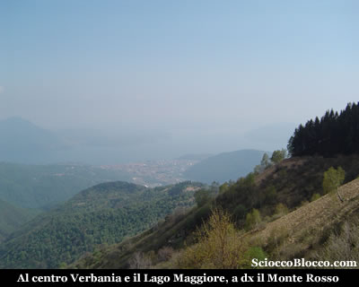
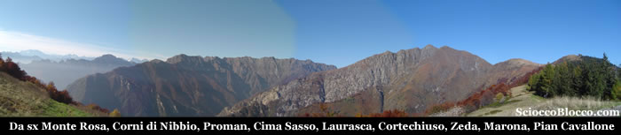
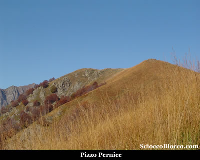
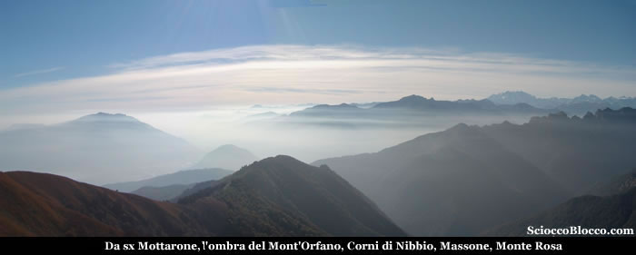
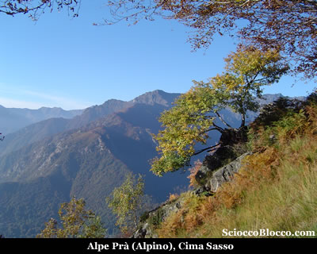

Questa semplice escursione ricalca nella prima parte l'itinerario classico per il Pian Cavallone, classico accesso per molte ascensioni alle montagne del comprensorio verbanese della Valgrande. Può essere effettuata comodamente al pomeriggio, ideale breve gita da stagioni intermedie che concedono con più frequenza giornate terse per apprezzare il notevole panorama che si gode da questi luoghi. Qui nell'ampio parcheggio sterrato contraddistinto al centro dalla **cappella Fina** (1100m), lasciamo l'auto e imbocchiamo il largo sentiero gippabile che parte sul fondo.

Ignoriamo il sentiero che subito sulla destra prosegue in piano, il quale porta alla cappella di Porta a Caprezzo, e dritti saliamo sulla comoda strada che si immerge in un bosco. Superiamo una cappelletta dedicata da un padre alla memoria del figlio, quindi la deviazione per l'*Alpe Cavallotti*, la strada diviene comoda mulattiera, quindi marcatissimo sentiero, e arriviamo nei pressi di una fontana ormai fuori dal bosco (30').

Se il tempo vi assiste il panorama è già notevole, **Verbania** si stende sulle rive del **Lago Maggiore**, il **Monte Rosso** appare sulla destra e i monti lombardi fanno da sfondo. Per noi la giornata non è delle migliori. Proseguiamo ora su battutissimo sentiero tanto che i bordi risultano spesso 40cm più alti del centro, da far sembrare il camminamento più una trincea che una traccia. Aggiriamo il *Pizzo Pernice* nostra meta che è sopra alla nostra sinistra e ai margini di un fittissimo e scuro bosco di abeti rossi arriviamo alla lunga spianata che precede il Pian Cavallone*(45min)*. Qui la vista si apre mirabile verso nord.

Da sinistra a destra, il **Monte Rosa** e i suoi ghiacci, i **Corni di Nibbio**, il **Proman**, più vicino a noi l'**Alpe Prà** o **Alpino** e la cresta che corre verso **Cima Sasso** quindi **Bocchetta di Campo** e il **Pedum**, la testata frontale che divide **Val Pogallo** da **Val Loana** e **Val Cannobina **con **Laurasca**, **Cimone di Cortechiuso**, **Marsicce**, quindi a destra la dorsale con **Monte Zeda**, **Pizzo Marona**, **Cima Cugnacorta**, **Monte Todano**, **Pian Cavallone**. In questo punto un cartello indica chiaramente il sentiero che scende verso Cicogna, non segnalato un evidente traccia risale la larga cresta prativa che torna in pratica nella direzione del nostro arrivo, è questo il nostro sentiero. Le pendenze si fanno più impegnative ma in pochi minuti raggiungiamo l'omino di cima del **Pizzo Pernice**(1500m)(1.00h).

Cima secondaria e tra le ultime della Valgrande, che sempre più arrotondate vanno scemando verso il **Lago Maggiore**. Tuttavia ottimo punto di osservazione che spazia sia pure da modesta altitudine a 360° sul territorio del Vco. Ora il panorama si concede anche verso sud, ma sui laghi la foschia è densa.

Il **Mottarone** e i monti che delimitano l'imbocco della **Val d'Ossola** affiorano come fantasmi tra le nebbie, presagi di desideri lontani. Proseguiamo il nostro cammino, il sentiero prosegue in cresta e allo scoperto inizia a scendere per poi avanzare in falso piano hai margini di un bosco che sale dal versante Pogallino. Rapidamente raggiungiamo un piccola sella dove si può ammirare Cicogna in fondo alla valle al di la del fiume. Qui un sentiero evidente ma senza indicazioni scende nel bosco alla nostra sinistra, volendo ci riporta seguendo la prima diramazione a sinistra incontrata nuovamente sul sentiero principale del Cavallone percorso all'andata oppure proseguendo all'Alpe Cavallotti e poi al sentiero principale ma poco più in basso. Noi ignoriamo questa ipotesi e continuiamo in cresta tra piccoli saliscendi poco sotto quota 1300m, tra gli squarci della vegetazione dai colori incandescenti tipici di questa stagione possiamo ammirare ancora **Cicogna** in basso e sopra l'**Alpe Prà** (**Alpino**) e **Cima Sasso**.

Arriviamo così appena sotto la cima del **Monte Todun** (1289m)(1.30/1.45h). Cima che possiamo raggiungere in pochissimi minuti. I cartelli sono cancellati dalle intemperie, comunque un marcatissimo sentiero scende a tornanti sulla sinistra. In una decina di minuti approdiamo su una larga mulattiera, un cartello indica chiaramente sulla sinistra Cappella Fina. Da qui in leggera discesa prima su largo sentiero e poi sulla strada forestale in costruzione torniamo a Cappella Fina nostro punto di partenza e arrivo (2.15/2.30h). Facile giro ad anello alla portata di tutti, consigliato in primavera e autunno perchè fattibile in mezza giornata, che consente grandi panorami.

**Grazie agli escursionisti di giornata Dario e Fabrizio.**
