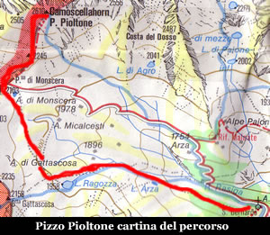
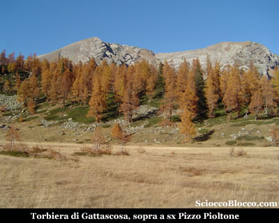
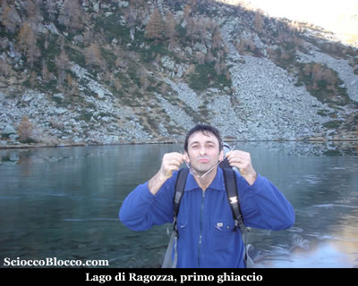
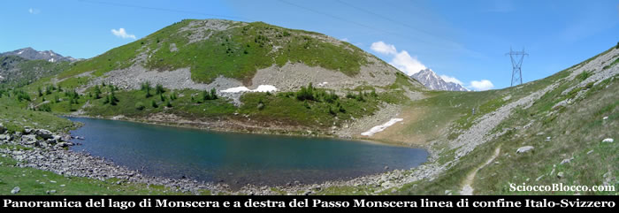
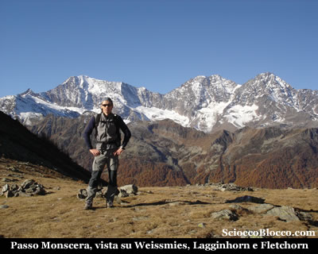
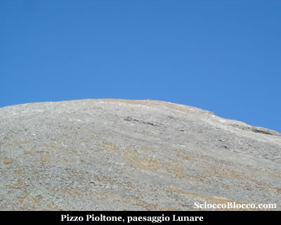
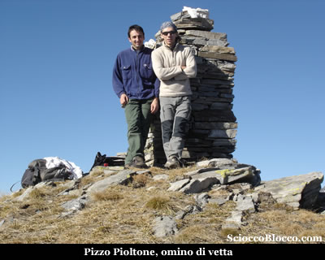
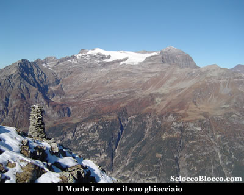
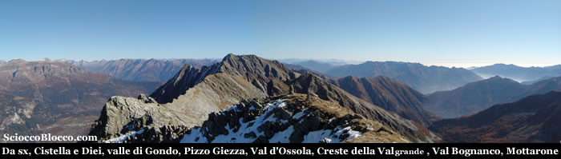

Qui all'**Alpe San Bernardo** (1628m), alla sinistra del parcheggio parte un largo sentiero indicato dai cartelli con il codice (D0) e dai colori bianco-rosso del CAI, per il **Lago di Ragozza** e il **Rifugio Gattascosa**.

All'interno di un bosco l'ampia mulattiera sale dolcemente, dopo circa 10min arriviamo ad un bivio, seguiamo la traccia che sale ora più accentuatamente sulla destra, perchè quella sulla sinistra ci porterebbe in pochi minuti al piccolo **Lago d'Arza** (1742m), di 1500mq e una cinquantina di centimetri di profondità, circondato da torbiere. Deviazione che comunque ci farebbe perdere poco tempo. Saliamo ora un poco più decisamente sempre all'interno di un bosco dominato dai larici, al margine di un piccolo ruscello che in alcuni punti attraverseremo con l'aiuto di alcuni ponticelli di tronchi. Quando il sentiero spiana, sbuchiamo dalla vegetazione in una larga radura. E' questa la **Torbiera di Gattascosa** (1831m) (35/45min).

La Torbiera è solcata da numerosi rigagnoli e dal ruscello popolato da numerosi *salmerini* che abbiamo già costeggiato più in basso. La vista è notevole le cime della **Val Bognanco** ci circondano, il **Pizzo Pioltone** la nostra meta è li ad attenderci con le falde sprofondate tra i larici dai colori fiammeggianti di fine ottobre. Attraversiamo il pianoro, il sentiero sempre molto evidente si impenna tra un rado bosco di larici, tuttavia lo sforzo è breve e approdiamo al **Lago di Ragozza** (1958m) (45/55min).

Possiamo notare l'immensa frana scesa dalla **Cima di Verrosso**, che ha occluso l'uscita del lago che formava il bacino sottostante oggi solo torbiera. Questo lago immerso in un ambiente stupendo, ha una superficie di 10.000mq e una profondità di 3,5m, è circondato da larici e da una infinità di rododendri e cespugli di mirtilli. Se in primavera questo posto è fantastico per i suoi colori vivaci, ora l'autunno regala scorci dalle tinte tenui ma ugulmente emozionanti. Il primo ghiaccio ricopre leggero la superfice lacustre. Prendiamo il sentiero che sale al margine del lago e ci apparirà il **Rifugio Gattascosa**(1993m)(50min/1.00h)che raggiungiamo in pochi minuti.

Il **Rifugio Gattascosa** dispone di 25 posti letto è gestito e può essere un ottimo punto d'appoggio sia per mangiare nelle gite di un giorno, sia per pernottare qualche giorno usandolo come punto di partenza per il trekking dei laghi della **Val Bognanco**. Caratteristico il modo di accatastare la legna tagliata in piccoli pezzi a forma di panettone che ricorda le vecchie carbonaie. Ammiriamo ancora il profilo del **Pizzo Pioltone** che ci sovrasta, e dopo esserci rifocillati ripartiamo con il sentiero che esce in piano proprio dietro il rifugio. Siamo ora sulla gippabile che dall'**Alpe San Bernardo** sale sul versante opposto della valle, e che passando per l'*Alpe Monscera* giunge al rifugio. Dopo pochi minuti incontriamo una deviazione sulla sinistra, chiari cartelli indicatori, imbocchiamola e dopo una facile salitella ci ritroveremo sulle sponde del **Lago di Monscera** (2072m)(1.05/1.15h).

Proprio sotto la sella del Passo è posto il **Lago di Monscera**, collocato nel più alto dei terrazzi naturali della valle glaciale del **Rio Rasiga**, questo laghetto occupa attualmente una superfice di 5600mq con una profondità massima di 4,5m, circondato da bassa vegetazione perchè posto sul limite altimetrico della vita arborea è comunque circondato da rari larici e popolato da anfibi. Alcuni resti di canalizzazioni testimoniano un passato sfruttamento per l'irrigazione, oggi adibita solo a pascolo. Salendo pochi metri raggiungiamo il **Passo Monscera** (2103m)(1.10/1.20h) dove corre il confine **Italo-Svizzero** suggellato da un cippo di marmo.

Di fronte a noi si apre la vista sulle vette del **Vallese** dominate da sinistra verso destra da *Weissmies(4023m), Lagginhorn(4010m) e Fletchhorn(3996m)*, ricoperte dai ghiacci. Qui al passo, sulla destra, sale un sentiero che supera un paio di dossi erbosi e in una decina di minuti ci porta all'attacco dell'erta finale.

Cinquecento metri di dislivello, totalmente su pietraia ci attendono, la traccia una volta sotto il picco è evidente e sale zigzagando con pendenze assai impegnative che sotto un sole estivo potrebbero diventare proibitive se non ben allenati e con buone riserve d'acqua. Il paesaggio oscilla tra il lunare e il marziano, ma la fatica è tutta terrestre. Finalmente guadagniamo la vetta del **Pizzo Pioltone** (2612m)(2.30/3.00h).

Sulla vetta è posto un omino in pietra, nel quale è incastonata una cassetta metallica con il libro di vetta, posata nel 2004 da alcune sezioni CAI. Sulla cresta in direzione nord corre il confine **Italo-Svizzero**, tanto che questa cima ha anche un altro nome usato in territorio* Elvetico* rispondente a *"Camoscellahorn"*. Appena arrivati, di fronte a noi appare il **Monte Leone** con il suo ghiacciaio.

La giornata bellissima di fine ottobre ci consente un panorama superbo.

Infatti dopo il *Leone*, proseguendo verso destra, sopra la **Valle di Gondo** svettano il **Cistella** e il **Diei**, quindi la cresta che dal Pioltone porta al **Pizzo Giezza**, in basso la **Val d'Ossola** delimitata dalle creste della **Val Grande**, sotto di noi si apre la **Val Bognanco** con i suoi laghi e giù in fondo la sagoma del Mottarone con la sua antenna televisiva ben visibile. Da qui il ritorno avviene per lo stesso percorso, oppure tornati al **Passo Monscera** si può, costeggiando l'omonimo lago sulla sinistra, andare all'Alpe Monscera e quindi all'**Alpe San Bernardo** nostro punto di partenza e arrivo. Che si scelga la soluzione ad anello (un poco più lunga) o la ripetizione del tracciato di andata, si torna appunto all'**Alpe San Bernardo** dopo (4.30/5.00h). Escursione abbordabile sino al passo che diventa per esperti dal passo alla vetta a causa di un dislivello notevole con una salita molto ripida.

Grazie agli escursionisti di giornata Dario e Flavio.
