Questa
escursione ricalca quasi completamente quella a Cima
Sasso.

Nella piazzetta di Cicogna
( 732 m ), dove lasceremo la macchina nei pressi
del circolo, proprio dietro la fontana ( fate scorta di
acqua perché poi scarseggierà), parte il sentiero
con indicazioni ben chiare per la nostra prima meta cioè
Alpe Prà ( Alpino
).

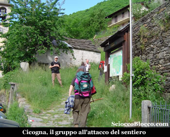

Il sentiero parte subito con buona pendenza snodandosi all'interno
di un bosco di latifoglie, tutto il percorso è punteggiato
da ben 20 cippi che indicano la strada e da otto bacheche
e quattro leggii che con immagini e brevi testi descrivono
alcune caratteristiche del luogo.

Affrontando con ritmo regolare l'impegnativa salita, circa
a 2/3 del percorso per l'Alpe
Prà ( Alpino ) si esce dal bosco,
si impone una sosta per riprendere fiato e per ammirare
la vista che si apre sotto di noi sulla valle sul fiume
e sui due laghi Maggiore
e Orta.

Il sentiero continua in salita ma allo scoperto e in giornate
di sole estivo il caldo accentuerà non poco le difficoltà
dell'ascesa.

Arrivati in un tratto dove al nostro fianco vedremo fare
la loro comparsa le felci, alzando gli occhi vedremo sopra
di noi l'Alpe Prà
e il rifugio dell'Alpino,
quì sulla sinistra del sentiero nei pressi di un
ciliegio vi è una famosa roccia coppellata, una roccia
piatta con la punta rivolta alla valle e al lago.

Le coppelle
sono cavità di varie dimensioni, eseguite su una
roccia in quantità e con disposizioni variabili.

Presenti in tutto il mondo, per alcuni studiosi potrebbero
essere collegate a luoghi di culto e di tradizione preistorica.

La stessa chiesa sin dai primi secoli dell'era cristiana
condannò coloro che veneravano certe rocce in luoghi
selvaggi e nascosti in fondo ai boschi, pietre oggetto di
falsità diaboliche e sulle quali si depositavano
ex-voto, candele accese e altre offerte.

Molte le ipotesi sul significato dei massi coppellati, tra
le quali che fossero rappresentazione di costellazioni,
mappe del territorio o massi altare per sacrifici.

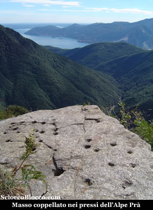

Riprendiamo il sentiero e con un ultimo sforzo eccoci all'Alpe
Prà ( 1290 m ) (1.00h/1.15h)
conosciuta soprattutto per la "Casa
dell'Alpino", rifugio aperto solo
saltuariamente e di proprietà dell'Associazione Nazionale
Alpini.

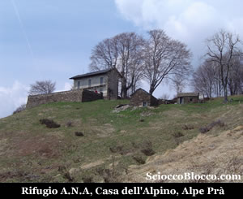

Ci troviamo ad uno degli accessi più suggestivi ai
monti ed agli alpeggi della Val
Grande e della Val
Pogallo, con itinerari di vario impegno
e grande fascino.

Una sosta sulla balconata naturale del rifugio per ammirare
di nuovo sotto di noi la valle di Cicogna
e i laghi Maggiore
e Orta
è d'obbligo, ruotando lo sguardo di 90° verso
destra potremo vedere i bellissimi
Corni di Nibbio e dietro sullo
sfondo il Monte Rosa.

Ripartiamo attraversando il faggeto, proprio alle spalle
del rifugio, qualche minuto dopo sulla destra incontriamo
l'intaglio nella roccia che ci porta in Val
Pogallo.

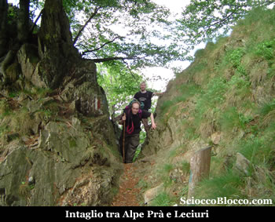

Arriviamo
scendendo un poco all'Alpe
Leciuri(1311m)(1.20h/1.35h) .

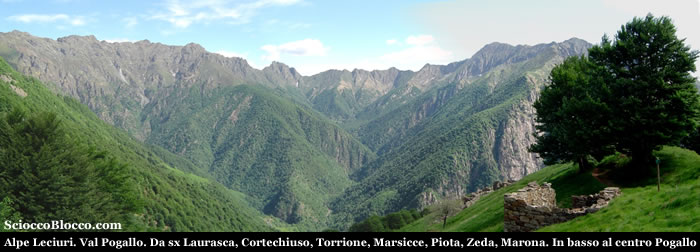

Davanti a noi si apre in tutta la sua bellezza la Val
Pogallo, in una carrellata partendo da sinistra
ammiriamo la Cima della Laurasca,
Cimone di Cortechiuso,
Cima Marsicce,
Monte Torrione,
Cima Crocette,
La Piota,
Monte Zeda,
Pizzo Marona,
al centro nel ripiano erboso l'Alpe
Busarasca, mentre al centro in fondovalle
Pogallo.

Ripartiamo, invece di scendere alle baite dell'alpe pieghiamo
a sinistra salendo nel bosco e sulla dorsale spartiacque
tra Val Grande e
Val Pogallo,
un po' su un lato, un po' sull'altro.

Il sentiero si fa ripido e bisogna superare alcune roccette
ma nulla di difficoltoso, poi quando la vegetazione finisce
subito siamo ricompensati da una notevole vista.

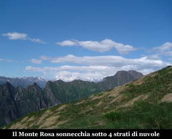

In
primo piano corre la catena dei Corni
di Nibbio e sullo sfondo sua Maestà
il Rosa.

Inizia ora un lungo cammino su un vero e proprio altipiano
erboso.

Dapprima incontriamo poco sotto il sentiero i ruderi dell'Alpe
Belmello (1419m).(1.50h/2.05h), costruito
con il marmo bianco, di un filone che affiora nei pressi
dopo aver attraversato tutta la valle, lo stesso marmo di
Candoglia con il quale è stato edificato
il Duomo di Milano.

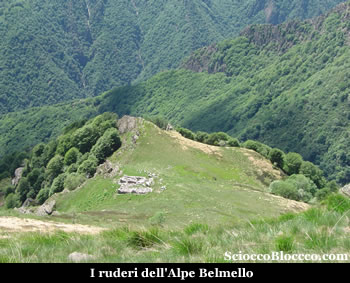

Quindi si arriva ai macereti e alla Colma
Di Belmello (1589m)(2.15h/2.30h).

Superiamo aggirandoli alcuni dossi erbosi che sbucano dal
pianoro della colma e raggiungiamo l'attacco della piramide
terminale di Cima Sasso(2.30h/2.50h).

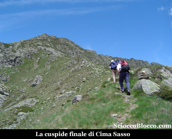

Qui
bisogna prestare molta attenzione, per Cima
Tuss non vi è un sentiero ma solo alcune
labili tracce e pochi ometti.

Circa a quota 1640m (altimetro personale), proprio all'attacco
dell sentiero finale per Cima Sasso, sulla sinistra si stacca
una traccia che si infila tra sfasciumi sotto la dirupata
parete sud-ovest di Cima Sasso.

La nostra meta è ben visibile la infondo a sinistra.

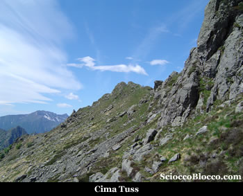

Bisogna
procedere con calma, guardandosi intorno noteremo qualche
traccia qua e la, e rari ometti che tra la parete strapiombante
e la parte alta degli sfasciumi, ci portano alla cresta
erbosa che precede la vetta.

Finalmente Cima Tuss
(1735m)(3.00h/3.20h).

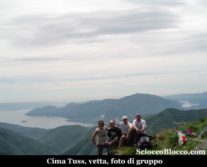

Verso
sud si apre un panorama mirabile.

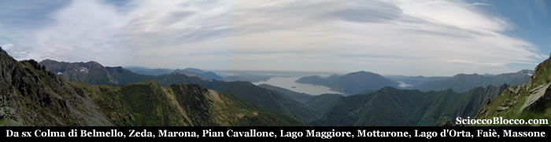

Da
sinistra in primo piano la
Colma di Belmello appena percorsa e l'omonimo
alpe, quindi Monte Zeda,
Pizzo Marona,
Cugnacorta,
Todano, Pian
Cavallone, Pizzo
Pernice, Lago
Maggiore e le isole Borromee, Mottarone,
Lago d'Orta,
Massone,
e più vicino a noi la parte sud dei Corni
di Nibbio.

Alle nostre spalle il dirupato versante sud del Pedum,
che è forse la montagna più imponente della
valle.

Pedum
che visto dalla valle ricorda (mah...) un "cammeo"
con le sembianze di testa umana (Napoleone secondo alcuni,
il Duce secondo altri).

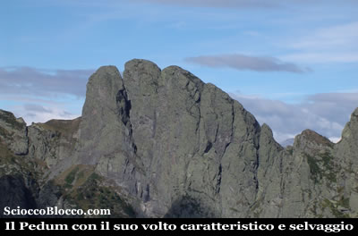

Sempre
alle nostre spalle a nord-ovest tutta la ValGrande
impervia e arcigna, solcata dalle acque dell'omonimo rio
con al centro la forra dell'Arca.

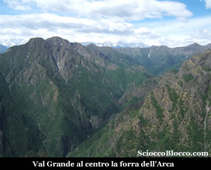

Da
qui il ritorno avviene per lo stesso percorso fatto all’andata,
tornando a Cicogna dopo
5.00h/5.30h.

Escursione per esperti nell'ultimo tratto, data l'assenza
di sentiero, e l'uso delle mani in qualche passaggio, ma
che regala grandi panorami e un assaggio di wilderness.

Un
grazie agli escursionisti di giornata Marco, Francesco,
Fabrizio e Dario.

