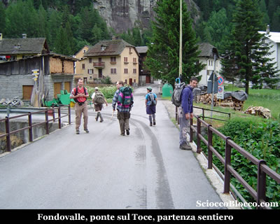
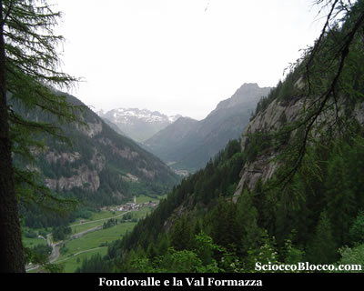
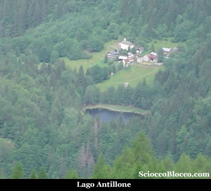
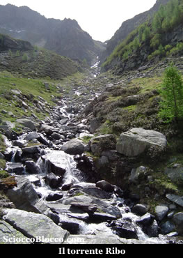
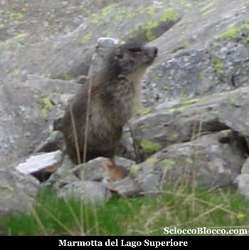
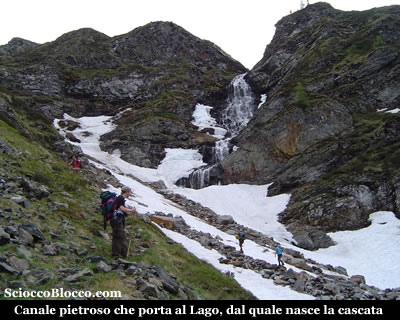
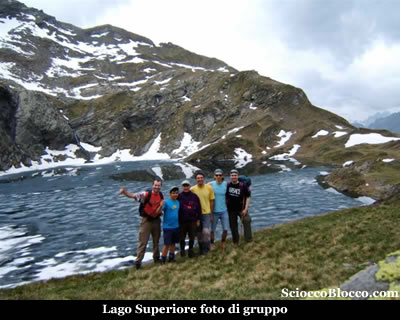
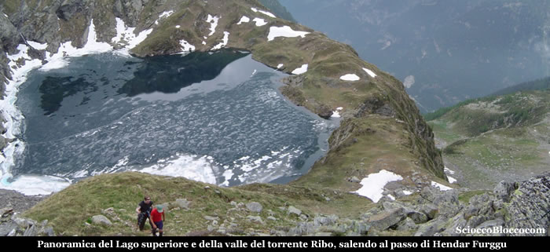
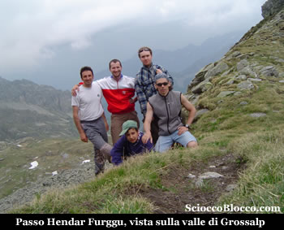

Qui a **Fondovalle** (1220m), lasciamo l'auto nei pressi di un campeggio situato all'ingresso del paese, e attraversiamo un ponte sulla destra, che supera il **fiume Toce** il quale da pochi chilometri ha iniziato la sua corsa verso il Lago Maggiore.

Attraversiamo il piccolo agglomerato e incontriamo una larga strada prativa che seguiamo sulla destra. Questa strada non è altro che la pista per lo sci di fondo, sport principe nell'inverno formazzino. Dopo pochissimi metri, sulla sinistra, un cartello consunto di divieto di accendere fuochi e un segnale bianco-rosso del C.A.I. su di una pianta indicano l'imbocco del nostro sentiero. Immerso nel bosco il sentiero piega a destra e sale gradualmente, sino a portare sulla strada di accesso all'acquedotto, che vedremo poco sopra (10min). Raggiungiamo l'acquedotto e proseguiamo sul sentiero che riparte alle sue spalle. Ora la salita si fa impegnativa, all'interno di un fitto bosco di abeti rossi guadagnamo quota rapidamente, superiamo un rigagnolo e in un raro squarcio tra la vegetazione ammiriamo **Fondovalle** e la **Val Formazza**.

Continuiamo a salire, e dopo aver guadato un ruscello, usciamo dal bosco e raggiungiamo l'Alpe Stavello (1594m)(50min/1.00h).

L'Alpe è formato da pochi ruderi, uno dei quali coperto da tettoia per riparo d'emergenza. Voltandoci verso la direzione del nostro arrivo, possiamo vedere **Fondovalle** e in particolare il **Lago Antillone**. Proseguiamo l'ascesa ora in un ampio vallone aperto, dove alla nostra destra scorre il torrente, e su buona pendenza ci dirigiamo verso il bosco che vediamo sopra di noi. Entrati nel bosco, dominato dai larici, le pendenze si accentuano, pieghiamo verso destra, un camoscio ci attraversa la strada e dopo un traverso, sbuchiamo dalla vegetazione ormai sulle sponde del **torrente Ribo**, nei pressi del bivio per il **Passo di Bosco** (1930m circa)(1.50/2.00h).

Passo che conduce a Bosco Gurin in Val Maggia insediamento Walser. Una Coturnice prende il volo proprio sotto il nostro naso. Qui possiamo vedere tutto il percorso dell'alta valle del **torrente Ribo** e quello che ci aspetta fino alla meta. Infatti noi seguendo il sentiero che in pratica segue il letto del torrente, e ignorando la traccia per il passo di Bosco, riprendiamo a salire ormai su prati aperti, arrivando ad un larga conca (2070m circa)(2.10h/2.20h).

Posto adatto ad una sosta ristoratrice, e se non fate troppo rumore frequentato da sospettosissime marmotte che noi abbiamo avuto la fortuna di immortalare. Ormai siamo in vista della nostra prima meta, alcuni ometti e segni di vernice bianco-rosso, ci conducono in direzione del canale pietroso percorso dal torrente.

Il canale ancora ricoperto da abbondanti nevai, lo si percorre sul lato sinistro, usando prudenza in quanto il terreno è molto friabile e le pendenze elevate. Il sentiero che passa di fronte ad una cascata spettacolare che scopriremo nascere dal lago soprastante, piega a destra guadando un rigagnolo e in pochissimi minuti di salita ci fa approdare sulle sponde del **Lago Superiore**(2254m)(2.45h/3.00h).

Il lago ancora parzialmente ghiacciato è di una bellezza mozzafiato e ripaga ampiamente la fatica. Il **Lago Superiore** è di origine glaciale, con i suoi 35m di profondità e i suoi quasi 5 ettari di superficie è il secondo lago naturale della **Val Formazza**. Per i pescatori, ricordo la presenza di trote che solo nei mesi più caldi sono meglio disposte alla cattura. La posizione del lago è molto caratteristica, con un lato sovrastato dalle pareti strapiombanti del Pizzo Stella e l' altro che precipita improvviso nella valle sottostante, formando la cascata. Dopo la meritata pausa pranzo, decidiamo di raggiungere il passo che è ben visibile verso nord. Il dislivello è limitato e lasciamo gli zaini al lago. Il sentiero segnalato dai soliti colori bianco-rosso parte esattamente nella zona di arrivo del sentiero appena percorso per raggiungere il lago. Le pendenze sono subito notevoli, dapprima su magri prati.

Raggiungiamo una motta da dove la panoramica sul **Lago Superiore** e la valle è magnifica. Quindi tra il Pizzo Biela e il Pizzo Stella, su sfasciumi e nevai abbondanti dove è consigliato prestare attenzione per il rischio di scivolate, raggiungiamo il **Passo Hendar Furggu**(2419m)(3.15h/3.30h).

Dove corre il **confine** **Italo-Svizzero**, e ci affacciamo sulla valle che porta a *Grossalp* e sempre a *Bosco Gurin in Val Maggia*. Da qui il ritorno avviene per lo sesso percorso fatto all'andata, fino a tornare a **Fondovalle** dopo (6.00h/6.30h). Escursione molto bella per la pochissima frequentazione antropica, per la numerosa fauna incontrata, e per uno dei più bei laghi sin qui visti, ma abbastanza faticosa per il buon dislivello e le pendenze sempre impegnative.

**Un grazie agli escursionisti di giornata Elia, Flavio, Francesco, Fabrizio, Dario, e uno speciale ad Alessio per i suoi primi 1000m di dislivello.**
