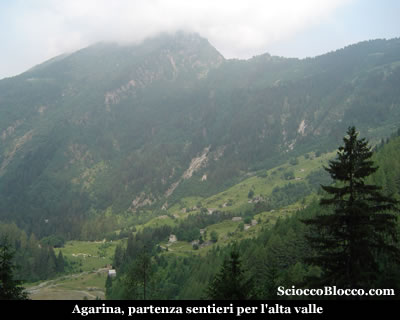
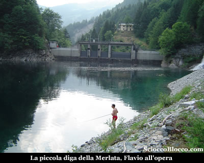
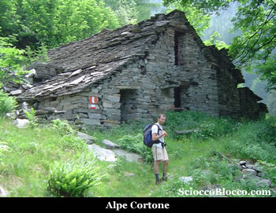
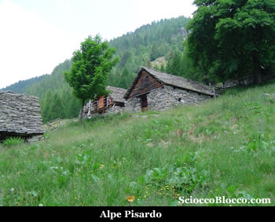
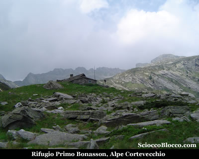
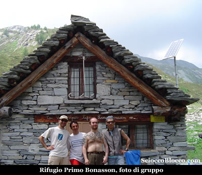
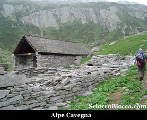
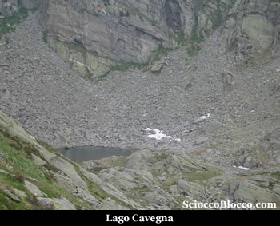

Giunti ad **Agarina**(1186m) grazie alla strada consortile recentemente asfaltata, e che è percorribile con l'acquisto dell'apposito bollino (15€), reperibile oltre che in comune in qualsiasi bar o alimentari di Montecrestese, lasciamo l'auto alla fine dell'asfalto.

Iniziamo a camminare su di una strada sterrata, in breve arriviamo alla fine della gippabile e superato un cancelletto in legno, saliamo su di una mulattiera ricavata nella roccia, aerea e panoramica. Entriamo nel bosco e in discesa raggiungiamo il **Ponte di Faugiol**(1350m circa)(15/20min).

Attraversato il **Rio Nocca**, il sentiero sale nel bosco, teniamo la destra al bivio nei pressi del vecchio ponte crollato, risaliamo ancora un poco e poi in discesa giungiamo alla **diga della Merlata** (1380m circa)(30/40min).

Rientriamo nel bosco assai fitto, dominato dall abete rosso, e superato sulla destra un bivio con bella pioda segnavia raggiungiamo** l'Alpe Cortone** (1482m)(1.10h/1.15h).

Qui non facciamoci ingannare dalla larga traccia che scende verso il **Torrente Isorno** e che lo supera con una passerella, perchè questo è il sentiero che conduce al *Lago di Larecchio* a cui abbiamo dedicato una recensione. Proseguiamo sulla traccia in piano che sfiora un paio di ruderi e tende a scomparire tra l'alta vegetazione. Poco dopo infatti piega a sinistra e rientra nel bosco ora meno fitto e in salita su rigogliosi prati approda all'**Alpe Pisardo** (1609m)(1.30h/1.40h).

Inizia ora un lungo traverso su prati, sempre al fianco del **Torrente Isorno** che scorre alla nostra destra, dapprima superiamo in una bella radura **Il Campo** nutrito alpeggio che vedremo poco sopra di noi alla sinistra. Quindi continuiamo sempre in costa e in lieve salita tra prati a volte acquitrinosi. Finalmente il sentiero si impenna tra i larici ormai padroni della scena, la fatica inizia a farsi sentire, ma appena fuori dal bosco appare sopra di noi la nostra prima meta, **Alpe Cortevecchio** **Rifugio Primo Bonasson** (1925m)(2.30h/3.00h).

Il **Rifugio Bonasson** è di proprietà della Sez. CAI Valle Vigezzo (Piazza Risorgimento 28038 S. Maria Maggiore (VB), tel. 032494737 il venerdì sera) è chiuso e bisogna ritirare le chiavi in sede. Dispone di 18 posti letto, è munito di stufa a gas e pannello solare, e di acqua corrente alla vicina fontana, vi è inoltre un locale invernale sempre aperto. E' chiamato così in ricordo di Primo Bonasson, abile alpinista vigezzino, che domenica 1 luglio 1979 perisce sulla Pioda di Crana. L'evento tragico colpisce profondamente tutta la Valle, e in sua memoria il 19 agosto 1979 viene inaugurato all'**Alpe Cortevecchio** il rifugio a lui dedicato. Inserito in un bell'anfiteatro naturale con il fiume che si sente scorrere giù in basso nella valle, e nulla di civilizzato all'orizzonte ci si sente proprio fuori dal mondo. Consumiamo il meritato pranzo e studiamo la nostra prossima meta.

Il tempo non promette nulla di buono, il giro del Lago Gelato è troppo rischioso, puntiamo quindi al Lago di Cavegna. Dietro il rifugio parte il sentiero che dopo breve salita, scende a guadare il torrente per poi risalire in breve all'**Alpe Cavegna** già ben visibile dal rifugio (2038m)(2.45h/3.15h).

Qui non seguiamo il sentiero principale che passa tra le due baite e che conduce alla Bocchetta del Lago Gelato ma teniamoci sulla destra dell'alpeggio. Tra poche tracce e rari ometti su salita impegnativa, dapprima arriviamo ad una piccola radura con un paio di pozze e di rigagnoli. Quindi continuando la salita tra magri prati e sfasciumi, piegando verso destra in direzione del torrente arriviamo in vista del **Lago di Cavegna**, che raggiungiamo con un traverso (2205m)(3.15h/3.30h).

Il **Lago di Cavegna** è un piccolo lago di circo glaciale inferiore a 6000 mq, che si trova sotto il* passo di Porcareccio*. Da qui il ritorno avviene per le stesso percorso dell'andata sino a tornare ad **Agarina** dopo 6.00h/6.30h. Bella escursione in una valle poco conosciuta e frequentata, faticosa per i lunghi traversi più che per il dislivello, e consigliata ad escursionisti esperti in quanto nell'ultima parte spesso il sentiero scompare e per tutto il percorso le indicazioni sono molto scarse.

**Un grazie agli escursionisti di giornata Flavio, Francesco, Fabrizio, Dario.**
