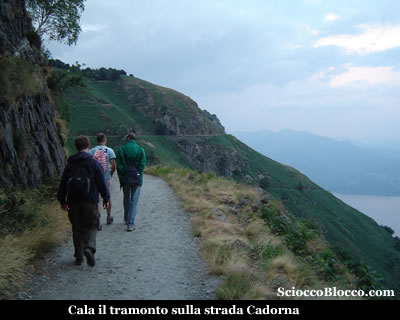
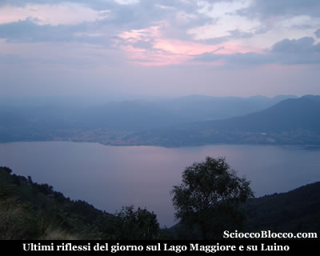
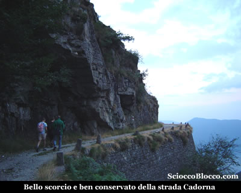
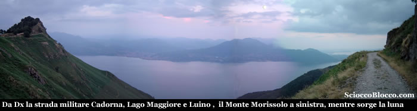
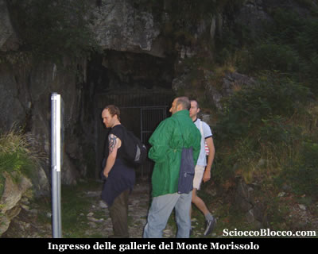
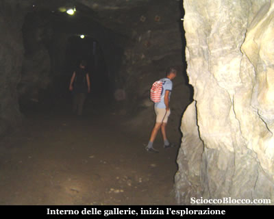
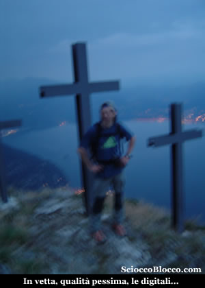
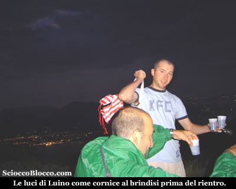

A **Pian Cavallo** (1235m) superiamo il centro *Auxologico*, e dopo pochi metri sulla destra una strada con cartelli indicatori, scende di poco a raggiungere una sbarra dove lasceremo l'auto. Qui al fianco del rinomato centro per la cura di disturbi dell'alimentazione, superiamo la sbarra che impedisce l'accesso alle auto e iniziamo a camminare su la strada sterrata che si inoltra nel bosco. L'escursione che ci apprestiamo a fare è facilissima e adatta a bambini, anche se noi la facciamo in notturna e quindi in questo caso è consigliato conoscere preventivamente i luoghi. Come si diceva facile ma ricca di storia, infatti la strada che percorriamo è la strada militare Cadorna.

Con il nome di "***Linea Cadorna***" si intende il sistema di fortificazioni militari costruito durante la Prima Guerra Mondiale tra il ***Lago Maggiore*** e il ***Monte Massone***. Le fortificazioni comprendono un fitto reticolo di mulattiere militari, trincee, postazioni d'artiglieria, luoghi di avvistamento, ospedaletti e strutture logistiche, centri di comando. Furono volute dal generale ***Luigi Cadorna*** di Pallanza, capo di stato maggiore dell'esercito italiano, per difendere il confine da un ipotizzato attacco austro-tedesco attraverso la Svizzera mai avvenuto. Esse coprono, nella logica della "***guerra di posizion*****e**", un dislivello di 2.000 m tra la piana del ***Toce*** e il ***Monte Massone*** e fra ***il Lago Maggiore*** (Carmine inferiore) e il ***Monte Zeda*** e proseguono nelle Alpi centrali fino alle Orobie. Tra l'***Ossola*** e la ***Valtellina*** furono costruiti 72 km di trincee, 88 postazioni di artiglierie di cui 11 in caverna, 296 km di strade carrozzabili, 398 km di mulattiere. I lavori costarono più di 100 milioni di lire del tempo e impiegarono oltre 15.000 operai. In un'economia di guerra, i lavori ebbero un impatto positivo per le popolazioni locali in quanto offrirono lavoro retribuito a muratori e scalpellini e costituirono una prima occasione di lavoro salariato per la manodopera femminile impegnata nel trasporto dei viveri alle squadre in montagna. Un "sentiero storico", attrezzato con pannelli esplicativi per visite didattiche, è stato allestito tra la*** Punta di Migiandone*** e il ***Forte di Bara***. Altri tratti visitabili sono la mulattiera nord del ***Montorfano*** e le alture del ***Verbano*** (***Passo Folungo***, ** ** ** *Monte Carza)***. Ben presto fuori dal bosco, la strada è ben visibile incisa nella montagna, e in leggerissima ascesa procediamo con alla nostra destra un panorama fantastico.

Il tramonto è ormai completo, gli ultimi riflessi rosa colorano il **Lago Maggiore**, e compaiono le prime luci di **Cannero **sotto di noi e **Luino** al di la del lago sulla sponda lombarda. Purtroppo la serata non è delle migliori, molte nuvole coprono l'orizzonte e qualche tuono si ode in lontananza ma non ci facciamo scoraggiare e proseguiamo. La strada è in ottime condizioni, e sarebbe percorribile anche in auto con cautela, ma giustamente è stato chiuso l'ingresso per preservarla. Aggiriamo un bel promontorio roccioso dove i muri di sostegno della carreggiata sono ben visibili.

E subito dopo appare già la nostra meta, nota anche come il Cervino di Cannero, in un panorama che si fa superbo.

Il profilo del Morissolo è inconfondibile di fronte a noi, alla nostra destra la bellezza placida del Lago Maggiore all'imbrunire mentre sorge una timida luna tra le nuvole. Ancora pochi minuti, e tenendo la destra al bivio sotto la cima, eccoci all'ingresso delle **gallerie** (30/40 min) .

Le gallerie di recente restauro, con la posa di cancelli a molla per evitare l'ingresso delle numerose capre e pecore che frequentano la zona, sono in ottimo stato e un cartello all'ingresso ne descrive brevemente la storia. Entriamo e iniziamo l'esplorazione.

Al secondo cancello è posto un interruttore con sensori automatici, che attivano l'illuminazione delle gallerie e facilitano la percorrenza. Le **caverne fortificate del Monte Morissolo** costruite tra il 1916 e il 1918, che costarono la vita anche a due operai, avrebbero dovuto ospitare nelle quattro specole altrettanti cannoni calibro 149,1mm che sparavano proiettili di 80kg sino a 15km di distanza. Le aperture orientate a nord, nord-est avrebbero dovuto proteggere il lato verso la Val Cannobina e la litoranea del lago, come già detto per proteggere da una presunta invasione austro-tedesca attraverso la Svizzera, che mai ebbe luogo. Scrive Teresio Valsesia nel suo ormai mito *"Val Grande ultimo paradiso*" : *"La vetta del Morissolo è una gruviera di gallerie, camminamenti, depositi scavati nella viva roccia..."*. Usciamo di nuovo all'aperto, una breve scaletta porta ad un piccolo tunnel con punti per l'osservazione, mentre alla base sulla destra esce un po' esposto un sentiero che su alcune roccette conduce alla vetta del **Monte Morissolo** e alle sue tre croci (1311m)(45/55min).

Ormai il buio è quasi completo, lo spettacolo del Lago Maggiore e delle luci dei paesi che popolano le sue rive è grandioso, solo nuvoloni invidiosi coprono la luna ormai splendente. Scendiamo all 'interno di un bosco in buona pendenza rieccoci sulla strada Cadorna, al bivio incontrato poco prima dell'arrivo alle gallerie(1.15/1.30h). Abbiamo così completato l'aggiramento del Morissolo. Anche se il temporale si avvicina, ci meritiamo il premio per questa bella gita notturna.

Ormai è notte, le luci di Luino ci fanno compagnia, mentre brindiamo alla bella serata, macchiata solo dalla mancanza della luna piena. Ritorniamo sui nostri passi sino a tornare a **Pian Cavallo** dopo (2.00/2.30h). Facile gita alla portata di tutti , ma se effettuata di notte meglio conoscere i posti.

**Un grazie agli escursionisti di giornata Alberto, Fabrizio, Francesco e Dario.**
