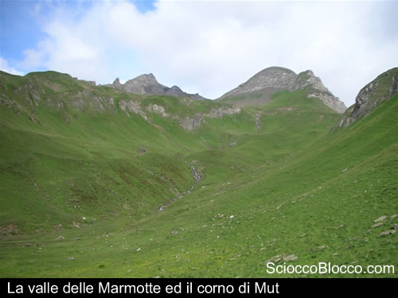
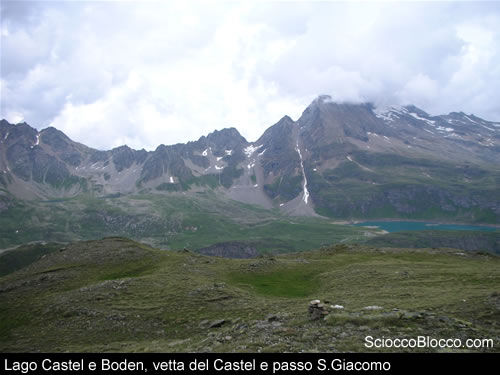
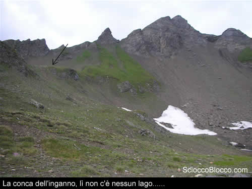
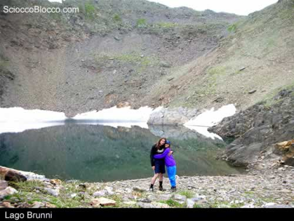
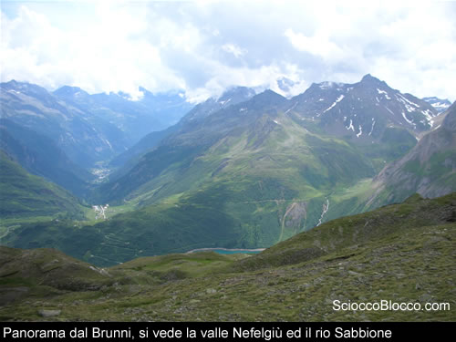

Da Riale seguiamo il sentiero che conduce al rifugio Maria Luisa tagliando i tediosi e lunghi tornanti della carrabile. Il panorama è già bello. Si intravede infatti il lago di Morasco oltre l'imperioso muraglione della diga mentre oltre questo si notano le rocciose montagne che circondano il lago. Dopo circa un'ora di cammino giungiamo al rifugio Maria Luisa dove è possibile reperire informazioni su questa escursione poiché il sentiero per il lago Brunni non è segnalato sulla cartina. L’itinerario consigliato prevede di prendere per la Valrossa e una volta giunti alle pendici del corno Mut deviare a sinistra per seguire una pista attraverso la pietraia segnalata da ometti di pietra. Appena lasciato il rifugio facciamo di testa nostra ignorando o quasi le indicazioni forniteci, cosicché guadiamo il torrente seguendo le tracce di sentiero sull’altro versante fino ad imboccare la valle delle marmotte (parallela alla Valrossa). Non ci pentiamo della nostra scelta, infatti la valle delle Marmotte è un incantevole pratone alle pendici del corno Mut.

Risaliamo questa bella valle senza particolari difficoltà ma notiamo che non vi sono tracce di sentiero a guidare i nostri passi, imperterriti continuiamo e ci troviamo alle pendici del corno Mut. Alle nostre spalle possiamo vedere il lago Castel e i laghi del Boden. La vetta Castel (Sua maestà) domina tutta l'alta val Formazza, dal Castel fino al passo San Giacomo. Incantevole.

Giriamo a sinistra risalendo la pietraia seguendo gli ometti di pietra che si ergono abbastanza frequentemente sulle rocce. In alto davanti a noi scorgiamo una conca incassata in cima alla pietraia. Pensiamo erroneamente che sia la sede del lago Brunni e così ci lanciamo alla salita della ripida pietraia.

Giunti in cima ci accorgiamo che l'altimetro segna i 2600 metri circa, il luogo è circa quello esatto ma il lago non c'è. Peccato perché un lago ci starebbe davvero bene in questa austera cornice di rocce. Discendiamo la pietraia e ritorniamo a seguire le tracce degli ometti di pietra che ci conducono all'aggiramento della parete che sovrasta la nostra destra ed in breve giungiamo al lago Brunni. Incantevole nella sua tetra cornice d'alta montagna.

Splendido il panorama sul lago di Morasco e fondovalle. Due aquile che volteggiano dinanzi a noi rendono particolarmente affascinante la visuale davvero mozzafiato.

**

 **

Scarica recensione

**Un ringraziamento a Giada e Vittorio **
