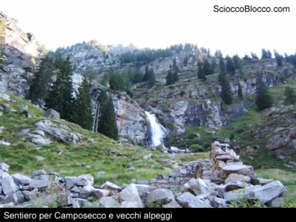
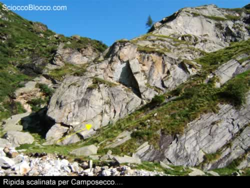
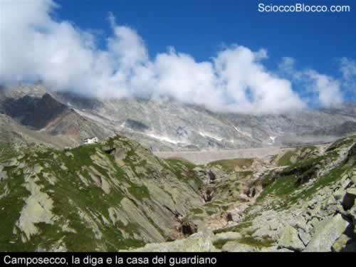
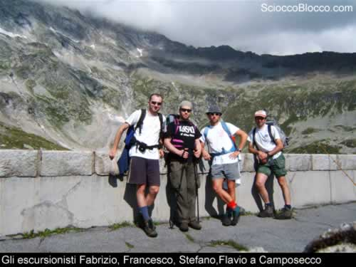
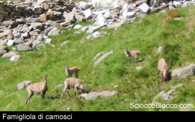
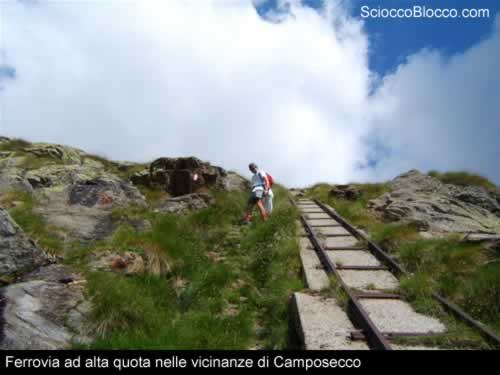
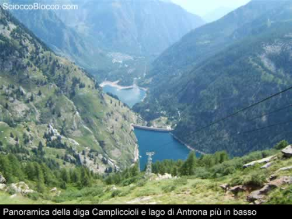
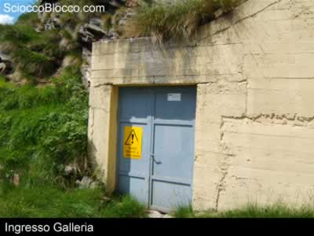
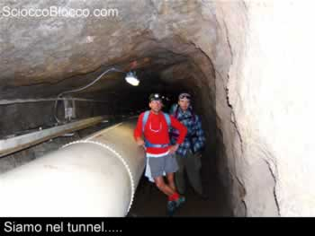
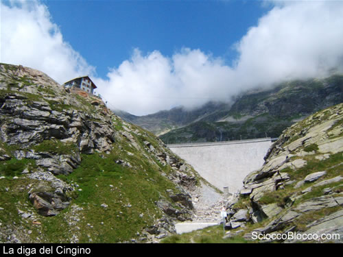

Partenza di buonora dal lago di Antrona dove prendiamo, poco prima della strada ENEL il sentiero GTA (Grande traversata delle Alpi) che ci porta fino ai piedi della diga di Campliccioli (se la strada privata ENEL è aperta si può salire fino al lago di Campliccioli in auto). Attraversiamo la diga di Campliccioli e ci portiamo sulla sponda destra del lago, proseguiamo ed attraversiamo un ponticello, da cui possiamo vedere un notevole scivolo di roccia che si getta nel bacino, poco dopo ci troviamo ad un incrocio, il sentiero a sinistra ci permette di fare il giro dell'invaso mentre quello a destra, che si inerpica immediatamente,ci porterà sino a Camposecco. La salita è abbastanza dura ed è intervallata da facili tratti in falsopiano,è segnata in maniera regolare ma il sentiero non è molto battuto per cui in alcuni tratti lo si può perdere ma non c'è da temere.

Arrivati ad un pianoro attraversiamo vari alpeggi abbandonati, continuiamo a camminare tenendo il torrente sulla destra. Arrivati al termine di questa ampia conca notiamo a destra, oltre il torrente, una ripida parete in cui scorgiamo degli scalini in pietra, più in basso una scritta sulla roccia “Camposecco”, saliamo su questa ripidissima scalinata....... Questo tratto è davvero impegnativo e le pendenze sono sempre elevate e sarà così sino a Camposecco, davanti abbiamo 1 ora buona di cammino.

Dopo circa 3 ore dalla partenza raggiungiamo finalmente la nostra prima meta, consolatevi perchè da qui in poi non faremo più tratti in salita. Camposecco si trova al termine di un'ampia conca circondata da cime attorno ai 3000m di altutidine chiamate Corenette di Camposecco, la diga è davvero possente e alla sua sinistra possiamo vedere le vari strutture costruite dall'uomo, esiste anche un bivacco in cui gli escursionisti possono dormire.

Il lago è piuttosto grande e, nonostante i 2325 m di altitudine, ospita molte trote sempre insidiate da numerosi pescatori. La diga di Camposecco, è stata costruita tra il 1925 e il 1930, nel punto più profondo delle fondazioni, è alta 35 metri ed è larga 347 metri. La capacità massima è di 5.500.000 mc.

Con nostra sorpresa incontriamo anche una piccola famiglia di camosci per nulla intimoriti dalla nostra presenza tanto che si lasciamo ammirare e fotografare.

Dopo un meritato riposo ed un panino riprendiamo la marcia, dobbiamo portarci alla sinistra delle varie costruzioni da cui possiamo vedere le vecchie rotaie di un trenino ormai in disuso e ampi tratti di sentiero su muraglioni, infatti come dice Paolo Crosa Lenz nel suo libro "Antrona Bognanco": "L'ambiente è molto suggestivo e permette di conoscere un pezzo di storia della gigantesca colonizzazione idroelettrica vissuta da queste montagne dagli inizi del secolo scorso. Un cammino di archeologia industriale alpina."

Percorriamo velocemente il tratto di sentiero che ci separa dall'ingresso della galleria che ci porterà alla diga del Cingino; avete letto bene.....oggi è previsto anche un tratto di circa 3km nelle viscere delle montagne...... Raggiungiamo una nuova serie di costruzioni sempre di proprietà del ENEL ed in particolare si tratta dell'arrivo della funivia che parte dalla diga di Campliccioli.

Da qui inizia la famosa galleria che ci permetterà di attraversare in poco più di 30 minuti la Punta di Rossa e di arrivare al Cingino. L'ingresso è oltre la funivia dove troviamo una porta in ferro, appena entrati sulla sinistra troviamo l'interruttore dell' illuminazione. La galleria è alta circa 1,80 per 2 metri di larghezza, la maggior parte dello spazio è occupato da una condotta idrica, al suolo è presente una grande quantità di acqua ed in molti tratti sono presenti delle passerelle metalliche per evitare di lasciare in ammollo i nostri poveri piedi. State vicino alla condotta poiché dalle pareti poco illuminate emergono qua e la degli spuntoni metallici, mettetevi anche una felpa........

Usciti dalla galleria ci troviamo sull'altro versante della montagna e la nostra seconda metà è davvero vicina, seguiamo il sentiero che aggira un piccolo colle e ci troviamo alla base dell'imponente diga del Cingino, seguendo il sentiero sulla destra in pochissimo tempo arriviamo a destinazione, adesso possiamo pranzare e dedicarci alla pesca. Il serbatoio di Cingino è il risultato della sopraelevazione e dell’ampliamento di un piccolo lago di origine glaciale già esistente. La diga, costruita tra il 1925 e il 1930 nel punto più profondo delle fondazioni è alta 50 metri ed è larga 152 metri. La capacità del lago è stata portata a 4.500.000 mc. Se siete fortunati potrete anche vedere degli stambecchi che scendono sino a qui per leccare il salnitro dalle pareti dell'invaso.

Prima di ripartire andiamo a visitare il bivacco rimesso a nuovo nel luglio del 2005, è spettacolare il lavoro che è stato fatto per cui abbiatene rispetto. Adesso è il momento di ridiscendere a valle e lo facciamo attraverso il sentiero SFT ( Simplon Fletschorn Trekking) molto ben segnato, comunque state bene attenti perchè la prima parte del ritorno è su di una pietraia dove è facile farsi male e perdere il sentiero. La discesa che ci porterà in Val Troncone, nome che deriva dal corso d'acqua che la attraversa, è lunga però si passa dalle pietraie a stretti sentieri in mezzo al bosco fino a prati ben falciati in cui viene voglia di fermarsi ad ascoltare la natura. Ormai siamo a fondovalle e sono già trascorse circa 8 ore dalla partenza, ora dobbiamo solamente percorrere l'intera vallata sino al lago Campliccioli, da qui possiamo scegliere se costeggiare il lago dalla sponda destra o sinistra, il nostro obiettivo è la diga dove una volta arrivati scenderemo fino al lago di Antrona per trovare finalmente riposo e un bel bicchiere di birra gelata....dopo un cammino di 10 ore ce lo meritiamo.

Scarica recensione

**Escursionisti di giornata Francesco, Stefano,Flavio e Fabrizio **
