Giunti ad **Agarina**(1186m) grazie alla strada consortile recentemente asfaltata, che è percorribile con l'acquisto dell'apposito bollino (15€), reperibile oltre che in comune in qualsiasi bar o alimentari di Montecrestese, lasciamo l'auto alla fine dell'asfalto. Oggi abbiamo come obbiettivo il mitico lago Gelato e con un percorso quasi ad anello, anche il lago di Mattogno, solo la primissima parte del percorso sarà in comune tra salita e discesa.

Iniziamo a camminare su di una strada sterrata, in breve arriviamo alla fine della gippabile e superato un cancelletto in legno, saliamo su di una mulattiera ricavata nella roccia, aerea e panoramica. Nel bosco incontriamo un un bivio con caratteristico segnavia, noi andiamo dritti, mentre al ritorno torneremo dal sentiero lasciato a sinistra.

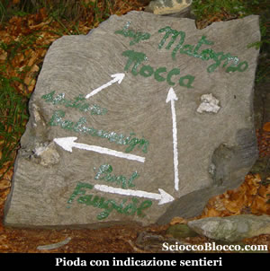

In discesa raggiungiamo il **Ponte di Faugiol**(1350m circa)(15/20min).

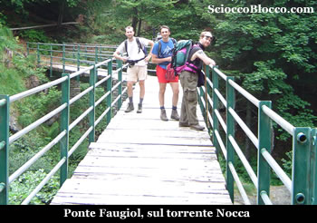

Attraversato il **Rio Nocca**, il sentiero sale nel bosco, al bivio nei pressi del vecchio ponte crollato teniamo la sinistra, iniziamo a risalire su di un sentiero abbarbicato alle pareti verticali che strapiombano giù nel torrente. Quindi saliti rapidamente di quota, superiamo un rudimentale cancello in legno, e fuori dal bosco in un tratto dove il letto del fiume è largo e poco inclinato superiamo il nuovo ponte sul Rio Nocca riportandoci sulla sinistra del corso d'acqua (50min/1.00h).

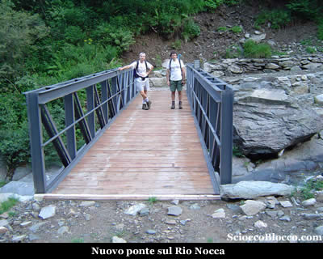

Qui per un tratto il sentiero diventa una larga strada sterrata dai recenti lavori di consolidamento, poi tornato sentiero si innalza in un bel bosco per raggiungere l'**Alpe Nocca** (1611m)(1.10h/1.20h).

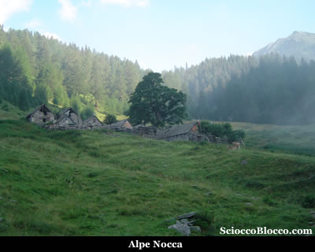

Poco sotto l'alpeggio proprio sul sentiero si trovano dei cartelli indicatori. A sinistra si inerpica il sentiero che sale direttamente al lago di Mattogno, noi invece proseguiamo dritti in falso piano lasciando le baite dell'alpe sopra a sinistra e ci dirigiamo verso l'Alpe Mattogno. Entriamo in un bel bosco di abeti secolari a giudicare dalla notevole grandezza dei tronchi, e iniziamo a salire su pendenze impegnative, al ritmo di secchi tornanti. Appena fuori dalla vegetazione, il paesaggio si fa notevole, in un ampia conca verde circondata a varie altezze da altri alpeggi eccoci all'**Alpe Mattogno** (1863m)(1.30h/1.45h).

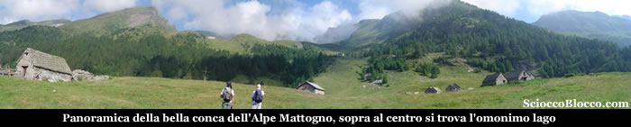

L'ambiente è bello e rilassante, tra prati verdi e cime che circondano l'alpe tutt'attorno. Le baite sono tutte ristrutturate, e nella casera al centro della conca una signora non più giovanissima lavora il formaggio in grossi pentoloni fumanti. Sulla destra, poco sopra un piccolo agglomerato di baite, ci sono dei cartelli indicatori, il nostro sentiero esce infatti proprio sulla destra dapprima non molto marcato. Traversando su buona pendenza ai margini del bosco, il sentiero sale abbastanza rapidamente nei pressi dell'**Alpe Mattignale dentro** (2040m)(2.00h/2.15h). Dove troviamo poche baite diroccate e una ristrutturata con brutto WC esterno di colore verde, ma che si nota bene anche a distanza come punto di riferimento. Qui probabilmente il sentiero non sempre evidente, devia prima dell'alpe in direzione dell'Alpe Fiesco. Noi giunti sin qui proseguiamo dritti sul dosso appena avanti e quindi sempre senza sentiero su prati verticali saliamo a sinistra nella piccola conca fino ad incontrare il sentiero GTA che seguiamo sulla destra. Superata una scaletta tagliata nella roccia arriviamo intorno a **quota 2200m** in una ampia conca(2.40h/2.50h).

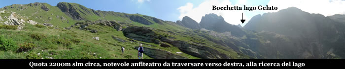

Ormai la vegetazione ci ha abbandonato da tempo, e in giornate estive il sole fa sentire la sua presenza. Prima su magri prati e poi su sfasciumi iniziamo un lungo traverso verso destra seguendo il sentiero GTA ben marcato dai colori bianco-rosso del CAI e da ometti. Arrivati sotto i contrafforti del Pizzo Mattignale, ormai su pietraia, il sentiero piega a sinistra ed inizia a salire vistosamente, la fatica inizia a farsi sentire, ma la meta è ormai prossima. Infatti dopo poco, giunti ai bordi della conca ecco apparire il **Lago Gelato** (2418m)(3.30h/4.00h).

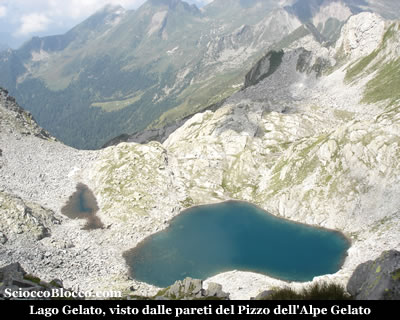

Il **Lago Gelato** è di origine glaciale, ha una superficie di circa 6500mq, un piccolo lago che fino a tarda stagione per l'altitudine e la posizione resta quasi totalmente ghiacciato da cui appunto il nome. Poco sopra alla destra del nostro arrivo oltre la piccola pozza, si trova la **Bocchetta del Lago Gelato** che raggiungiamo in breve(2441m).

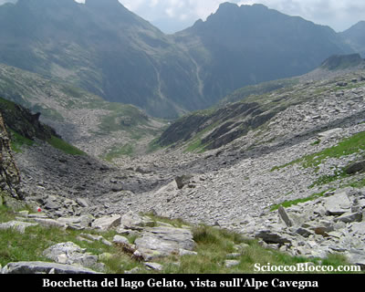

Dalla bocchetta vediamo i tetti dell'Alpe Cavegna e l'inizio della valle del rio Isorno che noi abbiamo percorso e descritto in un altra [recensione](http://scioccoblocco.com/recensioni/bonasson_cavegna.htm). Tornati al lago, ci meritiamo un buon pranzo, mentre ammiriamo il paesaggio che ci è costato tanta fatica. Sulle pareti del Pizzo dell'alpe Gelato, ci pare di vedere muoversi qualcosa, una veloce binocolata e si accende l'eccitazione, quattro fantastici stambecchi ci osservano dall'alto. Siamo troppo lontani per delle foto, e il più simile ad uno stambecco di noi prova l'inseguimento su per le pareti verticali del pizzo. VAI FLAVIO !!!

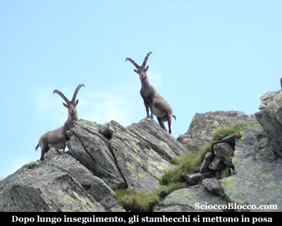

Grazie alle doti atletiche e alla curiosità degli stambecchi, Flavio riporta queste bellissime immagini. Riposati e rifocillati ripartiamo per il nostro giro quasi ad anello, obbiettivo lago di Mattogno. Ripercorriamo il sentiero dell'andata ma senza nessuna deviazione e dopo lungo traverso senza mai abbandonare la traccia GTA arriviamo prima all'**Alpe Fiesco**(2066m)(4.30h/5.00h). Quindi sempre in costa e quasi alla stessa altitudine sempre sul sentiero GTA arriviamo al **Lago di Mattogno**(2087m)(4.50h/5.20h).

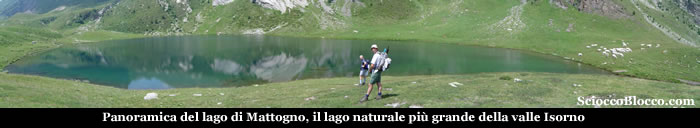

Bel lago, cirondato da verdi prati, ma senza nessuna pianta che possa dare un po di ombra e frequentato da colonie bovine. Il **Lago di Mattogno **con i suoi tre ettari di superficie, ai piedi del Pizzo del Forno, è il più grande della valle Isorno, e può dare soddisfazione ai pescatori. Dopo una pausa relax, riprendiamo il cammino, ancora sul sentiero GTA raggiungiamo in breve l'**Alpe Lago**(2066m)(5.00h/5.30h).

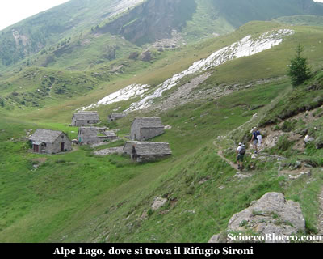

Qui all'**Ape Lago** si trova il **rifugio Adriano Sironi** 12 posti letto, diviso su due piani, al piano terra, chiuso, stufa a legna, fornello e lampada a gas e 8 posti letto su tavolato con materassi e coperte. Al piano superiore, sempre aperto, 4 posti letto sempre su tavolato con materassi e coperte. Di proprietà del CAI Sottosezione di Nova Milanese, Via Giussani 30, aperta il mercoledì sera, dalle ore 21,15 alle ore 22,30, per le chiavi, responsabile Achille Quarello tel. 0362.42395, oppure a Montecrestese in frazione Roldo, presso la 'Locanda delle Alpi' tel. 0324.232873.

Proseguiamo ora in discesa più marcata a raggiungere l'**Alpe Ratagina**(1920m)(5.20h/5.50h).

Quindi entriamo nel bosco e in rapida discesa arriviamo all'**Alpe Nocca**(1611m)(5.50h/6.10h). Siamo tornati sul tracciato dell'andata, attraversiamo un boschetto e all'inizio della strada sterrata che porta al nuovo ponte fatto all'andata notiamo una traccia che si stacca in salita verso destra. Seguiamo questo sentiero che si alza e poi in piano costeggia su pareti verticali il corso del rio Nocca, al riparo di una folta vegetazione. Per poi piombare in basso tra secchi tornanti che ci riportano al bivio con pioda segnaletica visto all'andata(6.40h/7.00h).

Scendiamo ora a destra e in breve superato il cancelletto in legno e la strada sterrata torniamo ad **Agarina**(1186m)(7.00h/7.30h). Escursione impegnativa per dislivello e per il sentiero a volte labile e quindi consigliata ad escursionisti esperti che porta a conoscere una valle poco frequentata e dagli scorci mozzafiato.

**Un grazie agli escursionisti di giornata Flavio, Fabrizio, Dario.**
