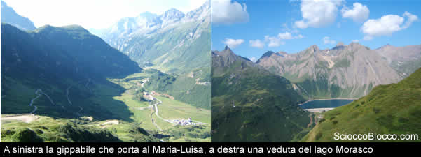
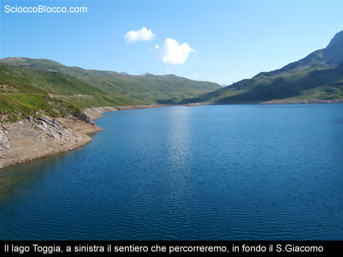
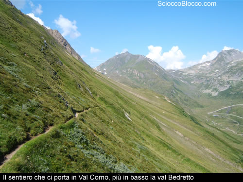
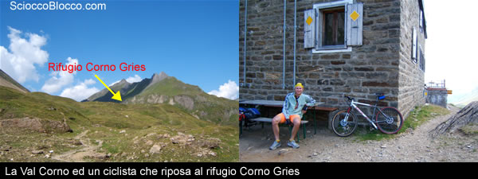
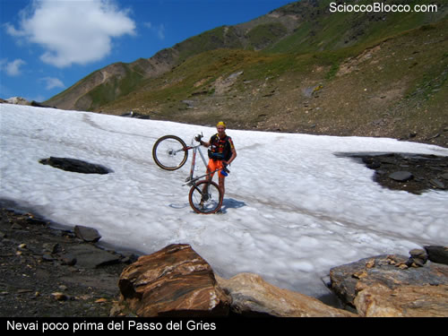
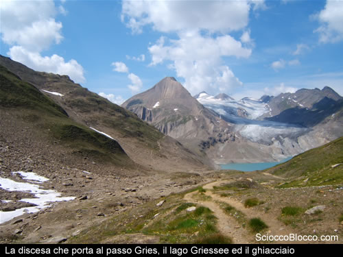
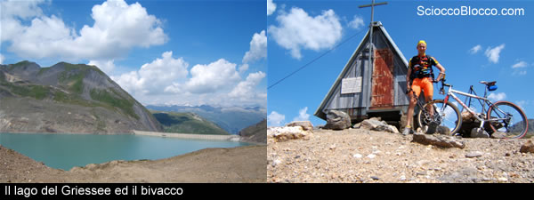

Telefono: 0324 - 63059 Fax: 0324-63251 E-mail: prolocoformazza@libero.it

RIFUGIO MARIA LUISA - Alta Val Formazza (VB) - Tel: +39 0324 63086 - Gestore: +39 347 5566808

Per affrontare questa escursione in bike si consiglia l'uso di normali scarpe da ginnastica e di una mtb ammortizzata anteriormente (oltre al solito caschetto).

L'escursione può essere affrontata anche a piedi ma visto il chilometraggio, circa 30 km, il tempo previsto è di almeno 6 ore.

Arrivati alla sommità della Cascata del Toce ci dirigiamo verso Riale dove parcheggeremo l'auto e partiremo verso il rifugio Maria Luisa. E' impossibile sbagliare strada visti i molti cartelli, inoltre il sentiero che dobbiamo percorrere è in realtà una bella gippabile piuttosto semplice per una mtb.

Chi volesse fare questa strada a piedi può abbreviare di molto il cammino tagliando i vari tornanti attraverso un sentiero piuttosto ripido che non stenterete a trovare.

Durante la salita potremo ammirare, dall'altra parte della vallata, la diga del Morasco e via via che saliamo il lago che ospita.

Dopo circa 40 minuti arriviamo al rifugio Maria Luisa posto proprio sotto la diga del Toggia. Ora proseguiamo la strada costeggiando il lago lungo la riva di sinistra; la strada è davvero facile, si tratta di un'ampia gippabile e con un pendenza di poco conto tanto che in circa 15 minuti è possibile arrivare al Passo S.Giacomo.

Durante la salita è possibile vedere, al termine del bacino, l'alpe Regina in cui si produce il famoso formaggio Bettelmatt. Arrivati al passo ci troveremo di fronte la Svizzera, ed in particolare la valle di         Bedretto e la strada che risale fino al passo della Novena.

Seguendo le indicazioni dei cartelli prendiamo a sinistra seguendo le indicazioni bianche e rosse, adesso dovremo scendere leggermente ed aggirare la montagna alla nostra sinistra in modo da entrare in Val Corno.

Il sentiero a questo punto si fa più difficoltoso e sovente dovremo scendere per spingere la mtb o per superare qualche tratto infido. Dopo pochi minuti ci troviamo sul versante svizzero della montagna, più in basso possiamo vedere e sentire la strada che conduce al passo.

Il sentiero che ci si para davanti non è difficile da seguire ma dobbiamo però fare attenzione perchè è stretto ed un errore non verrà perdonato, per cui avanziamo con cautela senza fare gli.....sboroooooni.

Il panorama cambia piuttosto in fretta e dagli scoscesi pendii passiamo ad un ampio pianoro da cui possiamo vedere il rifugio del Corno Griess in cima ad una collinetta, sembra quasi fatta ma la distanza inganna e, tra sali e scendi, ci mettiamo quasi 50 minuti per arrivare a destinazione.

Dopo un piccolo periodo di riposo riprendiamo a pedalare, ora dobbiamo arrivare fino al passo del Gries e la strada non ci aiuterà......fino al passo infatti ci toccherà spingere parecchio la bicicletta e dovremo attraversare un paio di nevai, ma niente di impegnativo, normale amministrazione.

Prendiamo il sentiero che scende a sinistra e cominciamo una bella discesa che ci porterà al passo del Griess vero e proprio, in lontananza possiamo già vedere l'omonimo lago....fantastico davvero. Scendiamo in fretta il pendio ma fate attenzione, qualche tratto in pessime condizioni c'è ancora e potrebbe farci qualche brutto scherzo.

Siamo arrivati al passo, dopo aver goduto del panorama del lago e del ghiacciaio possiamo fare una breve sosta al bivacco.

Riprendiamo la discesa verso il Morasco, ora dobbiamo fare particolare attenzione, il sentiero è stretto è con delle buone pendenze e ci sono parecchi tratti in cui è davvero difficoltoso restare in sella, abbiate pazienza tra poco sarete ripagati di questo piccolo disagio.......

Percorriamo tutto il pianoro del Bettelmatt facendo attenzione nella gimcana tra i numerosi escursionisti ed arriviamo ad affrontare l'ultima discesa......ora potete scatenarvi,la strada, perchè di questo si tratta, è ampia ma ricca di pietrisco ma senza paura si possono lasciare andare i freni.

Dopo questa bella discesa siamo ormai sulle sponde del Morasco, le stesse che guardavamo poche ore addietro mentre salivamo verso il rifugio MariaLuisa, ora possiamo goderci il panorama e riposiamo gli avambracci, la nostra escursione è praticamente finita, non ci resta che trovare un bar per una buona birra ristoratrice e poi via a casa.

Scarica recensione

**Escursionista di giornata  Fabrizio**

