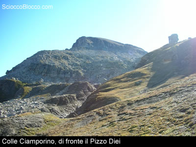
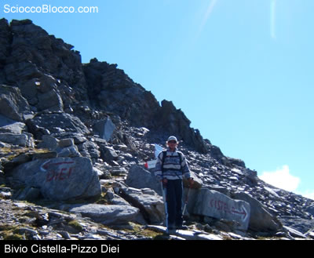
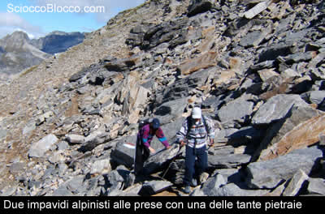
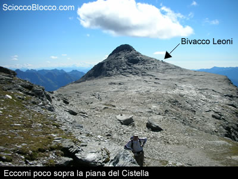
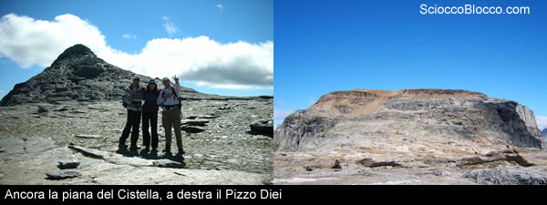
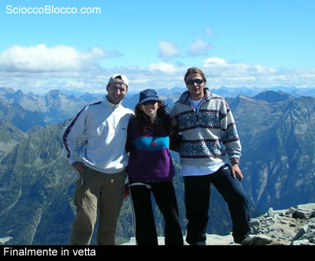
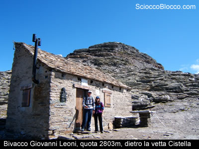
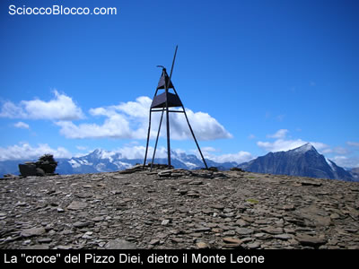

L'ascesa
al Cistella può essere
condotta attraverso diverse vie, quella presentata è
probabilmente la più semplice ma richiede ugualmente
allenamento e attenzione.

La
base di partenza è S.Domenico
dove si impone già una prima scelta, seggiovia o
salita a piedi fino a Ciamporino?
Per l'occasione abbiamo scelto la seggiovia e siamo fortunati
poiché questo comodissimo servizio non è sempre
in funzione, comunque andando sul sito sandomenico-ciamporino.it
potete conoscere i giorni e orari di apertura.

In
circa 15 minuti si arriva a Ciamporino
(usando la seggiovia naturalmente, altrimenti ci vuole circa
1 ora a piedi) e si trovano immediatamente i cartelli che
ci indicano la via per il Cistella;la
mano dell'uomo ha reso questa prima parte della escursione
piuttosto semplice infatti e sufficiente seguire le due
seggiovie che portano fino a Colle
Ciamporino.

Arrivati al capolinea della seconda seggiovia ci si trova
di fronte il Pizzo Diei, più
in basso una serie di sentieri che portano ai sui piedi,
si seguono gli ometti di pietra ed i segni bianchi e rossi
facendo attenzione ai passaggi sulla pietraia.

Durante la salita si alternano passaggi impegnativi su pietra
a comodi tratti di sentiero, anche se rari purtroppo, fino
a raggiungere un bivio molto ben segnalato dove proseguendo
dritti si va al Cistella, mentre
voltando a sinistra ci si arrampica fino al Pizzo
Diei.

Si prosegue dritti lungo un'impegnativa pietraia, il sentiero
non esiste ma sono evidenti sia gli ometti di pietra che
i segni di vernice che si riesce a seguire anche con qualche
acrobazia; in poco tempo si aggira il Diei
e fa la sua comparsa la piana del
Cistella e la sua vetta.

Dopo circa due ore e trenta di cammino ci si trova alla
sommità della piana del Cistella,
ai piedi della vetta si intravede il bivacco Giovanni Leoni,
nostra prossima meta.

La piana è lunga circa 1,5 km ed è ricca di
sali e scendi poco impegnativi che comunque non permettono
di capirne la vera estensione.

Il paesaggio ha qualcosa di irreale, siamo a 2800 metri
di quota, non esiste traccia di vegetazione ma solo una
grande distesa di rocce piatte di ogni dimensione,il grigio
delle rocce crea un contrasto incredibile con l'azzurro
del cielo e il verde delle vallate sottostanti che ci circondano
e alle nostre spalle il Pizzo Diei
si mostra in tutta la sua imponenza.

Dopo 3 ore di marcia si arriva al bivacco dove, abbandonati
gli zaini, ci apprestiamo ad andare in vetta; seguiamo gli
ometti o i segni gialli ed in pochi minuti ci ritroviamo
di fronte ad una piccola parete da “scalare”,
aiutandosi con mani e piedi si superano i tratti più
difficili e ci si ritrova finalmente in cima al Cistella.

La vista è davvero impareggiabile,ti senti in cima
al mondo, da qui possiamo vedere il lago
di Agaro, il lago di Devero, il Veglia, il lago d'Avino,
il monte Leone ed il Rosa...cosa si può chiedere
in più.......

Dopo le molte foto di rito ripercorriamo i nostri passi
per una meritata pausa al bivacco accontentando sia la vista
che lo stomaco.

Riprendendo la discesa cresce la voglia di “conquistare”
anche il Diei per cui,al bivio
superato poche ore prima, ci si inerpica lungo un morena
piuttosto dura ma che in pochi minuti porta quasi in vetta.

Se è possibile il panorama qui è ancor più
irreale, ci troviamo su un pianoro ricoperto da piccoli
sassi piatti rossicci immersi in un terso cielo azzurro,
più in basso vediamo la piana percorsa pochi minuti
prima ed il Cistella, il resto
del panorama l'abbiamo già ammirato ma lascia comunque
senza fiato; sazi di vette possiamo finalmente fare ritorno
al Colle Ciamporino, Ciamporino
e poi a S.Domenico.

Poniamo attenzione nella discesa su pietraia, la stanchezza
ed il sentiero a volte infido possono giocare dei brutti
scherzi.

Dopo circa sei ore di marcia, comprese le soste, rieccoci
nuovamente alla seggiovia, per chi non fosse ancora soddisfatto
o stanco è possibile scendere a piedi fino a S.Domenico,
vicino al Rifugio2000 c'è
il sentiero che serve allo scopo e che, in circa trenta
minuti, ci riporta alla nostra auto.

Scarica
recensione

Un
grazie agli escursionisti di giornata Giada, Vittorio, Fabrizio.

