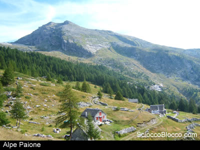
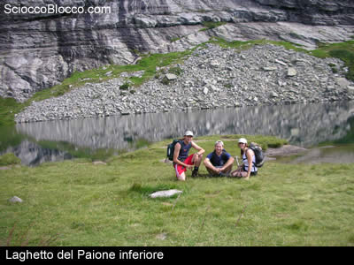
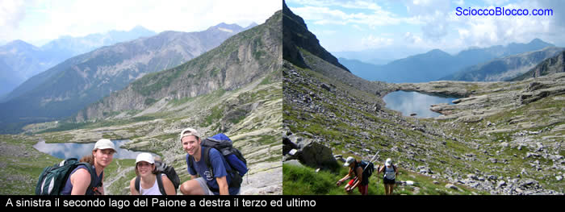
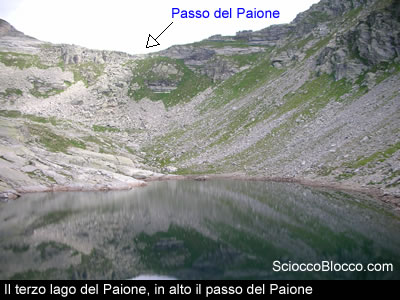
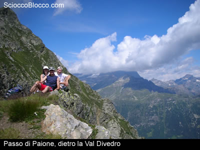
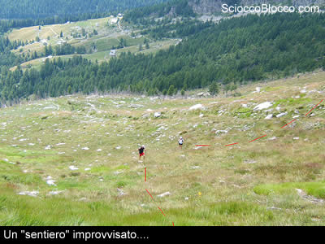
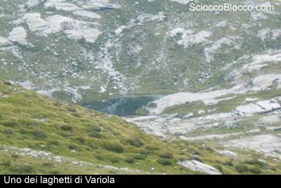

Qui
all'Alpe San Bernardo (1628m)
uscendo dal parcheggio sterrato scendiamo a destra alcune
decine di metri dove al bivio troveremo chiare indicazioni
per la nostra prima meta.

Infatti, svoltando a sinistra seguiamo il sentiero indicato
con la sigla (D8) e i colori rosso-giallo-rosso, per il
Passo Monscera.

Questa ampia strada sterrata in breve scende a superare
un ponte sul torrente Rasiga
(10min), per poi tornare asfaltata e inerpicarsi in ripidi
tornanti in un bosco di abeti rossi.

Dopo circa 20/25min dalla partenza incontriamo la deviazione
per l'Alpe Paione, ne seguiamo
il sentiero ben segnalato da tracce di vernice e cartelli
ed in breve tempo giungiamo all’Alpe Paione.

Sempre
seguendo il sentiero ci inoltriamo in un bel bosco;quando
i larici cominciano diradare siamo in vista del primo
lago del Paione ed è
qui che troviamo numerose piante di mirtilli.

Alle
spalle del lago il sentiero si erge sulla destra della
parete rocciosa fino a giungere al secondo lago di Paione.
Anche stavolta seguiamo il sentiero mantenendo il lago
alla nostra sinistra ed arriviamo al terzo ed ultimo lago
del Paione.

Dinanzi
a noi un’ultima ripida rampa ci conduce al Passo
del Paione addossato al Pizzo
Giezza. Il panorama è mozzafiato! Sotto
di noi possiamo osservare tutta la val
Divedro e davanti a noi si ergono maestosi i più
imponenti picchi dell’Ossola come il Monte
Leone, Pizzo Valgrande, pizzo Diei, monte Cistella, pizzo
Cervandone, la punta della Rossa ecc…

Scendendo
decidiamo di fare tappa ai Laghi
di Variola. Per giungerci, dal lago di Paione inferiore
imbocchiamo un sentiero all’inizio molto ben marcato
ma che poi si rivela piuttosto aereo e mal segnalato.
All’inizio il sentiero segue la costa della montagna
fino quasi a farci perdere le sue tracce in un pratone.

Lo
risaliamo senza particolari difficoltà e ritroviamo
il sentiero alla nostra destra in cima al vallone. Da
questo punto il percorso torna al essere segnato in modo
decente con ometti di pietra. In breve giungiamo ad un
bivio con cartelli di indicazione, risaliamo il vallone
sovrastante, seguiamo la cresta alla nostra destra ed
in breve giungiamo in vista dei Laghetti
di Variola.

Ritornando
al bivio è possibile imboccare un sentiero per
l’Alpe Dorca e da qui,
compiendo un ampio giro, tornare all’Alpe
San Bernardo, ma preferiamo ripetere il percorso
dell’andata poiché il cielo promette acqua
a breve termine…

Scarica
la recensione

Grazie agli escursionisti
di giornata Giada, Vittorio e Fabrizio.

