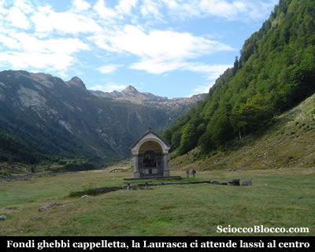
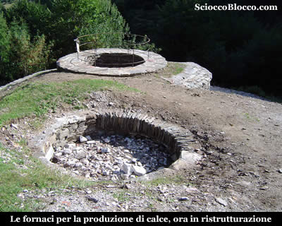
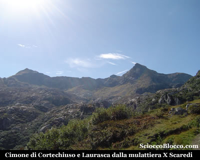
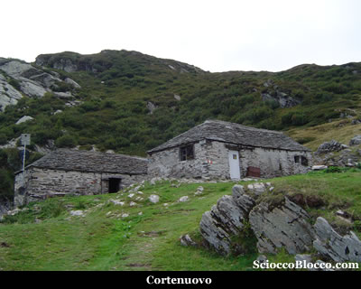
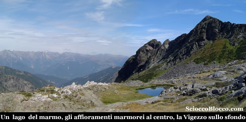
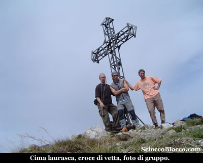
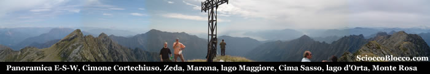
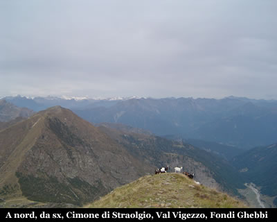
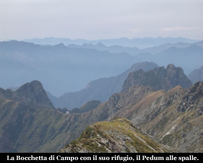
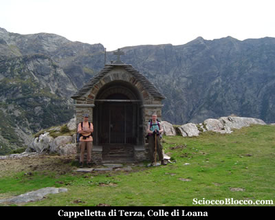

Giunti a **Fondo li Gabbi** o **Fondi Ghebbi** (1256m), parcheggiamo l'auto in una della numerose piazzole e scendiamo ad attraversare il greto del **torrente Loana** che in questa stagione è quasi completamente asciutto, e ci portiamo sul lato destro della valle nei pressi dell'agriturismo. Oggi la mattinata è serena e calda, la bella spianata della **Val Loana** si stende davanti a noi e lassù al centro svetta la nostra metà.

Il largo sentiero si dipana dopo l'agriturismo in leggerissima ascesa, sfiorando una cappelletta posta al centro del prato, costeggiando il lato destro della valle, passando quindi vicino ad un ponte in legno. Andando verso il restringimento dell'altipiano noteremo prima sulla sinistra, sul lato opposto, un piccolo gruppo di baite nei pressi del sentiero che scende dalla Forcola da noi percorso e [recensito](http://scioccoblocco.com/recensioni/loana_cima_mater.htm). Il sentiero a questo punto aggira sulla sinistra una piccola pietraia e nei pressi di alcuni cartelli indicatori si infila nel bosco sul lato destro della montagna. Da questo momento le pendenze si fanno impegnative in modo costante sino alla meta. Dopo qualche minuto arriviamo nei pressi delle **Fornaci** (circa 1340m) (25/30 min).

I resti delle antiche fornaci, ora in fase di restauro, venivano utilizzate un tempo per la fabbricazione della calce. Strutture di forma circolare, erano costruite in sasso a ridosso del pendio del terreno, nel muro a valle veniva costruita un’apertura denominata “bocca di carico” che serviva per introdurre la legna ed il carbone da ardere. Il calcare, ricavato nei pressi di **Scaredi**, vicino al Laghetto del Marmo, veniva ridotto in piccoli pezzi e trasportato a dorso di mulo fin qui, dove veniva messo in queste fornaci a cuocere lentamente. Dalla bocca di carico si inserivano il legname ed il carbone di legna che venivano fatti ardere a temperatura costante per circa 8 giorni. Una persona sorvegliava giorno e notte la cottura finché il calcare non si riduceva in materiale più tenero.

La calce bianca ottenuta veniva messa nei sacchi e a dorso di mulo portata a valle per essere utilizzata nella fabbricazione dei muri delle case o delle baite. La **Valle Loana**, con le sue fornaci, ed i suoi boschi ha fornito di legname e calce la *Valle Vigezzo*, e arredato la residenza borromea all’*isola Bella*, sul l*ago Maggiore*. Molte più di queste informazioni si possono trovare nel libro* "Malesco"* dello storico vigezzino * Giacomo Pollini*. Riprendiamo il cammino, la larga mulattiera rudemente gradonata che spesso in zona vengono definite *"Strà di vacch"*, sale ripida ai margini del bosco tra cespugli di mirtilli. Se non allenati la salita si fa sentire, il sole caldo di questo inizio settembre accentua le difficoltà, nei frequenti squarci però possiamo ammirare già scenari notevoli, dietro di noi la piana di Fondi Gabbi che si allontana, alla nostra sinistra la cresta che dalla Forcola corre alla Testa del Mater e a La Cima, quindi di fronte a noi il nostro obbiettivo.

Sulla sinistra il **Cimone di Cortechiuso** da noi salito e [descritto](http://scioccoblocco.com/recensioni/cimonecortechiuso.htm) e alla destra la Laurasca che ci attende. Attraversiamo alcuni ruscelli e piccoli passaggi su lastroni che interrompono il grezzo lastricato, quindi una diagonale che finalmente ci porta all'**alpe Cortenuovo** (1792m)(1.15h/1.20h).

L'Alpe **Cortenuovo** è costituito da due baite ancora in buono stato, in quanto utilizzate dai pastori di un gruppo di capre e mucche che si aggirano nei dintorni. Abbiamo percorso il tratto più lungo tra un punto di riferimento e l'altro, ripartiamo seguendo il sentiero che esce alla destra dell'alpeggio per poi piegare a sinistra per superare una bastionata rocciosa. Sormontata la quale siamo all'imbocco della piccola conca dove si trova l'**alpe Scaredi** (1841m)(1.30h/1.40h) che raggiungiamo in breve.

**Scaredi** vera e propria porta d' ingresso al Parco Nazionale Valgrande, ne fa luogo molto frequentato e dal forte fascino dato dalla sua storia secolare che si avverte subito sostando sui suoi prati. La bella baita ben ristrutturata è il bivacco sempre aperto di proprietà dell'ente parco, dotato di stufa, pannello solare, e numerosi posti letto nel sottotetto ben ristrutturato. Riposati e dissetati alla bella fontana, ripartiamo. Dietro l'alpeggio parte il sentiero ben evidente con cartello indicatore. Prestiamo attenzione però, la traccia piega a sinistra in direzione dei laghetti, mentre un altra prosegue dritta in direzione della vetta della Laurasca. Noi decidiamo di passare dai laghetti allungando il percorso di circa 15min. Quindi pieghiamo dapprima verso sinistra, passando sotto un contrafforte roccioso, quindi prendiamo a salire verso destra su pendenze che si fanno ardue. Tra rari ometti individuiamo la flebile traccia, che prima ci porta in una piccola conca solcata da un ruscello e quindi nei pressi di alcuni dei **laghetti del Marmo** (circa 2000m)(1.50h/2.00h).

I laghetti sono poco più che piccole pozze sparse nei declivi tra il **Cimone di Cortechiuso** e della Laurasca, che derivano il loro nome dagli affioramenti di marmo bianco tra gli specchi d'acqua. Da qui saliamo, traversando verso destra in direzione della traccia ben evidente che taglia orizzontalmente tra le due cime. Raggiunto il sentiero che è un tratto del mitico *sentiero bove*, proseguiamo verso destra proprio sotto la vetta, dopo qualche minuto, alcuni segnali di vernice indicano chiaramente l'attacco del sentiero per la vetta. Mancano ormai circa 150m di dislivello, ma verticali. Prima si prosegue verso destra (ovest), poi la traccia piega verso sinistra a risalire ormai l'ultimo tratto della cresta ovest. In breve tra sfasciumi si esce sulla piramide finale nei pressi della croce, finalmente **Cima della Laurasa** (2195m)(2.30h/3.00h).

Cima famosa e panoramica che deriva il suo nome dalla locuzione dialettale "Pizz 'dla brasca" ovvero "Pizzo della brace". Situata alla congiunzione di tre valli, **Val Loana**, Val Pogallo e Val Portaiola permette una visuale circolare su tutto il territorio della provincia del Vco.

In una panoramica *est-sud-ovest*, vediamo da sinistra il **Cimone di Cortechiuso** la cima gemella che sembra potersi toccare allungando la mano, sullo sfondo il **Gridone** o **Limidario**, **Monte Zeda**, **Pizzo Marona**, **Pian Cavallone**, **Lago Maggiore**, **Mottarone**, **Cima Sasso** sullo sfondo il **lago d'Orta**, la **Bocchetta di Campo**, **Corni di Nibbio**, sullo sfondo il **Monte Rosa** e alla sua destra lontano verso ovest l'inconfondibile piramide del **Cervino**.

Verso nord, il **Cimone di Straolgio** li a *'pochi passi'* sulla sinistra, sullo sfondo la **Val Vigezzo** e i suoi monti, in basso a destra l'altipiano della **Val Loana** con **Fondi Ghebbi** lasciato solo qualche ora fa. Affascinato dalla bellezza di **Bocchetta di Campo**, non resisto e faccio una zoommata con i mie poveri mezzi tecnici.

Il risultato non so se è decente, ma che bello quel posto laggiù e quella casina in equilibrio su di una lama con il gigante **Pedum** a proteggerla. Rifocillati, e lasciato il nostro segno sul libro di vetta, custodito nella scatola metallica sulla croce, a malincuore scendiamo. Tornati alla base della cuspide finale, sul sentiero Bove, seguiamo ora i chiari segni bianco-rossi del sentiero che torna in linea retta a **Scaredi**. Giunti di nuovo a **Scaredi**, alla nostra sinistra (ovest) possiamo notare una piccola cappelletta. Deciso ! In circa 10 minuti da **Scaredi** eccoci alla **Cappelletta di Terza**(1859m).

Posta sul **Colle di Loana**, il piccolo promontorio alle spalle di **Scaredi**, la **Cappelletta di Terza** è stata costruita nel 1847 da alpigiani e restaurata negli anni '80 dagli alpini di Malesco, deriva presumibilmente il nome dall'alpe Tercia ormai scomparso situato nella zona. All'interno sono raffigurati tre santi. A destra S.Antonio patrono degli animali, a sinistra S.Gioacchino protettore dei pastori e al centro Santa Genoveffa patrona di Parigi luogo di emigrazione dei vigezzini dell'altro secolo. Da qui una chiara traccia di fronte alla cappelletta risale un piccolo dosso erboso e in breve discesa ci riporta a **Cortenuovo** di nuovo sul sentiero dell'andata. Seguiamo il sentiero in discesa e ripercorriamo a ritroso il tracciato sino a tornare a Fondo Li Gabbi (1256) dopo(5.00h/5.30h). Escursione di media difficoltà più per le pendenze che per l'orientamento che è praticamente a vista, di grande valore paesaggistico.

**Un grazie agli escursionisti di giornata Francesco, Fabrizio, Dario.**

 **
