Giunti
a Miazzina
(750m), sul tornante poco prima della fine dell'asfalto,
sulla sinistra scende il sentiero con chiari cartelli
per Rugno.

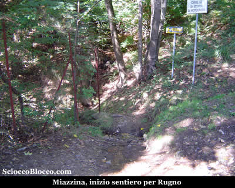

Il
sentiero, dapprima scende leggermente nel fitto del bosco,
poi con secchi tornanti cala rapidamente a superare su di
un ponte un torrentello, quindi su sentiero rudemente gradonato
in pochi ma ripidi tornanti raggiunge la radura soprastante
superata la quale eccoci a Rugno
(741m) (10/15 min).

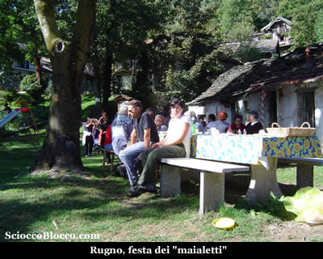

Rugno
un vero e proprio paese con baite finemente ristrutturate,
oggi è pieno di gente, in occasione di questa calda
domenica di ottobre, tutti gli abitanti delle baite si sono
riuniti nella piazzetta per un pranzo a base di maiale,
mentre i bambini si inseguono per i vicoli dell'alpeggio.

Qui mi accolgono Paola, Marcello e i loro figli Filippo
e Francesco, proprietari di una bella baita che mi ripropongo
di visitare al ritorno.

All'altro ingresso del paese, rispetto all'arrivo possiamo
vedere il minuscolo oratorio eretto in nome della Madonna
del Buon Consiglio.

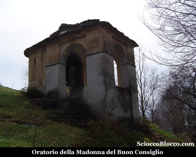

Possiamo
vedere sul piccolo promontorio al fianco dell'oratorio,
da dove si spazia già sul Lago
Maggiore e su Verbania
alcune coppelle su gli affioramenti rocciosi e
la struttura per il falò che viene acceso ogni ultima
domenica di luglio per la festa dell'alpeggio.

Ripartiamo, tornando verso l'ingresso dell'alpeggio, nei
pressi di una fontana in sasso sulla sinistra un cartello
segnavia n°7 segnala il nostro sentiero.

Riprendiamo a salire immersi tra le betulle e superiamo
un canale di recente costruzione e ritroviamo la mulattiera
selciata.

Dopo poco incontriamo una cappelletta (20/25min).

E'
questa la cappelletta"d'Midi"
(di Emidio), tutto intorno e in particolare qualche decina
di metri più su affioramenti rocciosi con incisioni
rupestri, coppelle e incisioni di croci, strani simboli
e figure umanoidi.

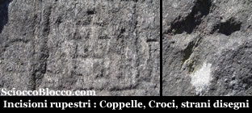

Le
coppelle sono cavità di varie dimensioni,
eseguite su una roccia in quantità e con disposizioni
variabili.

Presenti in tutto il mondo, per alcuni studiosi potrebbero
essere collegate a luoghi di culto e di tradizione preistorica.

La stessa chiesa sin dai primi secoli dell'era cristiana
condannò coloro che veneravano certe rocce in luoghi
selvaggi e nascosti in fondo ai boschi, pietre oggetto di
falsità diaboliche e sulle quali si depositavano
ex-voto, candele accese e altre offerte.

Molte le ipotesi sul significato dei massi coppellati, tra
le quali che fossero rappresentazione di costellazioni,
mappe del territorio o massi altare per sacrifici.

Riprendiamo il cammino in breve troviamo un bivio, teniamo
la sinistra, inizia la salita un po' impegnativa, usciamo
dal bosco e alzando lo sguardo vediamo la prossima meta.

Infatti in pochi minuti eccoci all'Alpe
Aurelio (934m)(30/35min).

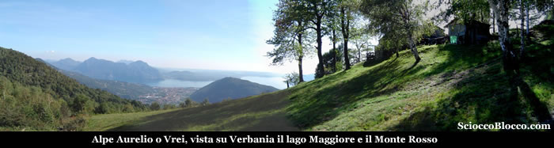

L'Alpe
Aurelio o come lo chiamano quelli del posto Vrei, è
uno splendido alpeggio costituito da molte meno baite rispetto
a Rugno, ma che dona oltre a maggiore tranquillità
uno dei panorami più belli che la zona possa offrire.

Sopra il nucleo di baite il sentiero propone un bivio, a
sinistra si va alla Motta d'Aurelio
che noi abbiamo descritto in un altra recensione,
in questo caso invece proseguiamo dritti, superiamo una
rete con cancelletto che delimita una proprietà e
rientriamo nel bosco.

La salita si fa impegnativa, in pochi minuti raggiungiamo
le baite della parte superiore dell'Alpe Aurelio, quindi
allo scoperto il sentiero piega a sinistra su magri e ripidi
prati.

E raggiunge un primo dosso con bella vista.

Il sentiero per qualche decina di metri in piano piega ora
a destra e sopra di noi è già in vista la
meta.

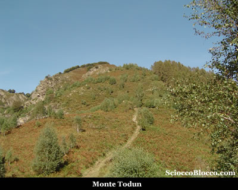

Riprendiamo
ora a salire, incontrando subito un cartello indicante "La
Colletta" (45/50min) che possiamo raggiungere seguendo
il tagliafuoco che si dipana in piano sulla destra.

Noi continuiamo a salire ormai su buone pendenze sino ad
incontrare un nuovo cartello indicante "Cappella Fina"
(55/60min) che possiamo raggiungere anche in questo caso
seguendo il largo tagliafuoco che esce in piano sulla destra.

Anche in questo caso continuiamo a salire, il sentiero con
ripidi tornanti ci porta in breve in cresta e seguendolo
sulla sinistra in pochi metri sulla cima del Monte
Todun (1298m)(1.00/1.15h).

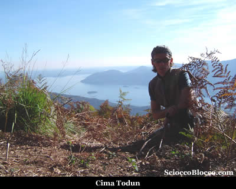

Il
sentiero, che pochissimo sotto prosegue sulla destra è
quello che cavalca la cresta della Colma
di Cossogno, e porta all'Alpe Cavallotti
e al Pizzo Pernice da noi percorso e recensito.

Qui dal Todun,
il panorama è superbo.

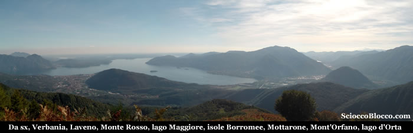

Da
sinistra, Verbania,
al di la del lago Laveno,
il Monte Rosso,
il Lago Maggiore
e le isole Borromee,
il Mottarone,
la foce del Toce,
Mont'Orfano,
lago d'Orta.

Alla mia sinistra, appena spiccato il volo dall'Alpe Cavallotti,
volteggiano quattro parapendii.

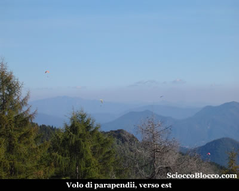

Alla
mia destra dietro il Monte
Faiè, la poderosa mole del Monte
Rosa.

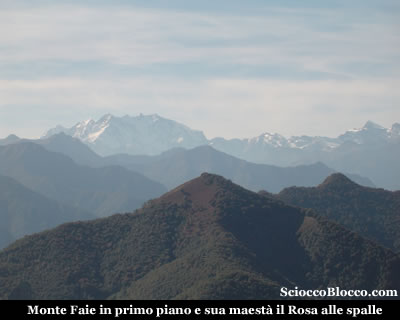

Il
ritorno avviene per il percorso di andata, ma con ancora
una tappa in quel di Rugno dove la festa volge all'epilogo,
ma sono in tempo per le caldarroste.

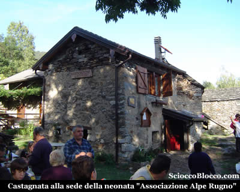

Qui
infatti, difronte alla sede della neonata
"Associazione Alpe Rugno" che
è il motivo principale dei festeggiamenti di oggi,
e alla quale vanno i miei migliori auguri per l'importanza
che hanno queste associazioni nella conservazione del nostro
territorio, gli specialisti stanno preparando delle ottime
'bruscarole'.

Dopo aver gustato qualche caldarrosta e aver visitato
la bella baita di Paola e Marcello, torno all'auto e a Miazzina(750m)
dopo (2.00/2.30h) dalla partenza.

Bella gita alla portata di tutti, con bellissimi scorci
panoramici.

Escursionista
di giornata Dario.

