Qui a **Cicogna** (732m), lasciamo l'auto nel parcheggio nei pressi del circolo e torniamo indietro in discesa al tornante che immette in paese. Qui parte il famosissimo sentiero per Pogallo, che oggi percorriamo nel primo breve tratto nell'escursione che ci porta a conoscere alcuni alpeggi abbandonati e poco conosciuti ma pregni di storia.

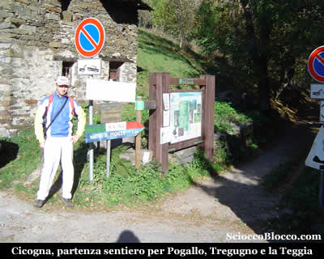

Imbocchiamo quindi il largo sentiero, che in falsopiano si addentra nei boschi della **Val Pogallo**, noto anche come il sentiero*** ***Sutermeister, che noi abbiamo descritto in una nostra [recensione.](http://scioccoblocco.com/recensioni/cicognapogallo.htm) Per chi ne volesse sapere di più consiglio "***Carlo Sutermeister fra Intra e Val Grande***" di Sutermeister Cassano, Alberti editore 1992. Dopo alcuni minuti di cammino tra gli squarci del bosco, possiamo già vedere alla nostra destra verso est un bello scorcio panoramico.

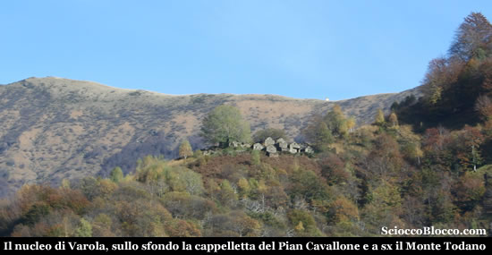

Il corte di **Varola** su di un ripiano erboso è li a un passo e sullo sfondo il puntino bianco della **cappelletta del Pian Cavallone** e sulla sinistra la croce del **Todano**. Ignoriamo il primo bivio nei pressi di una bella baita, il sentiero porta a Varola appena vista al di la della valle, e proseguiamo diritti. Dopo circa 15min troviamo un altro bivio dove un cartello segnalatore indica la nostra direzione. Andiamo a destra e iniziamo a scendere nel fitto bosco di castagne, che nel periodo autunnale ricopre il sentiero con mezzo metro di foglie. Con ripidi tornanti il sentiero poco marcato, precipita verso il fiume che raggiungiamo nei pressi di una **passerella** (500m circa) dopo (25min/30min) dalla partenza.

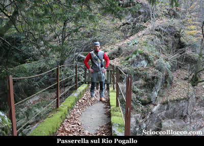

La passerella ci permette di attraversare il **Rio Pogallo** che inizia a gonfiarsi con le piogge autunnali e che crea giochi tra acqua e rocce sempre affascinati. In pochi minuti tutto il sapore aspro della **Val Grande** ci avvolge già completamente.

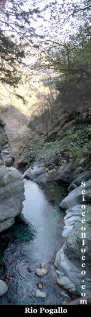

Non si può non fermarsi ad ammirare questo spettacolo naturale. Riprendiamo il cammino, dopo la passerella il sentiero piega a sinistra e scende quasi a toccare il torrente, per poi alzarsi nel bosco e superati un paio di ruderi arrivare in pochi minuti a **Corte Borlino** (550m) (35min/40min).

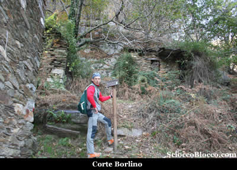

Corte ormai avvolto nel bosco, ma con qualche casera ancora in piedi dove al centro si possono notare le pietre che formavano il focolare. Continuiamo su salita impegnativa, immersi nel bosco di castagni le quali foglie complicano l'avvanzamento in questo periodo dell'anno. Quando il bosco si dirada un po e compaiono alcuni muri a secco il sentiero spiana su un dosso e appaiono le prime baite di **Tregugno **(700m) (55min/1h) .

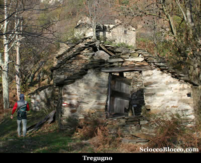

Tregugno nel '800 e agli inizi del '900 fu corte abitato tutto l'anno vivo e vitale, ora restano poche baite con il tetto apparentemente integro e il bosco sembra lentamente riprendere ciò che è suo. Nella testa appaiono ricordi e fantasie delle storie lette su questi luoghi e sull'onda di queste emozioni ci mettiamo a cercare la *"casa di Sofia"*.

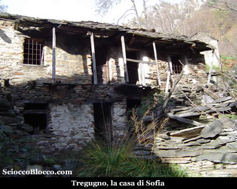

Ad un tratto eccola li davanti come la ricordavo dalle foto del libro. *Sofia Benzi*, che con il figlio *Antonio* sono i protagonisti dello straordinario libro* "A piedi nudi"* che attraverso la loro vita, l'autore *Nino Chiovini*, ricostruisce un secolo e più della storia della **Valle Intrasca**. Una vita quella di *Sofia*, figlia del leggendario *Pà Iachin (Giacomo Benzi)*, acculturato, possidente, cacciatore, pescatore, prima guida alpina locale nonchè primo salitore del Pedum cima simbolo della **Valgrande**, fatta come quella del figlio *Antonio* di stenti, sofferenze, poche gioie, come quella della maggior parte delle persone abitanti quelle povere zone. Difficile staccarsi da qui, intorno sembrano vagare ancora i sogni e le speranze di chi vi ha vissuto. Ma partiamo... Alla nostra sinistra le cime che chiudono la **Val Pogallo** a nord, alla nostra destra il corte di **Varola** e la cresta del Pian Cavallone che corre dal [Todano](http://scioccoblocco.com/recensioni/marona.htm) al [Pernice](http://scioccoblocco.com/recensioni/pizzopernice.htm) per terminare al [Todun](http://scioccoblocco.com/recensioni/todun.htm). Il sentiero sale nel bosco, per poi costeggiare una parete scoscesa, risalendola con decisi tornanti, e proprio su uno di questi troviamo una cappelletta.

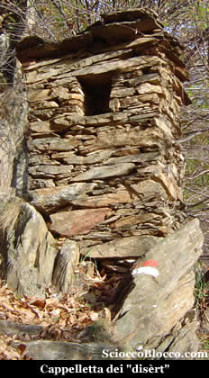

La capelletta dei *"disèrt"*, ovvero dei disertori nel dialetto locale, così mi vien da chiamarla visto che non ha nome. Infatti secondo una testimonianza orale raccolta dal *Chiovini*, pare essere stata costruita insieme ad altre ormai svanite, per un numero di nove in onore alla novena, da disertori alla leva napoleonica. Manufatto di povertà assoluta, dotato di una piccolissima nicchia dove depositare pochi lumini, ovvero piccoli ceri votivi. Riprendiamo il cammino, e dopo pochi tornanti eccoci di fronte ad un altra cappelletta questa intonacata di bianco e già visibile da Cicogna ad un occhio attento.

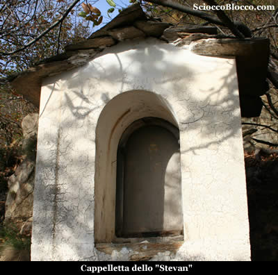

La cappelletta dello* "Stèvan"* prende il nome del suo edificatore al secolo *Stefano Morandi*, che fece voto di costruirla se avesse sposato la *Sofia* di cui abbiamo poc anzi parlato. E così fece subito dopo il matrimonio, costruì la cappelletta su uno sbalzo roccioso del sentiero tra *Tregugno* e *La Teia*, proprio di fronte al borgo di **Varola** che se ne sta aldilà del **rio Ransciola** adagiato su di un dosso al sole. La peculiarità della cappelletta, sta nel fatto che il dipinto raffigurante la **Madonna di Re** con in braccio il bambinello, della quale oggi si vede solo una piccola parte del volto, è realizzato su sottile lastra di marmo dalla levigatura naturale.

L'autore dell'opera, che è da far risalire al 1904 come la costruzione della cappelletta, è il cicognino *Giovanni Battista Benzi detto "Pitùr"*. Per chi ne volesse sapere di più, *"A piedi nudi" di Nino Chiovini Tàràrà edizioni 2004*. Dopo questo ennesimo tuffo nella storia, proseguiamo il cammino, il sentiero in breve spiana e piega verso sinistra, un breve traverso tra i castagni ci conduce all'ultimo alpeggio di oggi **La Teia** o **Teggia** (811m)(1.20h/1.30h).

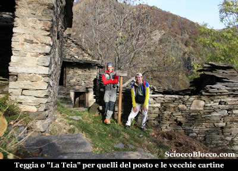

**La Teia** come chiamata in zona o **Teggia** italianizzata dalla cartografia recente, è un piccolo corte che si può definire gemello con il più cospicuo e sottostante Tregugno, è situato alla diramazione tra la valle del **rio Ransciola** alla destra e la **Val Marona** che si apre aspra e selvaggia alla nostra sinistra. Infatti uscendo dall'alpeggio possiamo vedere lassù a dominare la valle la **cappella della Marona**.

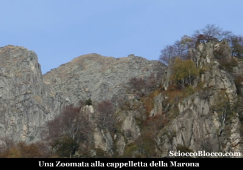

Proseguendo su questo sentiero che nella prima parte risale la Val [Marona](http://scioccoblocco.com/recensioni/marona.htm), si può raggiungere l'alpeggio de La Soliva e quindi il Pian Cavallone, ma per noi oggi non è possibile il buio incombe. Torniamo sui nostri passi ripercorrendo lo stesso sentiero che ci riconduce a **Cicogna** partenza e arrivo della nostra escursione dopo (2.30h/2.40h). Escursione facile per dislivello e durata, ma che richiede prudenza per il sentiero poco segnato e poco frequentato e che nel periodo autunnale diventa scivoloso per l'enorme quantità di foglie che ricopre e mimetizza la traccia.

**Un grazie agli escursionisti di giornata Fabrizio e Dario.**
