All'**Alpe Devero** (1640m) lasciamo la macchina nel comodo parcheggio sotterraneo di recente costruzione, e risaliamo la stradina che si insinua tra le prime baite dell'alpe, neve permettendo possiamo già mettere gli sci. Dopo pochi metri ci troviamo di fronte ad un piccolo ponticello, noi non lo attraversiamo ma andiamo a sinistra in piano e dopo circa 300m arriviamo agli impianti da sci rimodernati un paio di anni fa. Lasciando gli impianti sulla sinistra, iniziamo a camminare in piano verso il nucleo di baite che chiude verso il rio Buscagna la piana del Devero.

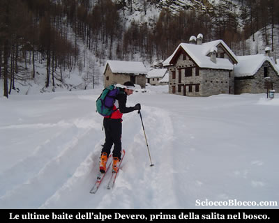

La neve caduta nei giorni precedenti è abbondante e pesante, per fortuna ci sono tracce che ci precedono e riducono un po la fatica dell'avvanzamento. Dopo il nucleo di baite la traccia piega a sinistra e inizia a salire nel bosco. Su mezza costa tra le piante e il fiume che scorre in basso a destra, si sale zigzagando in uno spazio abbastanza stretto.

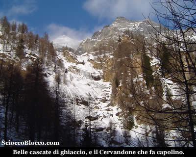

Alla nostra destra si vedono belle cascate di ghiaccio e appena velato dalle nuvole la vetta del **Cervandone** che sbuca tra le piante. Proseguiamo sempre nel bosco la salita si fa più ripida, per poi spianare per un breve tratto.

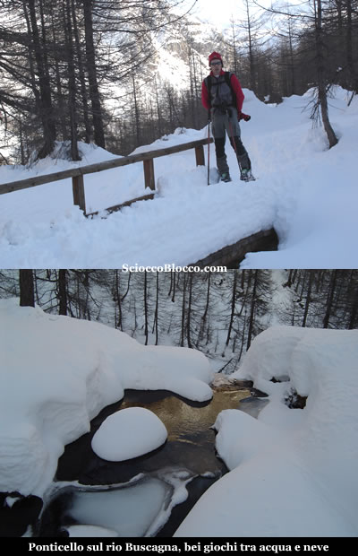

Siamo al ponticello in legno sul **Rio Buscagna** (25/30min), che regala belle forme con acqua, neve e ghiaccio. Riprendiamo a salire nel bosco, il sole non ha ancora raggiunto la conca dove ci troviamo e il freddo nonostante la fatica è pungente. Sbuchiamo in una piccola radura.

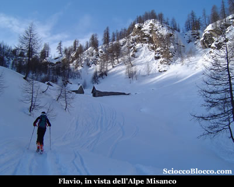

E' questa la radura dell'**Alpe Misanco** (45/50 min) che raggiungiamo in breve, il sole inizia a lambire i tetti delle baite. Voltandoci verso la direzione del nostro arrivo (nord) possiamo ammirare già un bello scorcio panoramico.

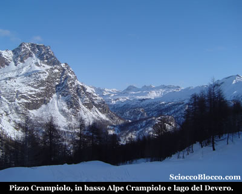

Il **Pizzo Crampiolo** domina la **piana del Devero**, dove possiamo vedere l'**Alpe Crampiolo** e il **Lago di Devero**, nonchè sulla sfondo i monti che separano Devero dalla **Val Formazza**. Qui all'Alpe Misanco sommerso dalla neve lo scenario è incantato. Riprendiamo a salire di nuovo nel bosco la salita si fa impegnativa, Flavio ormai caldo detta il ritmo sempre tecnico ed elegante, per me inizia la sofferenza... Il bosco si dirada velocemente, ora all'aperto e al sole si sta meglio, ma le pendenze ormai non lasciano più respiro, percorriamo la conca con più di un metro e mezzo di neve che ci porta all'altezza dell'arrivo degli impianti di sci (1.30/1.40h).

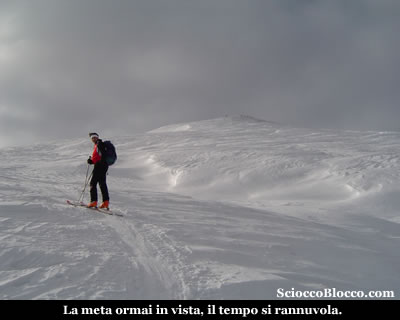

Siamo ormai allo scoperto, sulla cuspide finale, lasciamo gli impianti alla nostra sinistra, la meta è ormai in vista, su neve ora ventata e crostosa, risaliamo a vista con ultimo sforzo in direzione della vetta, mentre il tempo si copre. In breve eccoci in vetta al **Monte Cazzola** (2330m)(2.00/2.15h).

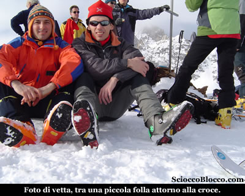

Finalmente ci rilassiamo, mangiamo qualcosa e facciamo due chiacchiere con i molti sci alpinisti che hanno raggiunto la vetta come noi. Il cielo si riapre un po e tutto intorno lo spettacolo dei monti è impagabile.

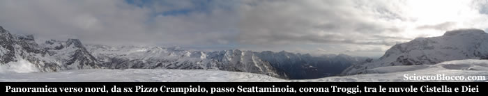

Verso nord lo sguardo spazia dal **Pizzo Crampiolo** al **lago di Devero** al passo **Scattaminoia** alla **corona Troggi** e alle altre cime che dividono **Devero** dalla **Val Formazza**, difronte a noi a poca distanza coperti dalle nuvole il **Cistella** e il **Diei**.

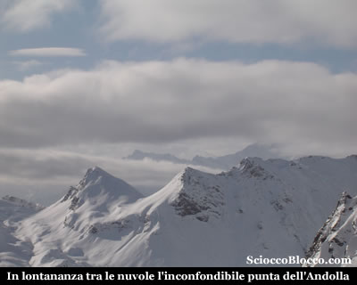

Verso sud possiamo vedere gli impianti sciistici di **San Domenico** e in lontananza come un'apparizione tra le nuvole, la punta inconfondibile del **Pizzo Andolla**. Infiliamo gli sci e iniziamo la discesa, che vista la neve pesante si preannuncia faticosa come la salita. Il percorso sarà esattamente quello dell'ascesa. Scesi dalla cima dove la neve e dura entriamo nella conca alla sinistra degli impianti, qui la neve è molta e pesante ma la mancanza di vegetazione ci permette di tentare qualche curva...

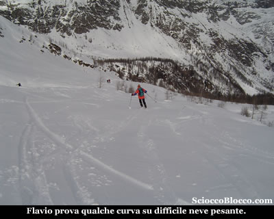

Flavio dall'alto della sua esperienza disegna qualche curva morbida, io provo a seguirlo. In questo primo tratto anche se molto faticosamente si riesce ancora a sciare, poi entrati nel bosco gli spazi si restringono.

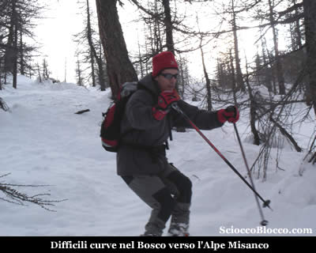

Torniamo di nuovo all'**Alpe Misanco**, sciando su neve umida e tra il fitto bosco, ho bisogno di tutta la mia esperienza. La fatica di questa discesa è notevole, le energie iniziano a scarseggiare, ancora nel bosco ripassiamo al ponticello sul Rio Buscagna. Poi dopo qualche passaggio stretto e un paio di piccoli guadi sul sentiero estivo raggiungiamo di nuovo la piana dell'**Alpe Devero** (1640m)(3.00h/3.30h).

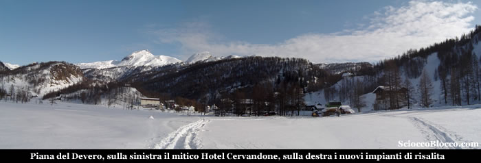

E' tornato il sole, la piana è bellissima e ovattata nella neve fresca, siamo stanchi ma appagati ci meritiamo un lauto pranzo al rifugio. Escursione facile per chi è allenato, tanto che i più esperti la usano come allenamento o test sulla condizione, ma che non va presa alla leggera da chi si accosta a questo bellissimo sport per la prima volta, dato un buon dislivello e la discesa per buona parte nel bosco.

**Un grazie agli escursionisti di giornata Flavio e Dario.**
