A **Viganella** (582m), lasciamo l'auto in uno spiazzo lungo la strada e dirigiamoci verso la chiesa che è ben visibile poco sopra la carrozzabile, alzando lo sguardo sulla montagna alla quale è addossato il paese possiamo già vedere il motivo della nostra gita.

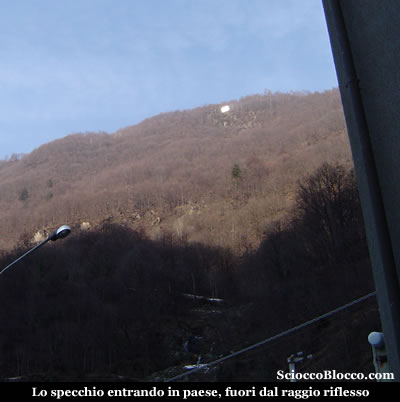

La curiosità di vedere l'ormai famoso e pubblicizzatissimo specchio di Viganella è la spinta che ci ha portato in questi luoghi oggi giorno dell'epifania. Da un idea del *Sindaco Pier Franco Midali *parlando con l'architetto *Giacomo Bonzani*, autore della struttura dello specchio, durante la realizzazione della meridiana posta sulla chiesa, nasce il progetto di portare il sole in paese anche nei mesi di assenza. Infatti dal 11 Novembre al 2 Febbraio il sole non riesce a raggiungere il paese perchè nascosto dalla **Colma**, la montagna che fronteggia sul lato opposto del **torrente Ovesca**, Viganella.

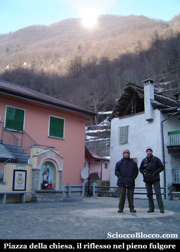

In breve in piazza siamo nel sole riflesso anche se oggi la giornata è un po velata. La bella piazzetta di recente ristrutturazione e illuminata debolmente dallo specchio che risplende lassù a poco più di 400m di dislivello. Dove non c'è mai stata ombra nei mesi invernali ora c'è...

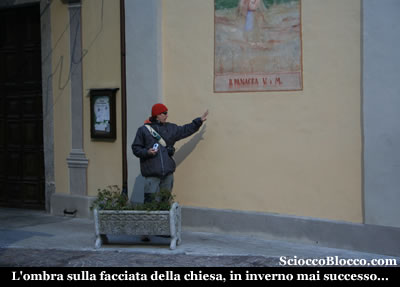

Esploriamo il paese tra stretti vicoli e case appiccicate l'una all'altra, purtroppo le case abbandonate sono di gran lunga superiori a quelle abitate, quasi alla fine del borgo incappiamo in una struttura a tre piani con logge ad arco e dall'ottimo restauro a dir poco superba, è questa **"Casa Vanni"**.

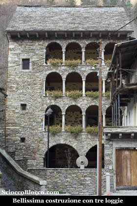

Tornando sui nostri passi di nuovo in piazza, ripenso a quanto letto su questo paese e questa valle. **Viganella** è un piccolo gruppo di case su un fazzoletto di terra pianeggiante rivolto al sole (almeno in estate) sul lato sinistro della valle scavata dal **torrente Ovesca**. Gli abitanti nei secoli hanno strappato con fatica angoli di terra alle scoscese pareti montane che circondano il piccolo ripiano che ospita il paese. L'altitudine contenuta, 582 mslm, l'esposizione al sole hanno favorito la coltivazione di vite, alberi da frutto, in particolare noci e castagne, oltre a segale, miglio e patate. Buona importanza ha avuto la pastorizia con allevamento di bovini, capre e pecore. Fino alla metà del secoloXIX, questa parte della valle era chiamata semplicemente *"Mezza Valle Antrona"*, molto probabilmente a causa del fatto che la valle era suddivisa in terzieri e questa zona era inclusa nel secondo "terzello". Solo più recentemente appare il nome di Viganella che deriva dal toponimo latino *"Vicanalia"* ovvero territorio e pascolo dei vicini. Mentre Antrona pare derivare da *"Truna"* ovvero cava di pietra da cui* "An(in)trona"* cioè *"nella cava"*. Nei secoli l'aumento della popolazione a fronte di un attività agro-pastorizia sufficiente a mala pena alla sussistenza portò inevitabilmente all'emigrazione. La storia di **Viganella** e di tutta la **Valle Antrona** è legata alla capitale Oscella e alla sua chiesa plebana. La pieve di Oxilia era la diocesi che raccoglieva a se tutto il territorio con la chiesa plebana (chiesa plebana cioè a capo di altre della zona) dei Santi Gervasio e Protasio, ovvero il Duomo di Oxilia da cui successivamenteDomodossola. Nel frazionarsi dei comuni della valle, anche il territorio di *Mezzavalle* sentì la necessità di una propria parrocchia è venne scelta come sede Viganella la frazione più popolata. Così dal 1610 al 1618 la comunità di Mezzavalle e in particolare quella di Viganella eresse la chiesa dedicata a "Maria nascente" che si festeggia l'8 settembre. La **Valle Antrona** è nota coma la valle del ferro per le sue miniere sparse un po ovunque di cui il monte simbolo è l'**Ogaggia**, dove tutt'ora sono ben visibili le gallerie dei minatori, che estratto il ferro lo portavano nei centri della valle dove erano posti forni e magli. L'estrazione del ferro in valle è già documentata nel secolo XIII , ed ebbe la sua massima spinta tra i secoli XIV e XVI. Dopo più di un secolo, verso la fine del '700, grazie all'imprenditore Verbanese **Pietro Maria Ceretti**, l'estrazione riprese vigore e tornò lavoro nei centri della valle grazie anche alla costruzione della moderna carrozzabile. Tuttavia con l'esaurirsi dei filoni e la maggiore comodità dei mezzi moderni che ormai avevano raggiunto il fondovalle, l'estrazione fu abbandonata alla fine dell'800, quando ormai le nuove industrie avevano trasformato **Villadossola** in uno dei poli siderurgici più importanti d'Italia, causando inevitabilmente la discesa a valle delle popolazioni attirate dalla possibiltà di lavoro e dalle maggiori comodità. Tutto questo portò fatalmente allo spopolameto dei paesi e alla morte delle piccole frazioni che ormai oggi lottano senza speranza contro l'inesorabile avanzare del bosco. Da ricordare infine una piccola parte di estrazione dedicata all'oro, e una parte più cospicua e redditizia alla pietra ollare o laveggio utilizzata per ricavarne recipienti da fuoco. Per chi ne volesse sapere di più : **-* "Viganella Storia,fede,arte"* di Tulio Bertamini, Edizioni Comune di Viganella 2003.** **- *"Antrona Bognanco"* di Paolo Crosa Lenz e Giulio Frangioni, Edizioni Grossi Domodossola 1994.**

Dopo questo veloce volo ad uccello sulla storia di questa valle e di questo paese, di nuovo in piazza, partiamo direzione specchio. Nella spiazzo di fronte alla chiesa al fianco del monumento ai caduti, parte il sentiero indicato da cartelli gialli e da segni bianco-rossi e giallo-rossi del CAI. Dapprima facciamo uno slalom tra gli stretti vicoli del paese, quindi imbocchiamo il sentiero che subito ripido sale nel bosco. Guadagniamo quota velocemente e dopo pochi minuti in uno squarcio tra la vegetazione appare la chiesa e la piazza che si va popolando.

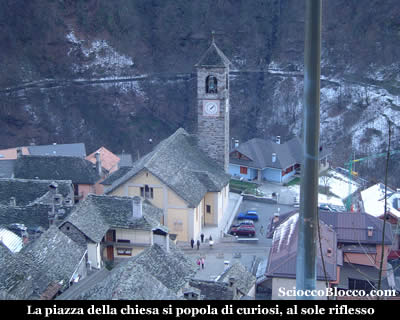

Notevole la vista sui vecchi tetti in sasso delle case abbandonate, quasi appoggiate l'una all'altra come per sorreggersi dall'attacco del tempo. Riprendiamo a salire nel bosco sempre piegando verso sinistra (ovest), la mancanza di neve di quest'inverno facilità l'avvanzamento che altrimenti sarebbe difficoltoso in questa stagione. Raggiungiamo l'**Alpe Brig** (691m)(20min).

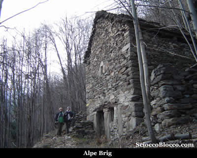

Continuiamo a salire su pendenze sempre considerevoli e sempre verso ovest, per arrivare nel bosco ad un bivio con cartelli indicatori (30min). Noi seguiamo per l'Alpe Pianezzo in salita. Il sentiero ripido porta in breve all'**Alpe Barco sotto** (897m)(35min).

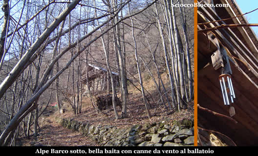

Qui una bella baita, ha appeso al ballatoio delle canne da vento, se passate di qui mentre c'è della brezza quindi, nessuna paura non ci sono gli spiriti.... Siamo giunti all'altezza del sole, infatti a questa quota il sole timidamente cerca di sbucare dalle creste della **Colma**. Continuiamo sempre su buone pendenze e aggirato un dosso roccioso, raggiungiamo un poggio naturale dove è posto l'arrivo della** teleferica** (950m circa)(45min).

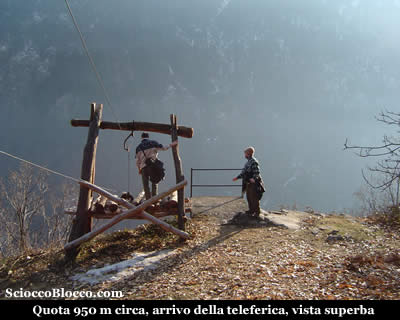

A precipizio sul torrente Ovesca si apre un panorama considerevole sulle cime che chiudono la Valle Antrona dalla Valle Anzasca. Ripartiamo entrando nel bosco, in breve raggiungiamo l'**Alpe Barco** (986m) (50min).

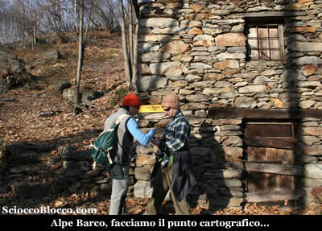

Qui un cartello giallo indica chiaramente per l'Alpe Pianezzo dritti in salita, proprio al fianco della baita con cartello indicatore della quota e dell'alpeggio. Riprendiamo il sentiero che sale ora ripido verso il crinale, in pochi minuti arriviamo all'**Alpe Pianezzo** (105om)(55/60min).

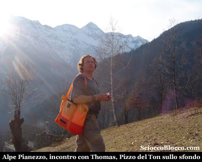

Bell'alpeggio fuori dal bosco con bella vista sulle cime circostanti. Qui salendo sopra l'alpeggio incontriamo *Thomas*, simpatico e loquace "eremita" di origini tedesche che vive da 20 anni in quest'alpe dove ha ristrutturato una graziosa baita che da in affitto e vive poco distante in due grosse strutture in fase di costruzione. Circondato da animali, da piante e facendo i suoi prodotti tipici, pare vivere in serenità con il mondo. Ci indica la direzione della nostra meta e ci racconta alcuni aneddoti sulla costruzione dello specchio e sul "vicinato" davvero gustosi. Ripartiamo sul vero e proprio altipiano che esce sulla destra del nostro arrivo, tornando di nuovo verso est, mentre alle nostre spalle ci osserva il **Pizzo del Ton**. In piano superiamo la casa di Thomas e rientriamo nel bosco, quando intravediamo una bella baita appollaiata su un dosso, saliamo i pochi metri e proprio sotto vediamo** lo specchio, Alpe Scagiola** (1050 m) (1.10h).

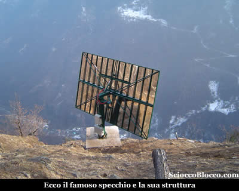

"Il progetto ha previsto l’installazione di uno specchio piano in acciaio inossidabile lucidato meccanicamente ed avente 8 m di larghezza per 5 in altezza, posto su un fusto metallico ancorato al suolo mediante un piccolo manufatto di cemento armato. Lo specchio è motorizzato opportunamente in modo altazimutale, così da poter seguire costantemente il moto dell’astro e dirigere in tempo reale il raggio riflesso nel luogo prestabilito, (parte pedonale della piazza principale di Viganella di fronte al monumento dei Caduti, la sede della Comunità Montana Valle Antrona ed il portichetto della Chiesa Parrocchiale). Mosso da un computer e da una centralina idraulica, dopo l’escursione diurna, si riposiziona nottetempo per ripartire il giorno dopo nella posizione prevista. I mq illuminati sono oltre 250, con un’ellisse centrale di circa 160mq a maggior concentrazione, pari all’50% del sole reale. A causa dell’ubicazione dello specchio, il rendimento maggiore si ha nelle ore del mattino, quando il sole, lo specchio e Viganella si trovano allineati. Il dislivello tra lo specchio ed il centro della piazza è di 481m , mentre la distanza inclinata è di 874 m. Lo specchio è azionabile in telecomando anche dal Municipio del paese." **Fonte :** [http://www.gimbonzani.it/curriculum/sole_riflesso.html](http://www.gimbonzani.it/curriculum/sole_riflesso.html)

Dello specchio di Viganella e del suo sole riflesso è in preparazione un libro *“La vera storia dello Specchio di Viganella”*, da parte del architetto *Giacomo Bonzani* e del giornalista de "La Prealpina" *Marco De Ambrosis *(mio vecchio e caro amico) con l’uscita prevista entro la Primavera 2007. Facciamo la classica foto di *"vetta".*

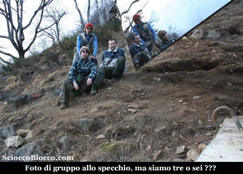

Riprendiamo la via del ritorno che avviene per lo stesso percorso di andata, ma tornando verso l'Alpe Pianezzo vediamo venirci incontro Thomas e alcuni suoi amici.....

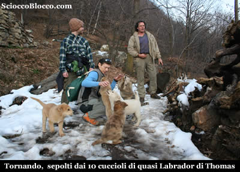

Ben 10 cuccioli di quasi labrador ci "aggrediscono" festosamente !!! Se siete interessati ad adottarli contattateci a : [trekking-bike@scioccoblocco.com](mailto:trekking-bike@scioccoblocco.com) Thomas e la sua banda ci accompagnano all'uscita dell'alpeggio, il nostro nuovo amico ci racconta di un suo sogno, cioè trasformare il suo eremo in aula didattica a cielo aperto per i bambini dell'elementari, noi possiamo solo fargli i nostri migliori auguri !! A ritroso sul percorso dell'andata torniamo a **Viganella** dopo (2.00h/2.10h). Bella gita alla portata di tutti anche se su sentiero costantemente ripido, che porta a vedere alpeggi sconosciuti ai più e al cospetto dello specchio, manufatto dal contenuto altamente tecnico ma nato da cuore e fantasia.

**Grazie agli escursionisti di giornata Francesco, Fabrizio e Dario.**
