Qui
nell'ampio parcheggio sterrato contraddistinto al centro
dalla **cappella Fina**
(1100m), lasciamo l'auto e imbocchiamo il largo sentiero
gippabile che parte sul fondo.

La neve qui è scarsa e tracciata da un esercito di
escursionisti che ci a preceduto nei giorni scorsi....

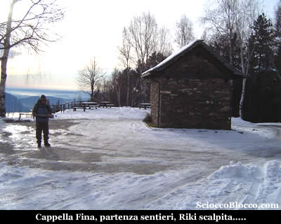

Partiamo
lasciando le nostre ciaspole appese allo zaino.

Ignoriamo il sentiero che subito sulla destra prosegue in
piano, il quale porta alla cappella di Porta a **Caprezzo**,
e dritti saliamo sulla comoda strada che si immerge in un
bosco.

La neve è poca e molto battuta si avanza tranquillamente
con gli scarponi da trekking.

Superiamo una cappelletta dedicata da un padre alla memoria
del figlio, quindi la deviazione per l'**Alpe Cavallotti**,
la strada diviene comoda mulattiera, quindi marcatissimo
sentiero, e arriviamo nei pressi di una fontana ormai fuori
dal bosco (30').

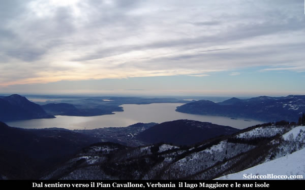

Se
il tempo vi assiste il panorama è già notevole,
**Verbania**
si stende sulle rive del **Lago
Maggiore**, il **Monte
Rosso** appare sulla destra e i monti lombardi
fanno da sfondo.

Oggi la giornata è velata in alto, ma sotto è
limpido e i **laghi di Varese
e Monate** riflettono nella luce del mattino.

Proseguiamo ora su battutissimo sentiero tanto che i bordi
risultano spesso 40cm più alti del centro, da far
sembrare il camminamento più una trincea che una
traccia, la neve è ancora poca e calpestatissima.

Giunti al masso che come una polena si protende verso il
lago, cambiamo direzione e puntiamo verso Nord-Ovest all'interno
del bosco, la neve aumenta di quantità e all'orizzonte
appare la prima meta.

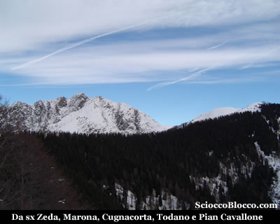

Aggiriamo il **Pizzo Pernice** e ai margini di un fittissimo
e scuro bosco di abeti rossi arriviamo alla lunga spianata
che precede la prima meta (1.00h).

Qui troviamo chiare indicazioni di un sentiero che scende
a **Cicogna** .

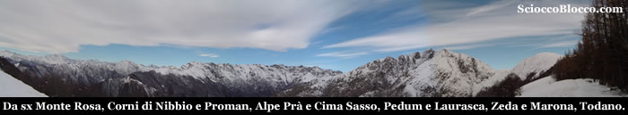

Dalla
nostra sinistra, il massiccio del
**Monte Rosa** sgombro da nubi svetta maestoso,
più vicino a noi corre la linea di cresta dei **Corni
di Nibbio** che termina nel **Proman**,
ancora più vicina la dorsale spartiacque tra **Valgrande**
e **Val Pogallo**
con **Cima Sasso**
il **Pedum** e
la testata frontale della **Laurasca**
e del **Cimone di Cortechiuso**,
sulla destra la cresta del **Monte
Zeda** e del **Pizzo
Marona**, per finire con il **Monte
Todano**.

Di fronte a noi scende il sentiero per Curgei e **Cicogna**,
alla nostra sinistra sale la traccia per il **Pizzo Pernice**,
noi andiamo a destra.

La neve ora è abbondante, calziamo le ciaspole, dapprima
alcuni metri in piano poi la traccia sale su buone pendenze,
ma in poco tempo raggiungiamo il **bivacco
invernale del Pian Cavallone**

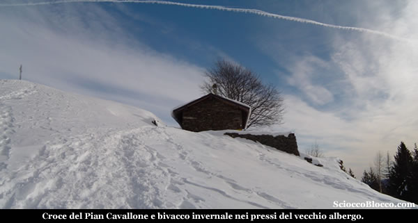

Quindi
nei pressi i resti del **vecchio
albergo del Pian Cavallone** bombardato durante
la seconda guerra mondiale.

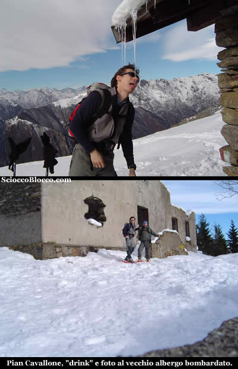

In
un paio di minuti, salendo alle spalle dell'albergo, raggiungiamo
la croce del Pian Cavallone
(1564m) (1.25h/1.30h).

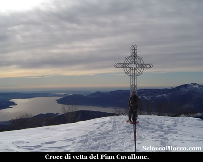

Il
panorama è notevole, il sottile velo grigio che copre
il sole regala una luce particolare sulle isole del golfo
Borromeo.

Sulla croce sono poste tre targhe del 1950/1975/2000 poste
ogni 25 anni in occasione del giubileo da parte di una associazione
cattolica.

La nostra prossima meta è ben visibile davanti a
noi verso Nord.

Scendiamo sull'ampia cresta e velocemente arriviamo alla
**cappelletta del Pian Cavallone**
(1528m) (1.35h/1.40h).

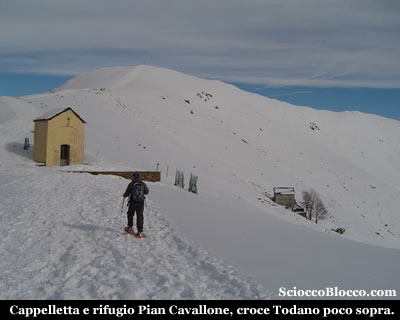

L'ambiente
ormai è prettamente invernale e la neve regala scorci
incantevoli, poco sotto vediamo il **rifugio
del Pian Cavallone.**

Il **rifugio del Pian Cavallone**
di proprietà del CAI Intra
costruito nel 1882 e gestito dalla Cooperativa **Valgrande**
è la meta più classica dell'escursionismo
verbanese per la sua facile accessibilità
da molti paesi della **Valle
Intrasca** come **Miazzina**,
**Intragna**, **Caprezzo**
e anche da **Cicogna**
ma con un po più di sforzo.

Testimone di questo è una foto posta su di un pannello
all'ingresso del rifugio, che ritrae centinaia di persone
che ricoprono totalmente la montagna in un escursione popolare
di inizio '900.

Il rifugio ben curato offre circa 30 posti letto, un paio
di ampie sale da pranzo, la luce elettrica a mezzo di pannello
solare e ottima cucina.

Può essere scelto come meta per merende e facile
gita o come punto di partenza per escursioni più
impegnative alle vette circostanti.

Resta aperto ogni fine settimana da aprile a ottobre e tutti
i giorni dall'ultima settimana di luglio alla fine di agosto,
apre su prenotazione e solo per gruppi in ogni periodo dell'anno.

Dietro la cappelletta partono due sentieri uno indica **Cicogna**
ma può essere utilizzato per raggiungere la Marona
senza salire al **Monte Todano** dove conduce il secondo
sentiero.

Noi saliamo la croce è ben visibile e la traccia
con una linea pressoche diretta punta alla vetta, le pendenze
si fanno notevoli, la fatica anche, le ciaspole fanno sentire
la loro importanza su questi ripidi pendii, in circa 15'
eccoci sul **Monte Todano**
(1667m)(1.50h/2.00h).

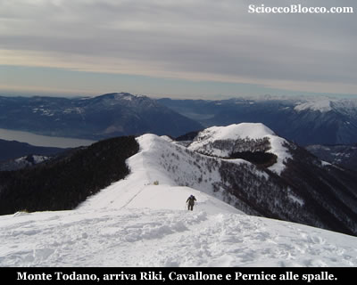

Il
panorama si fa più ampio, sul lago
Maggiore, sui
laghi lombardi, il Mottarone,
lago d'Orta,
Monte Massone,
**Monte Rosa**
e tutta la **Valgrande**.

Mentre Riki percorre gli ultimi metri, ammiro la cresta appena
percorsa e quella del **Pizzo
Pernice** che ci attende, sembra un lungo scivolo
innevato che si tuffa nel lago.

Riki è felice come un bambino per questa nuova esperienza,
e io felice di essere in parte artefice di questa gioia.

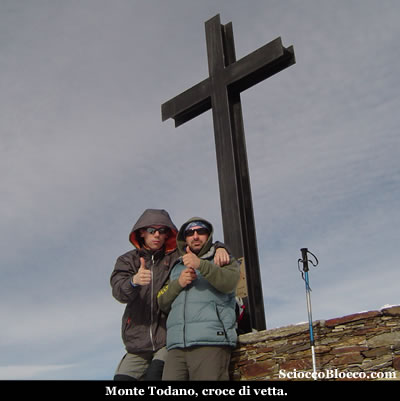

La croce di vetta è di recente posa da parte di una
associazione donatori di sangue, dove è posta la
scatola metallica con il libro di vetta.

La vista si apre giù sul versante opposto, tra i
numerosi alpeggi dell'alta **Valle
Intrasca** che noi abbiamo percorso e descritto
in una nostra recensione.

Mangiamo velocemente qualcosa mentre si alza il vento.

Ripartiamo e a ritroso ripercorriamo il percorso fatto poc
anzi sino a tornare al **bivio
per Curgei-Cicogna**.

Qui anzichè scendere verso sinistra sul percorso
dell'andata, saliamo dritti in linea retta su buone pendenze
verso la cima del **Pizzo Pernice**
(1500m)(3.00h/3.10h).

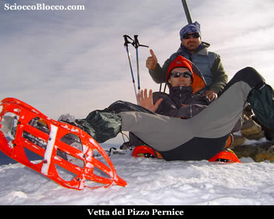

Il
vento è ancora sostenuto, il sole fa la sua comparsa
in modo più consistente, ammiriamo il panorama ancora
sul lago e su **Cicogna**
e la **Valgrande**.

Dopo la classica foto di vetta riprendiamo il cammino, sull'ampia
e aerea cresta.

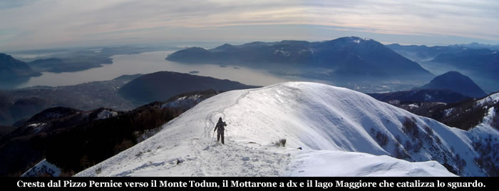

Lo
scenario è superbo, camminiamo sospesi tra neve e
acqua.

Dapprima in piano e poi in discesa, cavalchiamo la splendida
cresta che ci conduce in poco tempo al bivio per l'**Alpe
Cavallotti**.

Alla nostra destra vediamo **Cicogna**
capitale della **Valgrande**
e sopra l'**Alpe Pra**
o **Alpino**.

Proseguiamo in falsopiano, ai margini del bosco, mentre
la neve va diminuendo a causa della quota ormai bassa e
dell'esposizione a sud.

Togliamo le racchette da neve e dopo poco eccoci al **Monte
Todun** (1268m)(3.50h/4.00h).

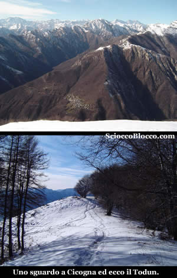

Abbiamo
raggiunto l'ultima cima dell'escursione, la più bassa
e la più a sud, ma che permette ancora bei panorami
sul lago.

Sulla sinistra, con chiaro cartello indicatore, scende il
sentiero che in pochi tornanti ci porta al **tagliafuoco**
(4.00h/4.10h).

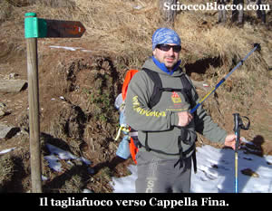

Ormai
la neve è un ricordo, seguiamo a sinistra il cartello
che indica Cappella Fina, Riki non è più così
felice come prima, la fatica si fa sentire e i sandali che
lo aspettano in macchina diventano un pensiero fisso.

Una buona camminata in piano e finalmente Cappella
Fina (1100m)(4.40h/5.00h) partenza e arrivo
della nostra escursione.

Bellissimo giro, raramente percorribile con la neve, per le
basse quote altimetriche e l'esposizione a sud, che tuttavia
dona sempre straordinari panorami, ma richiede un minimo di
allenamento.

**Grazie
agli escursionisti di giornata Riccardo e Dario.**

