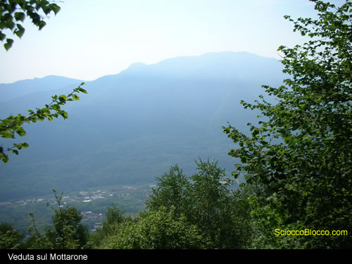
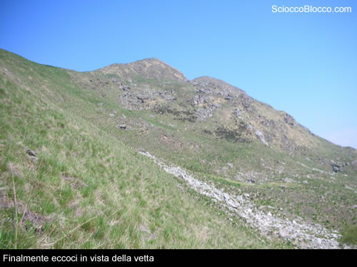
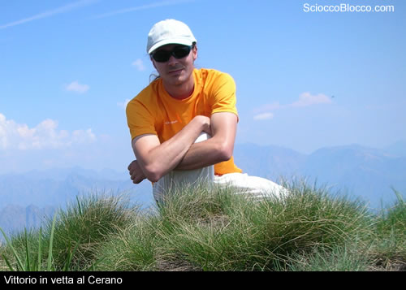
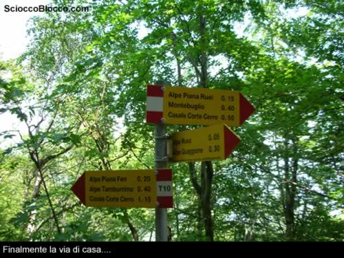

Dalla funivia abbandonata parte una strada acciottolata che funge anche da via crucis, in breve si  giunge al Santuario Getsemani, luogo di preghiera ormai abbandonato. All'interno della chiesa si può ammirare il bellissimo mosaico dedicato alla Vergine, così come le pitture di Theodore Strawinsky. Si prosegue seguendo le indicazioni per l’angelo, dopodichè seguire per l’alpe Urcia. In breve si giunge all’alpe dell’Urcia, dove si trovano frecce per M.Cerano.   Il sentiero si snoda nel bosco senza strappi e con pendenza sempre costante, l’itinerario è sempre ben segnalato e di facile percorrenza.  Ogni tanto si intravedono scorci piuttosto panoramici sul Mottarone ed in generale su tutta la valle, da Omegna fino al Lago Maggiore.

Dopo un’ora abbondante di cammino si giunge all’alpe Pianelle (1167m) , si prosegue il sentiero seguendo le indicazioni per Passo del Gan. Infatti vi sono due possibili vie per raggiungere la vetta, o seguendo per il Passo del Gan sbucando sotto il primo (a sud) dei tre gobbi caratteristici del monte oppure seguendo in direzione dell’alpe Colla, situato sotto il terzo e più nordico dei tre gobbi. Seguendo per il Passo del Gan ci si ritrova sotto il primo gobbo, la vetta è finalmente visibile.

L’ascesa prosegue con pendenza piuttosto elevate tagliando i pratoni e portandosi sulla cresta della montagna, la salita è piuttosto faticosa ma mai pericolosa. Giunti sulla cresta si incrocia il sentiero che sale dall’alpe Quaggione. Si prosegue sul sentiero fino a giungere in vetta, dove è situata una croce. (circa 3 ore dalla partenza).

Il panorama appaga della fatica fatta, gli occhi possono spaziare dal lago d’Orta al lago Maggiore. Sono visibili i Corni di Nibbio, la Zeda, il Monte Leone, il vicino M.Massone, l’imponente massiccio del Rosa, la cresta del monte Capezzone con ai piedi la valle Strona. Anziché ripercorrere il sentiero appena fatto  si scende in direzione dell’alpe Quaggione. Seguendo la cresta della montagna in direzione Sud si perde rapidamente quota fino a giungere ad un boschetto ed in breve all’alpe Quaggione. Sulla sinistra, appena dopo un’area pic-nic (dove è possibile riempire la borraccia) si segue una strada asfaltata che in poco tempo conduce all’alpe Rusa. Dalla carrabile superato l’alpe Rusa si snoda un sentiero che conduce a Casale Corte Cerro.

Il sentiero è sempre ben segnato ma non sempre evidente ed è abbastanza in disuso. Dopo aver abbandonato la carrabile si segue il sentiero che si snoda tra saliscendi assecondando le infinite pieghe della montagna senza accennare a perdere quota. Dopo circa un’ora di percorrenza, appena superato l’alpe Tamburnino, incrocio il sentiero percorso all’andata e finalmente inizio a perdere decisamente quota. In breve si rientra al santuario Getsemani e quindi all’automobile. Bella escursione adatta a  tutti anche se un po’ lunga, il sentiero è di facile percorrenza e sempre ben segnalato, eccetto l’ultimo tratto che dall’alpe Rusa conduce a Casale Corte Cerro.

Scarica recensione

Escursionista di giornata Vittorio

